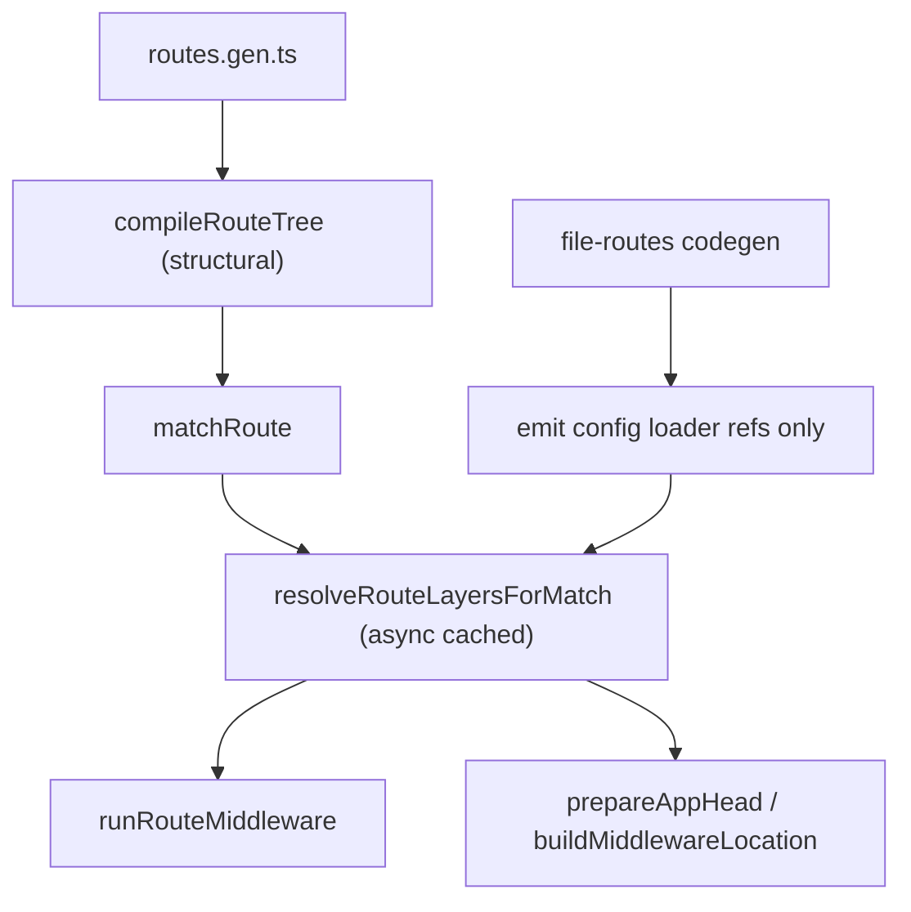

# Deferred Route Layers + Server-Only Config Plan

## Goal

Implement one integrated PR that:

- avoids shipping `page.config.ts` / `scope.config.ts` implementation code into browser bundles for SSR apps,
- removes FBR support for co-located `middleware.ts` (middleware defined only via config files),
- defers route layer resolution (`meta`, `head`, `middleware`) until route match usage time (SSR + CSR),
- preserves route matching behavior and typed route path guarantees.

## Target behavior

- `matchRoute` remains fast/synchronous (path regex + scoring only).
- Route layer values are resolved lazily on first use per route (and cached):
  - `meta`
  - `head`
  - `middleware` chain
- FBR generated code no longer eagerly imports config/middleware modules into the client route module.
- SSR and CSR both use the same deferred-resolution model.

## Architecture changes



## Implementation plan

### 1) Extend route model/types for deferred layers

Update [`packages/lib/src/router/types.ts`](packages/lib/src/router/types.ts) and related router typings to represent unresolved route layers and loader-backed layer sources.

- Add explicit loader types for route config/middleware module acquisition.
- Add a resolved-layer cache shape (per route ID) to runtime internals.
- Keep external `RouteTree` authoring ergonomic for both manual and FBR trees.

#### Mutual exclusivity for loader-backed `config`

To keep manual route-tree construction unambiguous, treat a loader-backed `config: () => import(...)` property as **XOR** with _all other_ layer properties on the same node.

- If `config` is present, the route/scope definition must not also specify any inline resolved layer fields (e.g. `meta`, `head`, `middleware`, and any other layer-related fields we introduce).
- If `config` is absent, then inline `meta` / `head` / `middleware` continue to be allowed (current behavior).
- Enforce this at:
  1. Type level (discriminated union / XOR helper types in `packages/lib/src/router/types.ts` and `createRouteTree` overloads)
  2. Compile level (runtime validation inside `compileRouteTree` / `createRouteTree` so misuse fails fast even if someone bypasses TS).

Key files:

- [`packages/lib/src/router/types.ts`](packages/lib/src/router/types.ts)
- [`packages/lib/src/router/createRouteTree.ts`](packages/lib/src/router/createRouteTree.ts)
- [`packages/lib/src/router/routePaths.ts`](packages/lib/src/router/routePaths.ts)

### 2) Make compile phase structural-only where possible

Refactor compile behavior to avoid eager `meta/head/middleware` finalization for loader-backed layers.

- Keep current sync matching fields in `CompiledRoute` (`pattern`, `params`, `score`, etc.).
- Store enough layer descriptors to resolve later.
- Keep `component/layout/error/notFound` lazy loader behavior unchanged.

Key files:

- [`packages/lib/src/router/manifest.ts`](packages/lib/src/router/manifest.ts)
- [`packages/lib/src/router/routeLayers.ts`](packages/lib/src/router/routeLayers.ts)

### 3) Add async layer resolver + cache

Introduce a runtime resolver that computes merged layer outputs for a matched route and caches results.

- `resolveRouteLayersForMatch(match, manifest)` style API (internal).
- Cache key: route ID (+ optional invalidation generation for HMR/dev).
- Single-flight behavior for concurrent requests.

Key files:

- [`packages/lib/src/router/routeMeta.ts`](packages/lib/src/router/routeMeta.ts)
- [`packages/lib/src/router/routeMiddleware.ts`](packages/lib/src/router/routeMiddleware.ts)
- (new internal helper, e.g. `routeLayerResolution.ts`)

### 4) Wire resolver into SSR + CSR execution paths

Ensure every place that needs `meta/head/middleware` resolves layers first.

- SSR pipeline:
  - [`packages/lib/src/router/prepareAppMatch.ts`](packages/lib/src/router/prepareAppMatch.ts)
  - [`packages/lib/src/router/prepareAppForUrl.ts`](packages/lib/src/router/prepareAppForUrl.ts)
  - [`packages/lib/src/router/prepareAppHead.ts`](packages/lib/src/router/prepareAppHead.ts)
- CSR pipeline:
  - [`packages/lib/src/router/navigation.ts`](packages/lib/src/router/navigation.ts)
  - [`packages/lib/src/router/prepareRoute.ts`](packages/lib/src/router/prepareRoute.ts) if needed
  - [`packages/lib/src/router/csr.ts`](packages/lib/src/router/csr.ts)

Also replace current sync shortcuts that assume precompiled middleware arrays with resolver-aware checks.

### 5) Remove `middleware.ts` from FBR; config-only middleware

**Current state (why the eager import exists):**

[`packages/file-routes/src/scanPagesDir.ts`](packages/file-routes/src/scanPagesDir.ts) hardcodes discovery with a fixed regex — **not configurable** unlike `pageFiles` / `layoutFiles`:

```ts
const MIDDLEWARE_RE = /^middleware\.ts$/
```

Codegen then emits eager imports + `collectRouteMiddlewareModule`:

```10:10:packages/file-routes/fixtures/basic/routes.gen.ts
import * as __mw_0 from "./pages/guarded/middleware"
```

Docs confirm fixed filename only ([`docs/v2/04-route-tree-and-matching.md`](docs/v2/04-route-tree-and-matching.md): `middleware.ts` — not listed under configurable `router.fileRoutes` keys).

**New FBR rule:** middleware is defined **only** via:

| File              | Scope           | Middleware field                   |
| ----------------- | --------------- | ---------------------------------- |
| `page.config.ts`  | leaf route      | `middleware` in `RoutePageConfig`  |
| `scope.config.ts` | directory scope | `middleware` in `RouteScopeConfig` |

**Remove:**

- `middleware.ts` scanning in `scanPagesDir.ts` (`node.middleware`, `MIDDLEWARE_RE`)
- `middleware` field on `FileRouteDirNode`
- codegen paths that emit `import * as __mw_*` and `collectRouteMiddlewareModule(__mw_*)`
- conflict checks for `middleware.ts` vs config (no longer applicable)

**Migrate existing usages** (3 FBR apps/fixtures):

| Current                                                                                                                              | Replacement                                        |
| ------------------------------------------------------------------------------------------------------------------------------------ | -------------------------------------------------- |
| [`packages/file-routes/fixtures/basic/pages/guarded/middleware.ts`](packages/file-routes/fixtures/basic/pages/guarded/middleware.ts) | `guarded/scope.config.ts` with `middleware: [...]` |
| [`e2e/file-routes/src/pages/guarded/middleware.ts`](e2e/file-routes/src/pages/guarded/middleware.ts)                                 | same                                               |
| [`e2e/file-routes-ssr/src/pages/guarded/middleware.ts`](e2e/file-routes-ssr/src/pages/guarded/middleware.ts)                         | same                                               |

(`e2e/file-routes-ssg` already uses `page.config.ts` middleware — no `middleware.ts`.)

**Manual route trees:** inline `middleware` on `createRoute` / `createRouteScope` / `createRouteTree` remains supported. `collectRouteMiddlewareModule` stays in `kiru/router` for hand-written trees if needed, but FBR codegen never emits it.

**Docs update:** remove `middleware.ts` from FBR file table in [`docs/v2/04-route-tree-and-matching.md`](docs/v2/04-route-tree-and-matching.md) and [`docs/v2/05-middleware-and-navigation-guards.md`](docs/v2/05-middleware-and-navigation-guards.md); document that `page.config.ts` / `scope.config.ts` are the FBR middleware sources (fixed names, paired with page/scope like today).

### 6) Change FBR codegen to emit lazy config loaders

Update FBR generation to avoid eager config imports in route module.

Current eager pattern:

- static `import * as __cfg_n from "./pages/.../page.config"`
- spread `...resolveRouteConfig(__cfg_n)`

New pattern:

- emit `config: () => import("./pages/.../page.config")` (or `scope.config`) as XOR node shape — no inline `meta` / `head` / `middleware` on same node,
- keep `component` loader refs as-is,
- preserve generated `PageRoute` typing and `RouteTree` augmentation behavior.

Example target for guarded scope (replaces `__mw_0` import):

```ts
r2 = createRouteScope({
  config: () => import("./pages/guarded/scope.config"),
  children: [r3],
}),
```

Key files:

- [`packages/file-routes/src/codegenRouteTree.ts`](packages/file-routes/src/codegenRouteTree.ts)
- [`packages/file-routes/src/types.ts`](packages/file-routes/src/types.ts)
- [`packages/file-routes/src/scanPagesDir.ts`](packages/file-routes/src/scanPagesDir.ts)

### 7) Vite plugin integration for SSR-safe client bundling

Ensure client output for SSR apps does not pull route config/middleware code transitively.

- Align generated route module shape with vite transforms and bundle boundaries.
- Reuse existing SSR/client transform strategy patterns where possible.

Key files:

- [`packages/vite-plugin-kiru/src/index.ts`](packages/vite-plugin-kiru/src/index.ts)
- [`packages/vite-plugin-kiru/src/fileRoutesCodegen.ts`](packages/vite-plugin-kiru/src/fileRoutesCodegen.ts)
- [`packages/vite-plugin-kiru/src/codegen/loaders.ts`](packages/vite-plugin-kiru/src/codegen/loaders.ts)

### 8) Tests + fixture updates

Update unit/integration coverage for deferred layer behavior and codegen output.

- file-routes generation tests and fixtures:
  - [`packages/file-routes/src/generateFileRoutes.test.ts`](packages/file-routes/src/generateFileRoutes.test.ts) — assert no `middleware.ts` / `__mw_` / `collectRouteMiddlewareModule` in generated output
  - [`packages/file-routes/fixtures/basic/routes.gen.ts`](packages/file-routes/fixtures/basic/routes.gen.ts) — regenerate without `import * as __mw_0`
  - [`packages/file-routes/fixtures/advanced/routes.gen.ts`](packages/file-routes/fixtures/advanced/routes.gen.ts)
  - [`packages/file-routes/fixtures/config/routes.gen.ts`](packages/file-routes/fixtures/config/routes.gen.ts)
- router runtime tests (middleware/nav/interceptors/head paths):
  - [`packages/lib/src/tests/unit/navigationIntercept.test.ts`](packages/lib/src/tests/unit/navigationIntercept.test.ts)
  - [`packages/lib/src/tests/unit/routeInterceptors.test.ts`](packages/lib/src/tests/unit/routeInterceptors.test.ts)
  - [`packages/lib/src/tests/unit/interceptPrefetch.test.ts`](packages/lib/src/tests/unit/interceptPrefetch.test.ts)
  - add targeted deferred-layer tests near middleware/meta/head helpers

### 9) Validate in real apps (incl. guarded redirect)

Run focused verification against:

- [`sandbox/ssr`](sandbox/ssr)
- [`e2e/file-routes-ssr`](e2e/file-routes-ssr)
- [`e2e/file-routes`](e2e/file-routes)
- [`e2e/file-routes-ssg`](e2e/file-routes-ssg)

Validation goals:

- no route regression,
- no client bundle inclusion of server-only config internals,
- middleware redirects still correct on SSR and CSR,
- generated routes typing unchanged for consumers.

## Risks and mitigation

- **Risk:** async layer resolution introduces navigation latency.
  - **Mitigation:** route-level cache + single-flight; optional prefetch hook for likely next routes.
- **Risk:** head/meta code paths read unresolved values.
  - **Mitigation:** centralize resolver call before all head/meta/middleware consumers.
- **Risk:** dev/HMR stale layer cache.
  - **Mitigation:** invalidate cache on route/module invalidation boundaries.
- **Risk:** breakage in current manual routes relying on sync assumptions.
  - **Mitigation:** support both inline sync layers and loader-backed layers with same external API.

## Deliverable shape (single PR)

- Runtime/types changes in `packages/lib`
- Codegen changes in `packages/file-routes`
- Build integration updates in `packages/vite-plugin-kiru`
- Fixture and test updates across file-routes + router unit tests
- Sandbox/e2e verification notes in PR description
