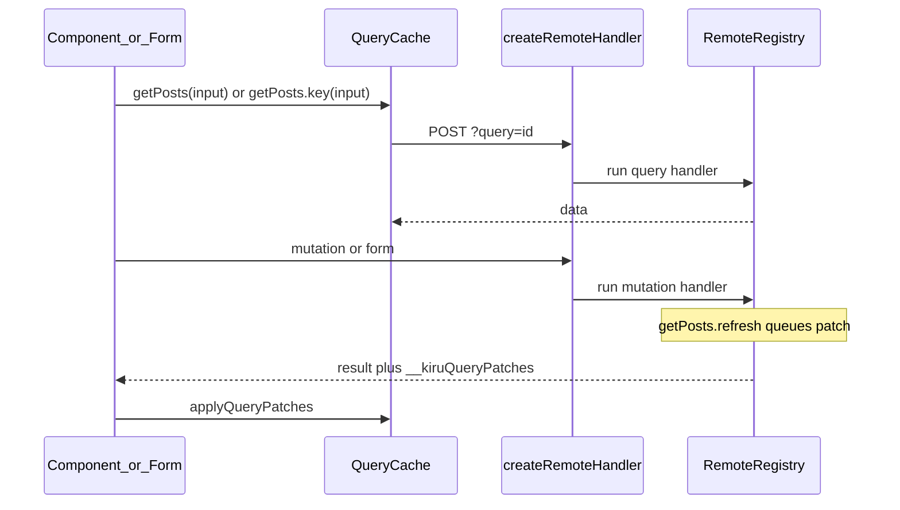
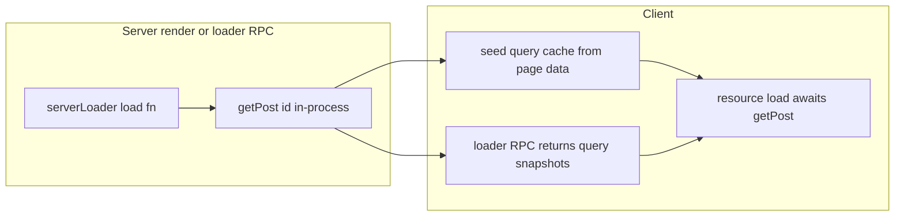

# Remote functions: query, mutation, form

## Goals

- **`query()`** — typed server reads, client dedupe by serialized args, `refresh()` / `set()` on instances
- **`mutation()`** — JSON RPC writes (today’s non-form `action()`), not callable during SSR render
- **`form()`** — multipart/form RPC + existing [`createFormController`](packages/lib/src/remote/formController.ts)
- **Single-flight invalidation** — `void getCatalog.refresh()` (void query) / `getPosts.key(id).set(result)` in handlers; patches in mutation response (replaces route-id `invalidate`)
- **Rename** — `*.actions.ts` → `*.remote.ts`, Vite `router.remote` glob, docs, e2e/sandbox (~13 files)
- **Positional calls** — `addLike(id)` / `getPosts("santa")`; optional trailing `{ signal }` only (no headers/query/body envelope)
- **Query API** — callable `fn(input)` / `fn()` plus **`Object.assign(fn, { key, refresh? })`**: `.key(input)` = cache identifier; `.refresh()` on factory for **void** queries only
- **Client-requested refreshes** — `submit().updates(getPosts, …)` / `mutation(…).updates(…)` + server `requested(getPosts, limit)` allowlist
- **Loader ↔ query cache** — same `query()` in loaders and `resource()` in components without double fetch (in-process on server, hydration + shared client cache; no `useQuery` hook)

Route **loaders** remain the URL/page integration layer; they **compose** `query()` instead of replacing it.

## Architecture



### Module layout

| File                                                                             | Responsibility                                                                              |
| -------------------------------------------------------------------------------- | ------------------------------------------------------------------------------------------- |
| [`packages/lib/src/remote/query.ts`](packages/lib/src/remote/query.ts)           | `query()`, cache key, client resource, server handle `refresh`/`set`, patch collector       |
| [`packages/lib/src/remote/mutation.ts`](packages/lib/src/remote/mutation.ts)     | `mutation()` — extract JSON RPC from [`action.ts`](packages/lib/src/remote/action.ts)       |
| [`packages/lib/src/remote/form.ts`](packages/lib/src/remote/form.ts)             | `form(schema, handler)` + config overload                                                   |
| [`packages/lib/src/remote/queryCache.ts`](packages/lib/src/remote/queryCache.ts) | Client cache + `applyQueryPatches` + loader seeding/hydration                               |
| [`packages/lib/src/remote/requested.ts`](packages/lib/src/remote/requested.ts)   | `requested()` server helper + parse/allowlist client `updates()` requests                   |
| [`packages/lib/src/remote/abortScope.ts`](packages/lib/src/remote/abortScope.ts) | `remoteCallContext.abortSignal`, `resolveRemoteFetchSignal`, `runWithRemoteAbortSignal`     |
| [`packages/lib/src/remote/index.ts`](packages/lib/src/remote/index.ts)           | Registry + `createRemoteHandler` (dispatch `?query=` / `?mutation=` / form on `?mutation=`) |

**Client UI reads:** [`resource()`](packages/lib/src/resource.ts) wraps `await query()` in `load` — no separate `useQuery` hook.

Delete **`action` export** entirely (unreleased).

Shared: [`ActionExecution`](packages/lib/src/remote/actionExecution.ts), middleware, validation, tokens, cookies, redirects, ISR `revalidate` meta on mutation/form.

### Wire protocol (all POST)

| Kind         | URL                                                   | Body                                           |
| ------------ | ----------------------------------------------------- | ---------------------------------------------- |
| **Query**    | `POST /?query=<routeId>:<exportPath>`                 | `JSON.stringify(input)` — `null` when no input |
| **Mutation** | `POST /?mutation=<id>`                                | entire JSON body = validated **input**         |
| **Form**     | `POST /?mutation=<id>` + `x-kiru-form` or native POST | FormData                                       |

**Framework-only request headers** (client cannot override or extend): `x-kiru-token`, `Content-Type: application/json`, plus normal browser headers on `fetch`. Origin allowlist unchanged.

**Remove from client API:**

- [`RemoteActionCallOptions`](packages/lib/src/remote/action.ts) (`body`, `query`, `headers`, …) — replace with narrow **`RemoteCallOptions`**: `{ signal?: AbortSignal }` only
- `validation.body` / `validation.query` on remotes
- URL search-param encoding for remote inputs (no `?foo=bar` on `?query=` / `?mutation=` URLs except the RPC discriminator param itself)
- Custom client `headers` on calls — put typed values in **validated input** instead

Client payload matches the query **input schema**. **`.key(input)`** always takes the same value as the call (scalar or full object) and names that cache entry for `updates()` / `requested()`.

**Abort:** optional trailing `{ signal }` on `query` / `mutation` calls and on `.key(input, { signal })`. Passed to `fetch` only; not serialized as input. **Implicit bag:** [`abortScope.ts`](packages/lib/src/remote/abortScope.ts) — while loaders / `resource()` load / in-process server remotes run, `remoteCallContext.abortSignal` is set; if both bag and explicit `{ signal }` exist, use `AbortSignal.any([bag, explicit])`. `resource()` load wraps with `runWithRemoteAbortSignal(ctx.signal, …)` so nested `query()` picks up `ctx.signal` without trailing options.

RPC helpers in [`rpcUrl.ts`](packages/lib/src/router/rpcUrl.ts): `buildQueryRpcUrl(id)`, `buildMutationRpcUrl(id)` — no arg serialization in URL.

**Server dispatch:** `createRemoteHandler` routes `?query=` vs `?mutation=`; both accept POST only.

Internal brands: `__kiruRemoteQuery`, `__kiruRemoteMutation`, `__kiruFormMutation` (or keep `__kiruFormAction` internally if churn is high — prefer `__kiruFormMutation` for consistency).

### Validation model (input only — no `body` / `query` keys)

**Delete** [`RemoteActionValidationConfig`](packages/lib/src/remote/action.ts) split (`body?`, `query?`) and all `validation.query` / `validation.body` / `InferActionConfigQuery` types.

**Single channel everywhere:**

| Authoring                                                              | Meaning                                                                              |
| ---------------------------------------------------------------------- | ------------------------------------------------------------------------------------ |
| `query(handler)` / `mutation(handler)`                                 | No input schema; void input                                                          |
| `query(schema, handler)` / `mutation(schema, handler)`                 | Shorthand — `schema` validates **input** (not a special “query schema”)              |
| `query({ validation: { input: schema }, handler })`                    | Config form — only `validation.input`, never `validation.body` or `validation.query` |
| `form(schema, handler)` / `form({ validation: { input: schema }, … })` | FormData parsed → validated **input** (rename from `validation.body`)                |
| `mutation({ middleware, revalidate, handler })`                        | No schema when input is void                                                         |

One Standard Schema per remote for client-supplied payload. Filters, pagination, ids, secrets → fields on that input object.

### Call API (input only)

**Mutations/forms** — positional, same as today:

| Definition                            | Call        | POST JSON               |
| ------------------------------------- | ----------- | ----------------------- |
| `mutation(handler)` / `form(handler)` | `fn()`      | `null`                  |
| `mutation(schema, handler)`           | `fn(input)` | `JSON.stringify(input)` |

**Queries** — callable **function** with `Object.assign(call, { key, refresh? })`. Call argument = validated **input** (typed from schema):

| Schema                  | Call                             | POST JSON                             |
| ----------------------- | -------------------------------- | ------------------------------------- |
| void                    | `getPosts()`                     | `null`                                |
| object                  | `listPosts({ filter: "santa" })` | `JSON.stringify({ filter: "santa" })` |
| scalar (e.g. author id) | `getPosts("santa")`              | `JSON.stringify("santa")`             |

**`RemoteCallOptions`** — trailing only: `fn(input, { signal })`, `fn({ signal })` for void, `getPosts.key("santa", { signal })`. Implement `isRemoteCallOptions()` to peel the last arg (object-input queries must pass options as second arg).

**Input shape correspondence** (same as Svelte remote queries):

```ts
// Scalar input — call arg is the string itself:
export const getPosts = query(v.string(), async (author) => { ... })
getPosts("santa")

// Object input — call arg is the object shape:
export const listPosts = query(v.object({ filter: v.string() }), async ({ filter }) => { ... })
listPosts({ filter: "santa" })
```

**Handlers** receive validated **input** as the primary argument (plus framework args where applicable):

```ts
mutation(idSchema, async (id) => { ... })
query(z.object({ filter: z.string() }), async ({ filter }) => { ... })
```

**Middleware** ([`action-middleware-demo`](e2e/ssr/src/pages/action-middleware-demo.actions.ts) today uses client `headers` option): migrate to **input-based** checks — e.g. `mutation(z.object({ secret: z.string() }), …)` and middleware reads validated input (run validation before middleware, or pass parsed input into `ActionMiddlewareContext`). Do not rely on client-supplied custom HTTP headers for app logic.

**Server-side** `request.headers` remains for ambient HTTP metadata (cookie, user-agent) where needed; not for parallel untyped client channels.

**Codegen client stubs:**

```ts
export async function bump(...args) {
  return __$mutation(id, args)
}
export async function addLike(...args) {
  return __$mutation(id, args)
}
export const getPosts = __$defineQuery(id, schema)
// runtime peels trailing { signal } from args; POST body = validated input only
```

Mutations: peel options → `fetch` signal; POST JSON = **input** only. Queries: same; cache key ignores `signal`.

### Query API: callable + `.key()` + `.refresh()` (`Object.assign`)

Every `query()` export is a **function** plus fixed methods (no per-query `bind` option):

```ts
Object.assign(call, {
  key(input: Input): RemoteQueryInstance<Input>,
  refresh?: () => RemoteQueryInstance<void>,  // only when Input is void
})
```

**`.key(input)`** — cache identifier for that query. Argument is always the **full validated input** (same value you would pass to the call). Returns a stable `RemoteQueryInstance` shared with the call form.

| Input schema                       | Fetch (triggers RPC when awaited) | Cache identifier (same serialized input)          |
| ---------------------------------- | --------------------------------- | ------------------------------------------------- |
| `v.string()`                       | `getPosts("santa")`               | `getPosts.key("santa")`                           |
| `v.object({ filter: v.string() })` | `listPosts({ filter: "santa" })`  | `listPosts.key({ filter: "santa" })`              |
| void                               | `getCatalog()`                    | `getCatalog.key()` or `getCatalog()` (void input) |

**Scalar:**

```ts
export const getPosts = query(v.string(), async (author) => posts)

await getPosts("santa")
getPosts.key("santa") // cache identifier — same key as getPosts("santa")

await form.submit().updates(
  getPosts,
  getPosts.key("santa"),
  getPosts.key("santa").withOverride((posts) => [newPost, ...posts])
)
```

**Object** — `.key()` takes the **object**, not a single field value:

```ts
export const listPosts = query(
  v.object({ filter: v.string() }),
  async ({ filter }) => posts
)

await listPosts({ filter: "santa" })
listPosts.key({ filter: "santa" }) // cache identifier

await form.submit().updates(
  listPosts,
  listPosts.key({ filter: "santa" }),
  listPosts
    .key({ filter: "santa" })
    .withOverride((posts) => [newPost, ...posts])
)
```

**Void query only** — factory `.refresh()` (not `getPosts().refresh()` on an input query):

```ts
export const getCatalog = query(async () => catalog)

await getCatalog()
void getCatalog.refresh() // factory method; void input only
```

**Rules:**

- `getPosts("santa") === getPosts.key("santa")` (same cache entry / dedupe).
- **Instance** (from call or `.key`): `await instance`, `instance.refresh()`, `instance.set(data)` (server), `instance.withOverride(fn)` (client).
- **No** `.filter()`, `.with()`, or configurable `bind` — only `.key()` + optional factory `.refresh()` for void.
- Typing: `key`’s parameter type = call’s input type (`string` vs `{ filter: string }` vs void).

**Client reads (`resource()`):** UI binds queries via [`resource()`](packages/lib/src/resource.ts), not a dedicated hook:

```ts
const catalog = resource(async ({ signal }) => getCatalog({ signal }))

const post = resource({
  source: { id: () => params.id },
  load: ({ id }, { signal }) => getPost(id, { signal }),
})
```

`await query()` inside `resource.load` uses `queryCache` (dedupe, hydration seed, patches). After mutations, `resource.refetch()` or cache subscribers (optional v1).

**Server in-process:** `getPosts("santa")` / `getPosts.key("santa")` / `listPosts.key({ filter })` invoke handler without HTTP in loaders/mutations.

### Query cache

- Key: `queryId + ':' + stableSerialize(input)`; patch entries use `input` field
- Client: dedupe in-flight; call and `.key(sameInput)` return shared instances per key
- Server: `execution.runtime.cache.memo` per request

### Mutation response envelope

```ts
type KiruQueryPatch =
  | { queryId: string; input: unknown; op: "refresh"; data: unknown }
  | { queryId: string; input: unknown; op: "set"; data: unknown }
```

(`input` here is the serialized cache key value — `undefined` / omitted for void queries.)

Attach `__kiruQueryPatches` on enhanced JSON responses (mutation + form). Flush collector before HTTP response. Client: `applyQueryPatches` after fetch (alongside token refresh in [`applyActionResponseHeaders`](packages/lib/src/router/routerGlobal.ts) — rename to `applyRemoteResponseHeaders` if desired).

**Remove:** `RemoteActionMeta.invalidate`, `x-kiru-invalidate`, route-id invalidation from remote meta.

### Client-requested query updates (`updates` + `requested`)

When the server cannot know which query **instances** are on screen (e.g. filtered list), the client declares what to refresh via **bound instances**; the server must **opt in** per mutation/form (bundle size + DoS).

**Client — chain on mutation/form result** (not on mutation input):

See scalar/object examples above under **Query API**.

- `updates(...targets)` accepts the **query fn** (`getPosts` — all active instances / factory), and **`.key(input)`** entries (preferred in `updates()` for explicit cache identity).
- `getPosts("santa")` and `getPosts.key("santa")` are interchangeable targets (same `input` on the wire).
- `.withOverride(fn)` — optimistic cache; roll back on failure.
- Wire `requested` entries: `{ queryId, input }` where `input` is the serialized value for that instance (e.g. `"santa"` for scalar, `{ filter: "santa" }` for object).
- Framework encodes a capped list in the mutation request (separate from validated **input**).

**Wire — mutation/form POST envelope** (alongside validated input):

```ts
type RemoteMutationWire =
  | null // void input, no updates
  | Input // input only
  | {
      input: Input | null
      requested?: Array<{
        queryId: string
        input: unknown
        optimistic?: unknown
      }>
    }
```

Cap **client** requested entries (e.g. max 8); server enforces a per-handler **`limit`** via `requested()`.

**Server — allowlist + `requested()`** (in [`requested.ts`](packages/lib/src/remote/requested.ts)):

```ts
export const createPost = form(postSchema, {
  refreshable: [getPosts, getPost], // declare which query *functions* this handler may refresh
  handler: async (data) => {
    for (const { input, query } of requested(getPosts, 5)) {
      void query.refresh()
    }
    await requested(getPosts, 5).refreshAll() // shorthand for refresh all requested getPosts instances
    getPost(slug).set(post) // server-initiated still allowed
    return redirect(303, `/blog/${slug}`)
  },
})
```

| Rule                                                                 | Reason                                                               |
| -------------------------------------------------------------------- | -------------------------------------------------------------------- |
| Handler must list `refreshable: [getPosts, …]` (query function refs) | Prevents arbitrary query code in mutation bundle / client-driven DoS |
| `requested(fn, limit)` — **`limit` required**                        | Bounds server work per request                                       |
| Bad/unauthorized requested entry                                     | That patch errors; mutation still succeeds if handler allows         |
| Parsing invalid `input` for a requested query                        | Same — per-entry error, not fail whole mutation                      |

**Interaction with server-initiated patches:** Handler may both `void getPosts.refresh()` and process `requested(getPosts, n)`; response merges all `__kiruQueryPatches`. Client applies optimistic updates immediately, then replaces with server patches.

**Tests:** `getPosts.key("santa")` ≡ `getPosts("santa")` for cache/requested; `updates(getPosts, getPosts.key("santa"))`; `withOverride` rollback; `requested` limit; `refreshable` allowlist.

### Loader ↔ query cache sharing

Avoid double fetch when a page **loader** and **components** use the same `query()`.



**1. In-process query during loaders (server)**

- When `load()` runs on the server (SSR or `POST /?loader=`), `query()` invocations use **in-process** `__kiruInvoke` (same as inside mutation handlers), not HTTP loopback.
- Results write to the **per-request query memo** and to a **collector** for serialization.

**2. SSR hydration**

- Extend page payload ([`pageData.ts`](packages/lib/src/router/pageData.ts) / `k-page-data` script) with optional `__kiruQueries: Array<{ queryId, input, data }>` collected during render/loader.
- On client bootstrap, `seedQueryCache(__kiruQueries)` before component `resource()` runs so `getPost(id)` hits cache on first paint.

**3. Client navigations**

- Loader RPC response envelope (parallel to mutation wire): loader result + optional `__kiruQueries` snapshot for queries invoked during that load.
- [`runPageLoad.ts`](packages/lib/src/router/runPageLoad.ts) after successful loader: seed shared [`queryCache.ts`](packages/lib/src/remote/queryCache.ts).
- [`loaderCache.ts`](packages/lib/src/router/loaderCache.ts) stays for route-keyed loader entries (`routeId + pathname + search`); query cache is **input-keyed** (`queryId + stableSerialize(input)`). Loader may return props from `await getPost(id)`; components use `resource(() => getPost(id))` — cache prevents duplicate `POST ?query=` when seeded.

**4. `router.invalidate()`**

- Extend [`router.invalidate`](packages/lib/src/router/routerInstance.ts) to optionally clear query cache entries (all, or by `queryId` metadata on `query({ meta: { routeIds } })` if we add light tagging). Minimum v1: invalidate clears loader cache **and** all query entries (simple); refine tagging if needed in implementation.

**5. Recommended authoring pattern (docs)**

```ts
// shared.remote.ts
export const getPost = query(idSchema, async (id) => fetchPost(id))

// page.tsx
export const load = serverLoader({
  load: async ({ params }) => ({ post: await getPost(params.id) }),
})
// Component: resource(async ({ signal }) => getPost(params.id, { signal })) — cache seeded, no second POST ?query=
```

**Tests:** SSR HTML contains `__kiruQueries`; client nav loader seeds cache; `resource()` does not refetch when cache hit; loader + component share one server invocation per request on server.

### `mutation()` vs `query()`

- **Mutation**: positional `mutation(id)` / `mutation()`; returns `Promise<Output>`; dev-throw if called during SSR render outside another remote handler
- **Query**: callable + `.key(input)` (cache id) + factory `.refresh()` (void only); instances thenable + `refresh` / `set` / `withOverride`
- **Form**: `form(schema, handler)`; handler receives validated input (not `request.formData` unless using unvalidated form config)

```ts
await addLike(item.id)

export const createPost = form(postSchema, async (data) => {
  void getPosts.refresh()
  return redirect(303, `/blog/${slug}`)
})
```

v1 form scope: keep `createFormController`; no `.fields.as()` / preflight yet.

### Codegen ([`packages/vite-plugin-kiru/src/codegen/remote.ts`](packages/vite-plugin-kiru/src/codegen/remote.ts))

- Alias scan: `query`, `mutation`, `form` from `kiru/remote`
- `RemoteMatch.kind`: `"query" | "mutation" | "form"`
- Client stubs: `__$defineQuery(id, schema)` → `Object.assign(call, { key, refresh? })` / mutation / form
- Server: register all kinds in `__INTERNAL_REMOTE_REGISTRY`

### Client bootstrap

- Client `query()` callable goes through `queryCache` + `fetch` directly (no `router.queries` / `useQuery` layer)
- `ensureMutationClient()` — replace `serverActions.dispatch` naming in [`globalContext`](packages/lib/src/globalContext.ts) / hydrate (e.g. `router.mutations.dispatch`)
- Parse `__kiruQueryPatches` from mutation/form JSON before returning user payload
- `runWithRemoteAbortSignal` in [`resource.ts`](packages/lib/src/resource.ts) load + [`runPageLoad.ts`](packages/lib/src/router/runPageLoad.ts) loaders

### Migrations

| Before                                                                           | After                                                                                                |
| -------------------------------------------------------------------------------- | ---------------------------------------------------------------------------------------------------- |
| `invalidate-demo` + `router.invalidate()`                                        | `counterQuery` + `form` + `resource(() => counterQuery())`; `void counterQuery.refresh()` in handler |
| Read-like `action()` in [`index.actions.ts`](e2e/ssr/src/pages/index.actions.ts) | `query()`                                                                                            |
| JSON write `action()`                                                            | `mutation()`                                                                                         |
| `action({ type: "form" })`                                                       | `form()`                                                                                             |
| All `*.actions.ts`                                                               | `*.remote.ts`                                                                                        |

### Docs

- Rewrite [`docs/v2/07-remote-actions.md`](docs/v2/07-remote-actions.md) as **Remote functions** (`query` / `mutation` / `form`, patches, `resource()` for client reads, security)
- Update import guide, vite plugin docs, `BREAKING-CHANGES.md` — terminology: “remote mutation” not “server action” where accurate

### Tests

- Refactor remote/form/middleware tests for new exports, `?mutation=` URLs, and input-based middleware (remove client `headers` call options from tests)
- Add `query.test.ts`, `abortScope.test.ts`; resource + seeded cache integration test (no `useQuery.test.tsx`)
- ISR `revalidate` meta on `mutation`/`form` ([`actionRevalidate.test.ts`](packages/lib/src/tests/unit/actionRevalidate.test.ts))

### Deferred

- `query.batch`, `query.live`, rich form fields (`.fields.as()`, preflight)

## Implementation order

1. `query()` + `abortScope` + POST `?query=` + positional input API + client cache + server dedupe/patch collector; wire abort bag in `resource` + loaders
2. `mutation()` + `form()`; delete `action()`; `?mutation=` wire + input-only validation
3. Server-initiated patch envelope + `applyQueryPatches`
4. In-process query on server (mutation/form/loader/SSR scope)
5. **Loader ↔ query cache** — `__kiruQueries` in page data + loader RPC snapshot + `seedQueryCache`; `resource()` + cache no double-fetch
6. **Client `updates()` + server `requested()`** — wire envelope, `refreshable` allowlist, `requested(fn, limit)`, form `submit().updates`
7. Codegen + `*.remote.ts` rename
8. E2E (invalidate-demo, requested-queries demo, loader+resource page), unit tests, docs sweep
