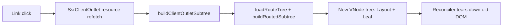
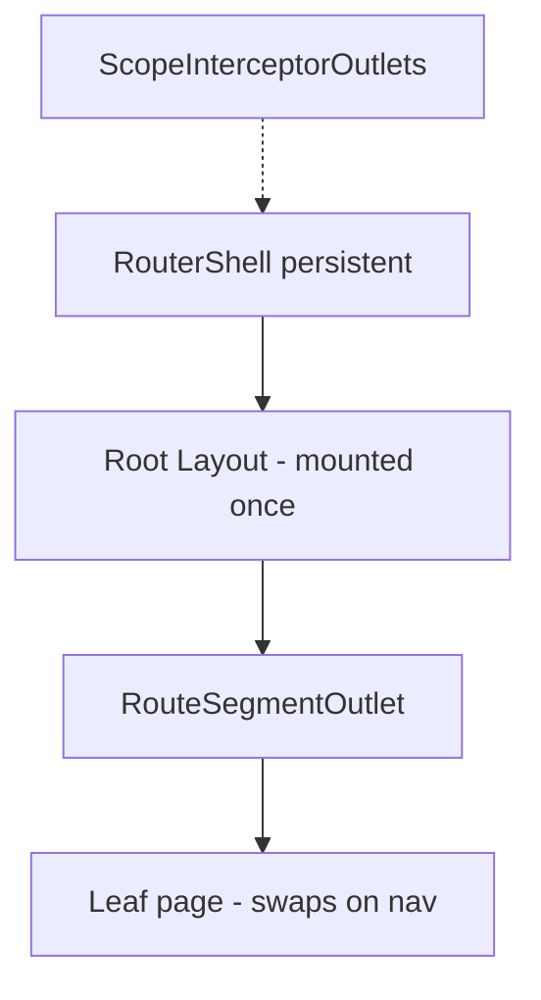

# Sandbox SSR: voting API, layout persistence, sidebar nav, flash diagnostics

## Problem summary

| Issue | Root cause (confirmed in code) |
|-------|-------------------------------|
| Voting throws at runtime | [`wrapMutationResult`](packages/lib/src/remote/mutationResult.ts) starts RPC immediately; `.updates()` fires a **second** RPC. Sandbox also passes **two** wire targets instead of one chained `.optimistic()` call. |
| **White screen flash** | **Primary:** every client navigation rebuilds the **entire** route subtree — root layout included — via [`buildClientOutletSubtree`](packages/lib/src/router/clientRoutePrep.ts) → [`buildRoutedSubtree`](packages/lib/src/router/routeTree.ts). The whole `#app` tree is torn down and recreated. **Secondary:** [`SsrClientOutlet`](packages/lib/src/router/ssrClientOutlet.tsx) nulls `outletRef` while pending (`outlet:evict-stale`). |
| **Sidebar link identity lost** | Same as above — layout [`sandbox/ssr/src/pages/layout.tsx`](sandbox/ssr/src/pages/layout.tsx) (sidebar `Link`s) is inside the rebuilt subtree, so DOM nodes are new after every nav. User repro: capture `/c/kiru` link on `/about`, navigate to `/c/kiru`, new link `!==` old link. |
| Sidebar community content wrong | **Separate bug** after layout persists: param-only nav (`/c/kiru` ↔ `/c/webdev`) reuses page setup with stale slug signals in [`CommunityPage`](sandbox/ssr/src/pages/c/[slug]/page.tsx) / [`FeedList`](sandbox/ssr/src/pages/feed/feed-list.tsx). |

### Why layouts remount today

All sandbox routes share one root layout ([`routes.gen.ts`](sandbox/ssr/src/routes.gen.ts) — single `layout: () => import("./pages/layout")`). Yet on each navigation:



There is no nested `<Outlet />` boundary — layout `{children}` is inlined at build time, so **layout and leaf are one atomic subtree**. The codebase already acknowledges this pattern for interceptors: [`ScopeInterceptorOutlets`](packages/lib/src/router/scopeInterceptorOutlets.tsx) renders scope interceptors **outside** the route outlet remount cycle.

---

## 1. Fix mutation `.updates()` — lazy single dispatch

**Files:** [`packages/lib/src/remote/mutation.ts`](packages/lib/src/remote/mutation.ts), [`packages/lib/src/remote/mutationResult.ts`](packages/lib/src/remote/mutationResult.ts), [`packages/lib/src/remote/formController.ts`](packages/lib/src/remote/formController.ts)

Refactor to **lazy dispatch** — no RPC until `await mutation(...)` or `.updates(...)` is consumed (exactly one request).

**Tests:** Extend [`packages/lib/src/tests/unit/mutationUpdates.test.ts`](packages/lib/src/tests/unit/mutationUpdates.test.ts) with dispatch-count assertions.

---

## 2. Fix sandbox voting usage

**File:** [`sandbox/ssr/src/pages/feed/feed-list.tsx`](sandbox/ssr/src/pages/feed/feed-list.tsx)

Single chained target:

```typescript
await votePost({ targetType: "post", targetId: postId, value }).updates(
  getFeed
    .key({ sort: sort.value, communitySlug: communitySlug.value })
    .optimistic((posts) =>
      (posts ?? []).map((p) =>
        p.id === postId ? { ...p, score: p.score + value } : p
      )
    )
)
```

---

## 3. Add voting to e2e/ssr Threadboard replica

Mirror sandbox: votes in [`db.ts`](e2e/ssr/src/pages/threadboard/server/db.ts), seed, `votePost` in [`feed.remote.ts`](e2e/ssr/src/pages/threadboard/feed.remote.ts), UI in [`feed-list.tsx`](e2e/ssr/src/pages/threadboard/feed/feed-list.tsx), Cypress in [`threadboard-sandbox.cy.ts`](e2e/ssr/cypress/e2e/threadboard-sandbox.cy.ts).

---

## 4. Layout persistence — test first, then lib fix (white flash + sidebar DOM)

### 4a. Confirmation test (user repro)

**Must fail on current branch.**

**Cypress** (e2e replica — same layout pattern): in [`threadboard-nav-tour.cy.ts`](e2e/ssr/cypress/e2e/threadboard-nav-tour.cy.ts) or new spec:

```typescript
// Layout DOM must survive leaf navigation
cy.visit('/threadboard/about')
cy.get('[data-testid="community-kiru"] a').then(($linkBefore) => {
  const elBefore = $linkBefore[0]
  cy.get('[data-testid="community-kiru"] a').click()
  cy.waitForNavSettled()
  cy.get('[data-testid="threadboard-community-kiru"]').should('exist')
  cy.get('[data-testid="community-kiru"] a').then(($linkAfter) => {
    expect($linkAfter[0], 'sidebar link should be same DOM node').to.eq(elBefore)
  })
})
```

**Sandbox parity:** add `data-testid="communities-sidebar"` and `data-testid="community-{slug}"` to [`sandbox/ssr/src/pages/layout.tsx`](sandbox/ssr/src/pages/layout.tsx) sidebar (lines 87–106) for the same manual repro.

**Unit / jsdom test:** extend [`routerShellTree.test.tsx`](packages/lib/src/tests/unit/routerShellTree.test.tsx) pattern — layout probe with `data-setup-id` must **not** change after simulated client nav between two routes sharing the same root layout (e.g. `/` → `/about`). Today it will change because the whole subtree is replaced.

### 4b. Lib fix — persistent scope layouts + leaf outlet

**Goal:** Shared layout scopes stay mounted; only the leaf segment (and any non-shared layout suffix) swaps on navigation.

**Primary files:**

- [`packages/lib/src/router/clientRoutePrep.ts`](packages/lib/src/router/clientRoutePrep.ts) — split `buildClientOutletSubtree` into layout-prefix vs leaf-suffix using `match.route.scopes` common prefix with previous match
- [`packages/lib/src/router/routeTree.ts`](packages/lib/src/router/routeTree.ts) — add `buildRoutedLeafSubtree` (leaf + layouts below divergence only) and/or internal `RouteSegmentOutlet` component that layout `{children}` renders into
- [`packages/lib/src/router/ssrClientOutlet.tsx`](packages/lib/src/router/ssrClientOutlet.tsx) + [`routerView.tsx`](packages/lib/src/router/routerView.tsx) — compose persistent layout shell once; resource load only updates inner outlet slot
- [`packages/lib/src/router/ssrAppBuild.ts`](packages/lib/src/router/ssrAppBuild.ts) — hydrate/bootstrap must match client composition (layout vnode parity)

**Design sketch:**



- For sandbox/e2e (single root layout): mount root layout outside `SsrClientOutlet` resource cycle; outlet resource returns **leaf-only** subtree passed as layout `children`.
- For multi-scope trees: compute longest shared scope prefix between `prevMatch` and `nextMatch`; remount only from first diverging scope index.
- Add outlet debug events: `layout:persist`, `layout:remount-suffix`, `leaf:swap`.

**Secondary mitigation (after layout persistence):** leaf-only pending SWR in `resolveOutletContent` — keeps previous **leaf** visible while loader runs, without reverting to full-tree stale fallback.

### 4c. Verify

- Layout persistence Cypress + unit tests green
- Manual sandbox: `/about` → `/c/kiru` — sidebar link is same element; no full `#app` wipe
- Blank-frame watcher (section 6) reports zero frames on `/about` → `/c/kiru`

---

## 5. Sidebar community navigation — content correctness (after layout fix)

With layout persisted, param-only sidebar nav (`/c/kiru` ↔ `/c/webdev`) still needs app-level slug sync.

### 5a. Cypress loop test

Loop 6–10 times: click `community-kiru` → assert kiru feed; click `community-webdev` → assert webdev feed (`p-3`). Use diagnostics after each click.

### 5b. App fixes

| File | Change |
|------|--------|
| [`sandbox/ssr/src/pages/c/[slug]/page.tsx`](sandbox/ssr/src/pages/c/[slug]/page.tsx) | Reactive slug from `useRouter().params`; sync `slugSignal`; `key={slug}` on `<FeedList>` |
| [`e2e/ssr/src/pages/threadboard/c/[slug]/page.tsx`](e2e/ssr/src/pages/threadboard/c/[slug]/page.tsx) | Same |
| [`feed-list.tsx`](sandbox/ssr/src/pages/feed/feed-list.tsx) + e2e copy | Sync `communitySlug` signal when prop changes |

Optional lib hardening: `forceLoaderReload` on pathname change within same route id ([`csr.ts`](packages/lib/src/router/csr.ts)).

---

## 6. Blank-frame diagnostics

- Extract [`routerDiagnostics`](e2e/ssr/src/e2e/routerDiagnostics.ts) to shared module; install in [`sandbox/ssr/src/client.tsx`](sandbox/ssr/src/client.tsx)
- `installBlankFrameWatcher()` + Cypress `assertNoBlankFrames`
- Use in layout persistence test and sidebar loop — catches transient `#app` emptiness Cypress end-state checks miss

Update [`docs/investigations/sandbox-ssr-navigation.md`](docs/investigations/sandbox-ssr-navigation.md) with layout remount as confirmed root cause.

---

## Verification checklist

1. **Layout DOM identity test fails** on current branch (`linkBefore === linkAfter`)
2. After layout persistence lib fix, identity test passes; white flash gone or greatly reduced
3. Sidebar kiru↔webdev loop passes after slug-sync app fixes
4. Mutation lazy dispatch + voting tests pass
5. `assertNoBlankFrames` passes on `/about` → `/c/kiru` and sidebar loops

## Suggested implementation order

1. Layout persistence **failing tests** (highest signal — confirms user repro)
2. Layout persistence **lib fix** (fixes white flash + sidebar DOM)
3. Mutation `.updates()` lazy dispatch + sandbox voting
4. E2e voting + sidebar content loop
5. Blank-frame diagnostics (validate + guard regressions)
