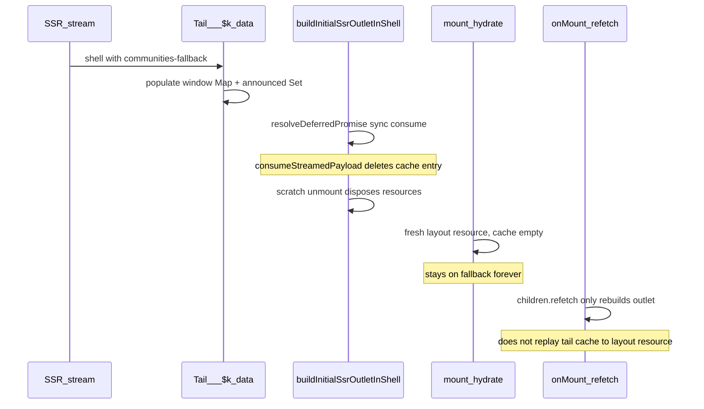
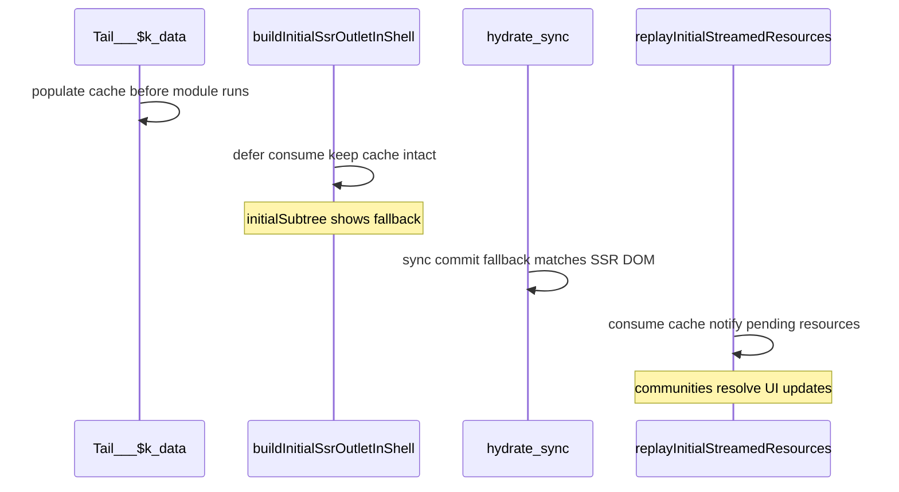

# Stream hydration follow-up + navigation abort fix

## Failing tests (current baseline)

| Test                                          | File                                                                                                        | Symptom                                         | Likely cause                                                                                               |
| --------------------------------------------- | ----------------------------------------------------------------------------------------------------------- | ----------------------------------------------- | ---------------------------------------------------------------------------------------------------------- |
| `community-kiru` timeout                      | [tier3-wave1.cy.ts](e2e/ssr/cypress/e2e/tier3-wave1.cy.ts) (Threadboard + feed-hydration-demo client visit) | `communities-fallback` persists; no `#app` wipe | **Server/client vnode tree mismatch** → layout `promiseId` ≠ tail `__$k_data` id; cache replay cannot bind |
| `community-kiru` timeout                      | [ssr.cy.ts](e2e/ssr/cypress/e2e/ssr.cy.ts) Threadboard dev block                                            | Same                                            | Same                                                                                                       |
| `invalidate-generation` empty                 | [tier3-wave1.cy.ts](e2e/ssr/cypress/e2e/tier3-wave1.cy.ts) Invalidation                                     | `data?.generation` never hydrates               | Likely separate `serverLoader` / `k-page-data` regression (investigate after stream fix)                   |
| `revalidate-demo.prerender-meta.json` missing | [tier3-wave1.cy.ts](e2e/ssr/cypress/e2e/tier3-wave1.cy.ts) ISR block                                        | Build artifact absent                           | May be downstream of Phase -1 Vite scan failure blocking build                                             |

**Tier3 command:** `cd e2e/ssr && pnpm run build && pnpm exec cypress run --config-file cypress.tier3.config.ts`

> **Blocker (fix first):** Vite dependency scan currently fails for `e2e/ssr` — see Phase -1 below. Dev server, build, and Cypress cannot run reliably until resolved.

**Success criteria (from prior work):**

- `__kiruAppWiped === false` (already passing)
- Bootstrap trace clean on happy path (already passing)
- `community-kiru` visible; `communities-fallback` gone
- Clicking post title (`/p/[id]` or `/threadboard/p/[id]`) opens interceptor without blank screen
- **E2E gate:** full sandbox-parity Cypress suite passes (see Phase E2E below) — DOM elements, not just HTML wire checks
- **`e2e/ssr` Vite dev/build succeeds** — no dependency scan error for `revalidatePath` / `revalidateTag`

---

## Phase -1 (first): Vite dep scan — `revalidatePath` / `revalidateTag` export blocker

**Symptom** (blocks all e2e/ssr work):

```
Failed to scan for dependencies from entries: e2e/ssr/index.html
No matching export in "../../packages/lib/dist/router/client.js" for import "revalidatePath"
  src/pages/revalidate-demo.remote.ts:2:9
```

**Root cause:**

1. [revalidate-demo.remote.ts](e2e/ssr/src/pages/revalidate-demo.remote.ts) imports `revalidatePath`, `revalidateTag` from `kiru/router` (correct for **server** handlers per docs).
2. [package.json](packages/lib/package.json) `exports["./router"].browser` → [router/client.ts](packages/lib/src/router/client.ts), which **deliberately omits** server-only [revalidate.ts](packages/lib/src/router/revalidate.ts) (full export only on [router/index.ts](packages/lib/src/router/index.ts)).
3. Vite-plugin-kiru **client stub** for `*.remote.ts` replaces handler bodies but **keeps** `import` declarations ([remote.ts](packages/vite-plugin-kiru/src/codegen/remote.ts) ~306–313 strips body nodes but skips `ImportDeclaration`; only `kiru/remote` imports are removed).
4. Vite dep pre-bundle scan follows the client stub → resolves `kiru/router` under `browser` condition → **missing exports**.

This prevents `pnpm dev`, production build, and Cypress in `e2e/ssr`.

### Fix (apply both for robustness)

**A. vite-plugin-kiru (primary)** — strip dead server imports from remote client stubs:

- In [codegen/remote.ts](packages/vite-plugin-kiru/src/codegen/remote.ts), after client stub transform, remove `ImportDeclaration` nodes for server-only modules no longer referenced:
  - At minimum: `kiru/router` imports (entire declaration — handler body is erased).
  - Mirror existing `stripAuthorKiruRemoteImports` pattern; consider generic “remove all unused imports after stubbing”.
- Add test in [codegen/remote.test.ts](packages/vite-plugin-kiru/src/codegen/remote.test.ts):

```ts
// client stub for revalidate-demo.remote.ts pattern
import { revalidatePath, revalidateTag } from "kiru/router"
export const bump = form(async () => {
  await revalidatePath("/x")
})
// assert client output has no kiru/router import and exports RPC stub only
```

**B. kiru lib (secondary / API completeness)** — export client-safe stubs from [router/client.ts](packages/lib/src/router/client.ts):

- Add [router/revalidate.client.ts](packages/lib/src/router/revalidate.client.ts) (or inline in client.ts) with `revalidatePath` / `revalidateTag` that immediately `throw new Error("… must only be called on the server")` — **no** `prerenderCache` import in client bundle.
- Re-export from `router/client.ts` so browser resolution satisfies bundlers if an import slips through.
- Full implementation stays in [revalidate.ts](packages/lib/src/router/revalidate.ts) on server entry only.

**Do not** change [revalidate-demo.remote.ts](e2e/ssr/src/pages/revalidate-demo.remote.ts) to drop `kiru/router` imports — docs and tier3 ISR tests expect on-demand revalidation from the handler.

### Verification (Phase -1 gate)

```bash
cd e2e/ssr && pnpm exec vite build   # or vite optimize --force / dev startup
# must NOT print "No matching export … revalidatePath"
cd packages/vite-plugin-kiru && pnpm test  # remote codegen test
cd packages/lib && pnpm test             # revalidate.test.ts still passes on server entry
```

Only after Phase -1 passes → proceed to E2E suite + vnode parity work.

---

## Phase E2E: sandbox-parity Cypress suite (required before/during implementation)

**Requirement:** Thorough e2e testing that mimics [sandbox/ssr](sandbox/ssr) via the existing [e2e/ssr Threadboard replica](e2e/ssr/src/pages/threadboard/). Assert **visible DOM elements** with Cypress — wire/HTML parsing (`fetchHtml`, `k-page-data`, `__$k_data`) is supplementary smoke only, not sufficient on its own.

### Sandbox behaviors to replicate and test

| Sandbox feature                                              | E2e replica status                                                                                             | Cypress must assert                                                                            |
| ------------------------------------------------------------ | -------------------------------------------------------------------------------------------------------------- | ---------------------------------------------------------------------------------------------- |
| Layout `resource(() => listCommunities())` + sidebar         | [threadboard/layout.tsx](e2e/ssr/src/pages/threadboard/layout.tsx)                                             | `[data-testid="community-kiru"]` visible; `communities-fallback` absent after hydrate          |
| Home feed via `serverLoader` + `resource({ load: getFeed })` | [threadboard/page.tsx](e2e/ssr/src/pages/threadboard/page.tsx)                                                 | `[data-testid="feed-post-p-1"]` with post title text; `feed-fallback` absent                   |
| Post title → `/p/[id]` interceptor modal                     | **Missing** — [feed-list.tsx](e2e/ssr/src/pages/threadboard/feed/feed-list.tsx) renders plain title, no `Link` | Click title → `[data-testid="post-modal"]` visible, layout/feed still in DOM, `#app` not empty |
| Login → `/threadboard/login` interceptor                     | Layout has Sign in link                                                                                        | Click → login modal testid visible; close → restore URL                                        |
| Query dedup (loader + resource same query)                   | [query-dedup-demo.tsx](e2e/ssr/src/pages/query-dedup-demo.tsx)                                                 | Loader + resource lists both show items; CSR nav does not white-screen                         |
| Hydration wipe guard                                         | [bootstrapDiagnostics.ts](e2e/shared/bootstrapDiagnostics.ts) wired in [client.tsx](e2e/ssr/src/client.tsx)    | `__kiruAppWiped === false`; `#app` children ≥ 1; bootstrap trace has no errors                 |

### E2e app changes (minimal, test-enabling only)

1. **Align feed-list with sandbox** — add post title `Link` to `/threadboard/p/[id]` in [e2e/ssr/src/pages/threadboard/feed/feed-list.tsx](e2e/ssr/src/pages/threadboard/feed/feed-list.tsx) (mirror [sandbox feed-list.tsx](sandbox/ssr/src/pages/feed/feed-list.tsx) ~163–169). Add `data-testid={`feed-post-title-${post.id}`}` on the link for stable Cypress targets.
2. **Login modal testid** — ensure [login-modal.tsx](e2e/ssr/src/pages/threadboard/login-modal.tsx) exposes `data-testid="login-modal"` (match sandbox pattern).
3. **Post modal** — already has `data-testid="post-modal"` ([post-modal.tsx](e2e/ssr/src/pages/threadboard/post-modal.tsx)).

### Cypress test file structure

Add dedicated describe block (prefer new file `e2e/ssr/cypress/e2e/threadboard-sandbox.cy.ts` or expand [tier3-wave1.cy.ts](e2e/ssr/cypress/e2e/tier3-wave1.cy.ts) **and** mirror critical paths in dev [ssr.cy.ts](e2e/ssr/cypress/e2e/ssr.cy.ts)):

**1. Hydrate — initial `/threadboard` visit (DOM-first)**

```ts
cy.visit(`/threadboard`)
cy.get("#app").should("have.attr", "data-kiru-hydrated-at")
cy.window().its("__kiruAppWiped").should("eq", false)
cy.get('[data-testid="threadboard-layout"]').should("be.visible")
cy.get('[data-testid="threadboard-home"]').should("be.visible")
cy.get('[data-testid="feed-post-p-1"]').should(
  "contain",
  "How does query cache seeding work"
)
cy.get('[data-testid="community-kiru"]', { timeout: 10_000 })
  .should("be.visible")
  .and("contain", "c/kiru")
cy.get('[data-testid="feed-fallback"]').should("not.exist")
cy.get('[data-testid="communities-fallback"]').should("not.exist")
cy.get("#app").children().should("have.length.at.least", 1)
// bootstrap trace clean
cy.window().then((w) => {
  /* assert no error/mutation:empty in __kiruBootstrapTrace */
})
```

**2. Query dedup — hydrate + CSR navigation (DOM-first)**

Extend existing [tier3 query-dedup test](e2e/ssr/cypress/e2e/tier3-wave1.cy.ts) ~415–430:

- After visit: assert **both** loader lists (`hot-loader-*`, `new-loader-*`) **and** resource list (`hot-resource-*`) visible with expected text.
- `cy.intercept("POST", /\?query=/)` — assert **deduped** query count (same `getPosts` key not fetched twice on initial hydrate when seeded from loader).
- Navigate away and back via nav links; assert lists still visible (no white screen); assert loader POST count bounded.

**3. Route interceptors — post modal (DOM-first)**

```ts
cy.visit(`/threadboard`)
cy.get('[data-testid="community-kiru"]', { timeout: 10_000 }).should(
  "be.visible"
)
cy.get('[data-testid="feed-post-title-p-1"]').click()
cy.get('[data-testid="post-modal"]', { timeout: 10_000 }).should("be.visible")
cy.get('[data-testid="post-modal"]').should(
  "contain",
  "How does query cache seeding work"
)
cy.get('[data-testid="threadboard-layout"]').should("be.visible") // not blank
cy.get('[data-testid="feed-post-p-1"]').should("be.visible") // feed persists under overlay
cy.get("#app").invoke("text").should("have.length.gt", 50)
cy.get('[data-testid="post-modal"]').contains("button", "Close").click()
cy.get('[data-testid="post-modal"]').should("not.exist")
cy.location("pathname").should("eq", "/threadboard")
```

**4. Route interceptors — login modal**

```ts
cy.visit(`/threadboard`)
cy.contains("a", "Sign in").click()
cy.get('[data-testid="login-modal"]', { timeout: 10_000 }).should("be.visible")
// close restores
cy.get('[data-testid="login-modal"]').contains("button", /close/i).click()
cy.location("pathname").should("eq", "/threadboard")
```

**5. Abort / navigation regression (post-intercept)**

After opening post modal, close and re-open; rapid click between posts; assert no `__kiruAppWiped`, no empty `#app`, bootstrap trace has no `ssrClientOutlet:error-boundary` or unhandled `"Aborted"`.

**6. SSR wire smoke (secondary)** — keep existing `fetchHtml` assertions in tier3 for `k-page-data`, tail `__$k_data`, stream $$ref ≠ loader $$ref. These run **before** client visit in the same test but do not replace DOM checks.

### Diagnostics to add/extend (implementation support)

Use existing [bootstrapDiagnostics.ts](e2e/shared/bootstrapDiagnostics.ts) + lib `devBootstrapTrace` — extend as needed so Cypress failures are actionable:

| Diagnostic                            | Where                                                                  | Purpose                                                                              |
| ------------------------------------- | ---------------------------------------------------------------------- | ------------------------------------------------------------------------------------ |
| `__kiruBootstrapTrace`                | already in e2e client                                                  | Wipe, hydration errors, unhandled rejections — assert empty on happy path            |
| `__kiruAppWiped`                      | already                                                                | Quick wipe detection                                                                 |
| `__kiruFallbackVisibleAtHydration`    | already in [client.tsx](e2e/ssr/src/client.tsx)                        | Confirm fallback was present at hydrate commit when expected                         |
| `__kiruStreamBootstrap` (new, window) | [routerHydrate.ts](packages/lib/src/ssr/routerHydrate.ts) after replay | `{ serverStreamIds, clientPromiseIds, replayed, matched }` — Cypress logs on failure |
| `resource:createPromise` trace        | already in [resource.ts](packages/lib/src/resource.ts) under `__DEV__` | Include `promiseId` + cache keys; surface last N entries on window in e2e builds     |
| Cypress failure hook                  | [cypress/support/e2e.ts](e2e/ssr/cypress/support/e2e.ts)               | On test failure, `cy.task('log', JSON.stringify({ trace, streamBootstrap }))`        |

Tier3 and dev configs must both run the Threadboard sandbox-parity block (tier3 = production build, dev = `ssr.cy.ts` fast feedback).

### E2E implementation order

1. Add missing testids + post title links to e2e threadboard replica (enables intercept tests).
2. Write Cypress tests **first** (red) against current broken lib — confirms they catch `community-kiru` + future regressions.
3. Implement lib fixes (Phase 0 → 1 → 2).
4. Green tier3 + dev Cypress before calling work complete.

---

## promiseId anatomy (line 273) — what actually mismatches?

`promiseId` is **two parts**, not one:

```ts
// resource.ts ~269–274
const { id, index } = resourceMeta.get(vNode) ?? {
  id: createVNodeId(vNode), // k:<base36 path>
  index: 0, // per-vnode resource call counter
}
promiseId = `${id}:resource:${index}`
```

| Part          | Source                                                   | Meaning                                                                                                                           |
| ------------- | -------------------------------------------------------- | --------------------------------------------------------------------------------------------------------------------------------- |
| `id` (`k:…`)  | [`createVNodeId(vNode)`](packages/lib/src/utils/vdom.ts) | Encodes the **ancestor chain** of `vNode.index` values (non-`FLAG_STATIC_DOM` nodes), joined and base36-encoded — e.g. `k:rcn1a2` |
| `:resource:N` | `resourceMeta` WeakMap per **vnode object**              | **Nth `createPromise()`** on that vnode (`0` = first `resource()` call, `1` = refetch, etc.)                                      |

Server tail scripts key on `promise.id` from the stateful promise created during **stream render** ([server.ts](packages/lib/src/ssr/server.ts) ~149).

### Is it the vnode path or the `:resource:N` suffix?

**Primary mismatch: the `k:…` path (`createVNodeId`), not the suffix.**

- **Scratch build** ([`buildInitialSsrOutletInShell`](packages/lib/src/router/ssrClientOutlet.tsx)): mounts to an off-DOM `div` in `renderMode === "dom"`. Reconciler assigns indices for that scratch tree. Path almost certainly **≠** server `headlessRender` path (different mount context, no DOM hydration walk).
- **Real `hydrate()`**: reconciler walks existing SSR DOM; indices _should_ match server headless render for the same tree shape — but this is structural, not guaranteed without a test that logs both ids.
- **`:resource:0` on first load**: both server and client start `resourceMeta` at `0` on a **fresh vnode**. Suffix only drifts when `createPromise()` runs again on the **same vnode object** (refetch, `updateResource`, aborted reload). That produces `:resource:1` etc., which will never match a server stream keyed at `:resource:0`.

The existing **announced-id scan** in [`resolveDeferredPromise`](packages/lib/src/resource.ts) exists precisely because the local `k:…` path often differs (especially scratch); it matches any announced/cache stream id during `isInitialSsrStreamPending()`.

### Would decrementing `resourceMeta.index` on dispose help?

**Limited scope — not the main fix for `community-kiru`.**

| Scenario                                                                     | Would decrement help?                                                                         |
| ---------------------------------------------------------------------------- | --------------------------------------------------------------------------------------------- |
| Scratch steals cache, real hydrate gets fresh vnode                          | No — fresh WeakMap entry already starts at `0`; problem is empty cache + different `k:…` path |
| Same vnode survives refetch/abort and needs to re-match server `:resource:0` | Maybe — counter at `1` after aborted `createPromise` won't match server id                    |
| Layout remount (new vnode) on navigation                                     | No — new vnode already gets `0`                                                               |

Decrement-on-dispose is a reasonable **hardening** for navigation/refetch (pairs with abort fix), but it does **not** fix server/client `k:…` path divergence.

---

## Phase 0 (first): vnode tree parity — server vs client

**User principle:** if `createVNodeId` differs between server and client for the same component, that is a framework bug and must be fixed before timing/replay workarounds. Fragment padding is acceptable to align depth when needed.

### What `createVNodeId` is

It is the **`k:…` portion** of `promiseId` (line 273). It is **not** a separate id system — it is derived from the **ancestor chain of `vNode.index`** ([vdom.ts](packages/lib/src/utils/vdom.ts) ~181–190). The framework already expects parity: [routerShellTree.test.tsx](packages/lib/src/tests/unit/routerShellTree.test.tsx) asserts `setup().id` matches across **headless stream render, mount, and hydrate** when the tree shape is identical.

### Documented tree divergence (root bug)

| Stage                                                                                          | `RouterProvider` outlet child                       | Layers above layout                                                 |
| ---------------------------------------------------------------------------------------------- | --------------------------------------------------- | ------------------------------------------------------------------- |
| **Server** ([buildAppElement](packages/lib/src/router/ssrAppBuild.ts) ~117)                    | `() => subtree` → `$INLINE_FN`                      | `INLINE_FN → routed subtree → layout`                               |
| **Client hydrate** ([routerHydrate.ts](packages/lib/src/ssr/routerHydrate.ts) ~200)            | `createElement(SsrClientOutlet)` **direct element** | `SsrClientOutlet → render fn → ErrorBoundary → subtree → layout`    |
| **Scratch** ([buildInitialSsrOutletInShell](packages/lib/src/router/ssrClientOutlet.tsx) ~335) | `createElement(BootstrapOutlet)`                    | `BootstrapOutlet → render fn → subtree → layout` (no ErrorBoundary) |

Three different index paths → three different `createVNodeId` values for `resource()` inside `ThreadboardLayout`, even though it is the "same" component.

**Concrete outlet-shape bugs:**

1. Server uses **inline-fn outlet** (`() => subtree`); client passes **`SsrClientOutlet` as a direct child** — not wrapped in `() => …`. The shell test always uses `() => buildShellSubtree()` for parity; bootstrap does not.
2. Server has **no `SsrClientOutlet` / `ErrorBoundary`** wrapper; client adds two extra component layers above the routed subtree.
3. Scratch uses **`BootstrapOutlet`** instead of the same outlet component the server/client hydrate will use.

Announced-id scanning in `resolveDeferredPromise` papers over (1) and (2) but does not fix the underlying parity violation.

### Fix strategy (ordered)

**0a. Add failing regression test (before any lib fix)**

Extend the [routerShellTree.test.tsx](packages/lib/src/tests/unit/routerShellTree.test.tsx) pattern to Threadboard-like layout + `resource()`:

- Render server HTML via `headlessRender(buildAppElement(...))` (or stream path) and capture tail `__$k_data` stream id for layout communities.
- `hydrate()` client shell and read layout resource `promise.id` (or `setup().id` probe in layout).
- **Assert equal** — test should fail on current code.

**0b. Unify outlet shape (preferred — no fragment math)**

Goal: identical vnode path from `RouterProvider` to layout on server and client.

1. **Shared outlet component** used on **both** sides — same outer structure (`SsrClientOutlet` or extracted `SsrOutletShell`):
   - Server [buildAppElement](packages/lib/src/router/ssrAppBuild.ts): change outlet from `() => subtree` to `() => createElement(SsrClientOutlet, { manifest, initialSubtree: subtree, ssrRender: true })` (or equivalent static mode that renders `ErrorBoundary → subtree` without client-only `resource()` during stream).
   - Client [bootstrapSsrClient](packages/lib/src/ssr/routerHydrate.ts): change from `createElement(SsrClientOutlet, …)` to **`() => createElement(SsrClientOutlet, …)`** — inline-fn outlet, matching server and [routerShell.ts](packages/lib/src/router/routerShell.ts) comment.
2. **`SsrClientOutlet` SSR mode**: during `renderMode === "stream"`, skip client `resource()` source wiring; render `ErrorBoundary → initialSubtree` so server HTML depth matches client first paint.
3. **Scratch** [buildInitialSsrOutletInShell](packages/lib/src/router/ssrClientOutlet.tsx): stop using `BootstrapOutlet`; use the **same** `() => createElement(SsrClientOutlet, …)` shell as hydrate (or build `initialSubtree` without an extra component layer above subtree).

**0c. Fragment padding (fallback only)**

If a layer cannot be shared (e.g. client-only `resource()` must sit above subtree), insert counted `Fragment` wrappers on the **server** (or both sides) so the index chain from root to layout matches. Fragments participate in `createVNodeId` (they are not `FLAG_STATIC_DOM`). Use only when 0b cannot achieve parity; document the required depth offset.

**0d. After parity**

- Layout `promiseId` should equal tail `__$k_data("…")` first arg — **direct cache lookup**, no announced scan required for the happy path.
- Demote announced-id matching to **fallback** for edge cases (refetch `:resource:1`, etc.).
- Phase 1 timing (defer consume + sync replay after `hydrate()`) becomes a smaller, confirmable follow-on.

### Diagnostic during implementation

Dev trace in `createPromise` for layout `resource()`:

```ts
{ promiseId, createVNodeId: id, resourceIndex: index, renderMode, announced, cacheKeys }
```

Compare server stream id vs client hydrate id — must match before Cypress is expected to pass.

---

## Root cause (secondary): timing + cache consume after ids match



**Confirmed mechanics:**

- SSR streams layout `listCommunities` via tail `__$k_data` with a **server vnode id** (see tier3 wire assertions in [tier3-wave1.cy.ts](e2e/ssr/cypress/e2e/tier3-wave1.cy.ts) ~340–379).
- [`buildInitialSsrOutletInShell`](packages/lib/src/router/ssrClientOutlet.tsx) runs a scratch mount that calls [`resolveDeferredPromise`](packages/lib/src/resource.ts), which **synchronously** `consumeStreamedPayload` and **deletes** the cache entry.
- Scratch unmount **disposes** layout resources; real hydrate creates **new** resource instances with **new client vnode ids**.
- [`SsrClientOutlet` `onMount`](packages/lib/src/router/ssrClientOutlet.tsx) only `children.refetch()` — it does **not** replay tail cache to layout-level resources that were not part of the outlet resource source.
- Feed works because [`serverLoader` + `resource({ load: getFeed })`](e2e/ssr/src/pages/threadboard/page.tsx) short-circuits via **head `k-page-data` → query cache** (`preferSeededQueryCache` in [resource.ts](packages/lib/src/resource.ts) ~384–434).

Threadboard layout uses `resource(() => listCommunities())` ([layout.tsx](e2e/ssr/src/pages/threadboard/layout.tsx)) — callback form, **no `queryAsLoad`**, so it **only** resolves via deferred stream path. Same pattern in [sandbox layout](sandbox/ssr/src/pages/layout.tsx).

**Constraint (why prior attempts failed):**

- Resolving communities **during** scratch/hydrate while SSR DOM still shows `communities-fallback` causes hydration mismatch → wipe. Any fix must keep fallback visible through the first hydrate commit, then resolve in a post-hydrate phase.
- Changing layout to `resource({ load: listCommunities })` alone is insufficient without deferring cache consume during scratch/hydrate (that change was reverted for this reason).

---

## Fix 1: Two-phase streamed resource bootstrap (lib) — after Phase 0

**Prerequisite:** Phase 0 vnode tree parity so layout `promiseId` matches server tail id.

**Key simplification:** [`hydrate()`](packages/lib/src/ssr/client.ts) is **synchronous** — it sets `renderMode = "hydrate"`, calls `mount()`, commits the vnode tree against SSR DOM, then restores render mode. So bootstrap can use a hard boundary:

```ts
// bootstrapSsrClient (routerHydrate.ts) — after await outletReady
const app = hydrate(shell, container, staticHydrate)
replayInitialStreamedResources() // sync, immediately after hydrate returns
return app
```

No need to rely on `onMount` microtasks for the **initial** stream replay (though `SsrClientOutlet` `onMount` refetch can remain for outlet refresh).



### 1a. Scratch phase — do not touch stream cache

Set `isBuildingInitialSsrOutlet` around [`buildInitialSsrOutletInShell`](packages/lib/src/router/ssrClientOutlet.tsx) (lines 301–356).

In [`resolveDeferredPromise`](packages/lib/src/resource.ts) when `isBuildingInitialSsrOutlet`:

- **Skip** sync `consumeStreamedPayload` / announced scan (stay pending, show fallback).
- Optionally skip registering abort-sensitive listeners that scratch dispose would tear down.

Scratch exists only to produce `initialSubtree` JSX with pending layout resources — matching SSR shell fallback text.

### 1b. Hydrate phase — stay pending through sync commit

During `renderMode === "hydrate"` (inside the `hydrate()` call), also **skip sync cache consume** so the first DOM commit still shows `communities-fallback` (matches prerendered HTML). Register event listener only if tail has not arrived yet.

### 1c. Post-hydrate replay — sync in `bootstrapSsrClient`

`replayInitialStreamedResources()` (new, in [pageData.tsx](packages/lib/src/router/pageData.tsx) or [resource.ts](packages/lib/src/resource.ts)):

1. Iterate `window[kiru:streamData]` entries + `kiru:streamDescendants`.
2. For each, dispatch synthetic `STREAMED_DATA_EVENT` **or** call an internal `replayStreamedPayloadToWaiters()` that pending `resolveDeferredPromise` listeners consume.
3. Uses **announced-id matching** — local `k:…` path need not equal server id.
4. Then clear defer flags; leave `clearStreamedSsrClientState` on pathname change unchanged ([csr.ts](packages/lib/src/router/csr.ts) ~512).

Call site: [`bootstrapSsrClient`](packages/lib/src/ssr/routerHydrate.ts) immediately after `hydrate()` returns (~195–210), **not** only in `SsrClientOutlet` `onMount`.

`SsrClientOutlet` `onMount` can keep `useHydratedPageDataRef = false; children.refetch()` for outlet-level refresh — orthogonal to layout stream replay.

### 1d. Announced-id scan — fallback only

Retain [`__$k_data` adds stream `id` to announced set](packages/lib/src/ssr/server.ts) (~21–26) as a safety net for refetch suffix drift (`:resource:1+`), not as the primary hydration binding once Phase 0 passes.

### 1e. Optional hardening: `resourceMeta` on dispose

If diagnostics show `:resource:1` on a surviving vnode after aborted refetch: reset `resourceMeta` counter in `dispose()` (or don't increment on aborted superseded loads). **Secondary** to timing replay; include only if traces show suffix drift.

### 1f. Unit tests

| Test                                  | File                                                                                                                                 | Asserts                                                         |
| ------------------------------------- | ------------------------------------------------------------------------------------------------------------------------------------ | --------------------------------------------------------------- |
| Scratch does not consume stream cache | new `threadboardBootstrap.test.tsx` or extend [resource-streaming.test.tsx](packages/lib/src/tests/unit/resource-streaming.test.tsx) | After `buildInitialSsrOutletInShell`, cache still has server id |
| Post-replay resolves layout resource  | same                                                                                                                                 | `community-kiru` equivalent in JSDOM nested layout + page       |
| Feed hydration still passes           | [feedHydrationBootstrap.test.tsx](packages/lib/src/tests/unit/feedHydrationBootstrap.test.tsx)                                       | No regression                                                   |

Mirror [feed-hydration-demo.tsx](e2e/ssr/src/pages/feed-hydration-demo.tsx) pattern (page-level sidebar + `serverLoader` feed) for the nested layout unit test.

---

## Fix 2: Navigation abort → blank screen (lib)

### Observed chain

```mermaid
flowchart TD
  click[Click_post_Link]
  nav[Router_navigate]
  dispose[Layout_or_page_unmount_dispose]
  abort[controller.abort_in_createPromise]
  reject["resolveDeferredPromise reject Error Aborted"]
  rejected[statefulPromise.state = rejected]
  derive[Derive throws p.error]
  eb[SsrClientOutlet ErrorBoundary fallback returns null]
  blank[Blank_screen]

  click --> nav --> dispose --> abort --> reject --> rejected --> derive --> eb --> blank
```

**Key files:**

- Abort handler: [resource.ts](packages/lib/src/resource.ts) ~670–672
- `.catch` only guards `error.value` with `isCurrentLoad()`, but still sets `statefulPromise.state = "rejected"` (~548–555)
- [`Derive`](packages/lib/src/components/derive.ts) throws on **any** `p.state === "rejected"` (~99–102, 123–125)
- [`SsrClientOutlet`](packages/lib/src/router/ssrClientOutlet.tsx) ErrorBoundary `fallback` returns `null` (~283–289)

`isAbortError` in [navigationScope.ts](packages/lib/src/router/navigationScope.ts) recognizes `DOMException` / `name === "AbortError"`, but abort handler uses `new Error("Aborted")` — **not** recognized.

### 2a. Treat superseded loads as cancelled, not errors

In [`resolveDeferredPromise`](packages/lib/src/resource.ts) abort listener:

- Use `new DOMException("Aborted", "AbortError")` (consistent with [navigationAbort.test.ts](packages/lib/src/tests/unit/navigationAbort.test.ts)).

In `createPromise` `.catch` (~548–555):

```ts
if (isAbortError(err)) return // do not set statefulPromise.state = "rejected"
```

### 2b. Belt-and-suspenders in Derive

In [`derive.ts`](packages/lib/src/components/derive.ts): if `p.state === "rejected" && isAbortError(p.error)`, treat as pending (show `fallback`) instead of throwing. Prevents ErrorBoundary wipe when stale promise objects linger.

### 2c. Navigation-scoped abort

Verify `dispose()` on layout remount during outlet refetch is the trigger when clicking post links to [`/threadboard/p/[id]`](e2e/ssr/src/pages/threadboard/layout.tsx) interceptor. No change expected to interceptor routing itself.

### 2d. E2E coverage (required, not optional)

Covered by **Phase E2E** suite — post-intercept navigation is a primary regression target:

- `threadboard-sandbox` describe: post modal open/close, layout + feed remain visible, `#app` not empty.
- Assert bootstrap trace has no `unhandledrejection` with `"Aborted"` or `ssrClientOutlet:error-boundary` after rapid intercept navigation.

Unit test still valuable: mount layout `resource(() => slowQuery())`, dispose mid-deferred-wait → Derive shows fallback, no throw.

---

## Fix 3: Secondary failures (after primary green)

### invalidate-demo

[invalidate-demo.tsx](e2e/ssr/src/pages/invalidate-demo.tsx) renders `data?.generation ?? ""`. If still empty after stream fix:

- Trace `readHydratedPageData()` timing in [runPageLoad.ts](packages/lib/src/router/runPageLoad.ts) for `serverLoader` on tier3 built app.
- Confirm `k-page-data` present in built HTML for `/invalidate-demo`.

### ISR `revalidate-demo.prerender-meta.json`

- Confirm [tier3 build](e2e/ssr/cypress.tier3.config.ts) emits `dist/client/revalidate-demo.prerender-meta.json`.
- Re-run tier3; if intermittent, add build-step assertion or fix SSG prerender route registration.

---

## Files to touch (ordered)

**Phase -1 (blocker — first):**

0. [packages/vite-plugin-kiru/src/codegen/remote.ts](packages/vite-plugin-kiru/src/codegen/remote.ts) — strip `kiru/router` (and other dead) imports from client remote stubs
1. [packages/vite-plugin-kiru/src/codegen/remote.test.ts](packages/vite-plugin-kiru/src/codegen/remote.test.ts) — revalidate import strip regression
2. [packages/lib/src/router/client.ts](packages/lib/src/router/client.ts) + optional `revalidate.client.ts` — client-safe throw stubs for bundler satisfaction

**Phase 0 (vnode parity):**

1. [packages/lib/src/router/ssrAppBuild.ts](packages/lib/src/router/ssrAppBuild.ts) — server outlet shape (`() => createElement(SsrClientOutlet, …)`)
2. [packages/lib/src/ssr/routerHydrate.ts](packages/lib/src/ssr/routerHydrate.ts) — client outlet shape (inline fn, not bare element)
3. [packages/lib/src/router/ssrClientOutlet.tsx](packages/lib/src/router/ssrClientOutlet.tsx) — SSR render mode + scratch shell alignment; remove `BootstrapOutlet` layer drift
4. [packages/lib/src/tests/unit/routerShellTree.test.tsx](packages/lib/src/tests/unit/routerShellTree.test.tsx) or new layout-resource parity test

**Phase 1+ (after ids match):**

5. [packages/lib/src/resource.ts](packages/lib/src/resource.ts) — defer consume, abort handling, replay hook
6. [packages/lib/src/router/pageData.tsx](packages/lib/src/router/pageData.tsx) — phase flags + replay helper
7. [packages/lib/src/ssr/routerHydrate.ts](packages/lib/src/ssr/routerHydrate.ts) — sync replay after `hydrate()`
8. [packages/lib/src/components/derive.ts](packages/lib/src/components/derive.ts) — ignore abort rejections
9. [packages/lib/src/tests/unit/resource-streaming.test.tsx](packages/lib/src/tests/unit/resource-streaming.test.tsx) + nested bootstrap test
   **Phase E2E (parallel with Phase 0 — write tests first):**

10. [e2e/ssr/src/pages/threadboard/feed/feed-list.tsx](e2e/ssr/src/pages/threadboard/feed/feed-list.tsx) — post title links + testids (sandbox parity)
11. [e2e/ssr/src/pages/threadboard/login-modal.tsx](e2e/ssr/src/pages/threadboard/login-modal.tsx) — `login-modal` testid if missing
12. [e2e/ssr/cypress/e2e/threadboard-sandbox.cy.ts](e2e/ssr/cypress/e2e/threadboard-sandbox.cy.ts) (new) or expanded tier3/ssr.cy — full DOM suite
13. [e2e/ssr/cypress/support/e2e.ts](e2e/ssr/cypress/support/e2e.ts) — failure logging of bootstrap trace / stream bootstrap
14. [e2e/shared/bootstrapDiagnostics.ts](e2e/shared/bootstrapDiagnostics.ts) + [packages/lib/src/ssr/routerHydrate.ts](packages/lib/src/ssr/routerHydrate.ts) — `__kiruStreamBootstrap` window snapshot

**No sandbox changes required** — e2e/ssr replica is the test target; sandbox remains manual smoke.

---

## Verification checklist

0. **Phase -1 gate** — `cd e2e/ssr && pnpm exec vite build` (or dev) completes without `revalidatePath` export error.
1. **Write E2E first (red)** — threadboard sandbox-parity Cypress tests fail on current code for expected reasons (`community-kiru`, missing post link).
2. `pnpm test` in `packages/lib` — **layout resource promiseId parity test passes** (Phase 0 gate), then streaming + abort tests.
3. `cd e2e/ssr && pnpm run build && pnpm exec cypress run --config-file cypress.tier3.config.ts` — full Threadboard sandbox-parity + query-dedup + feed-hydration DOM tests.
4. `cd e2e/ssr && pnpm exec cypress run` (dev config) — mirror critical Threadboard + intercept tests in [ssr.cy.ts](e2e/ssr/cypress/e2e/ssr.cy.ts).
5. `cd sandbox/ssr && pnpm dev` — manual confirm `/` communities + post click (e2e replica should catch regressions; sandbox is sanity check).
6. Triage `invalidate-demo` + ISR if still red.
