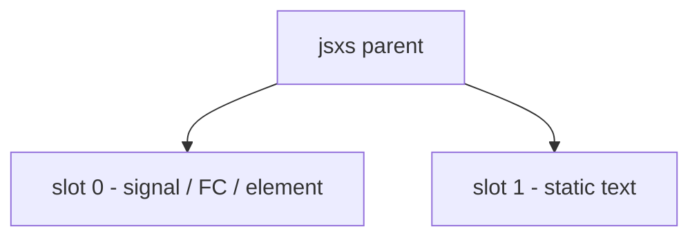
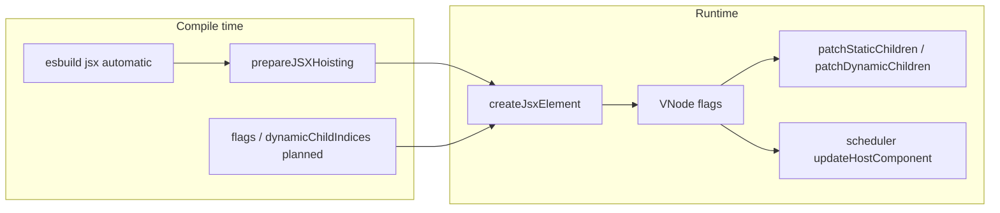
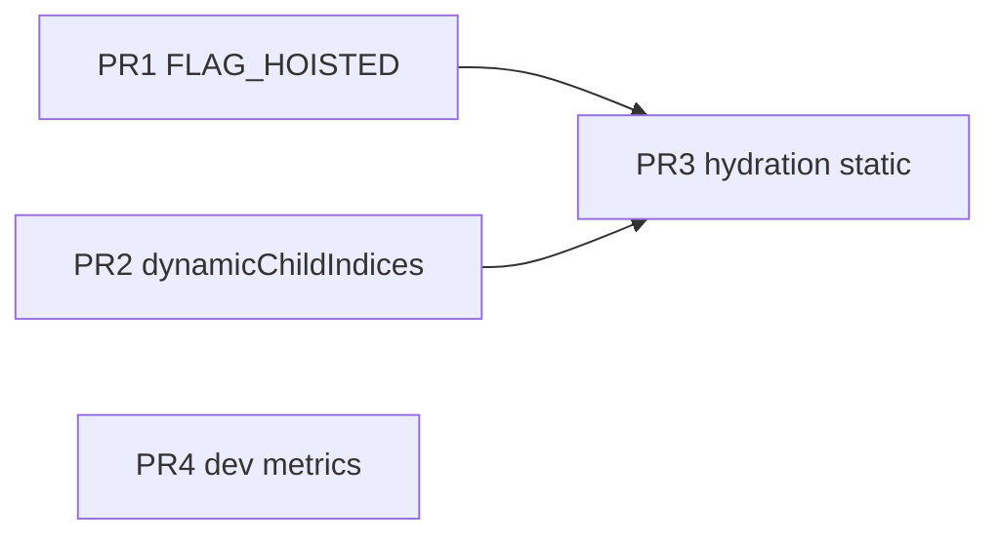
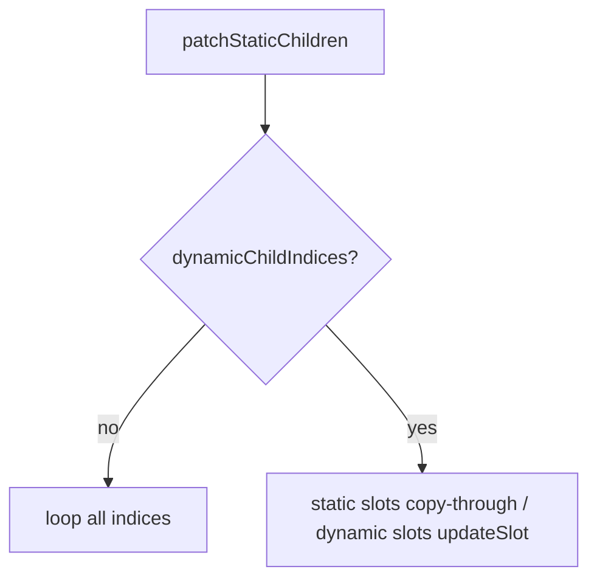

# Static children and JSX hoisting

End-to-end plan for Kiru’s **static children** optimization track: what `jsxs` promises, what is already shipped (phases 1–2D), what remains (phase 2E), and long-term research. Implementation lives in `packages/lib` and `packages/vite-plugin-kiru`.

---

## Core guarantee: what `jsxs` means

`jsxs` does **not** mean immutable values, hoistable subtrees, or “skip all work.” It means:

- Child **count** is fixed at the callsite
- Child **order** is fixed
- `props.children` is a **compiler-built array** (flat at the parent—no `false`, nested dynamic arrays, or string coercions on that parent)

It does **not** mean every slot is static. This remains valid:

```tsx
jsxs("div", {
  children: [
    jsx("span", { children: count() }),
    jsx("span", { children: "fixed" }),
  ],
})
```

Dynamic work happens **inside** slots; the parent only promises **topology**.



Runtime mapping:

| Factory | `FLAG_STATIC_CHILDREN` | Notes |
|---------|------------------------|--------|
| `jsx` | off | Single or dynamic child list |
| `jsxs` | on | Static child array; tagged in dev |
| `jsxDEV` | on when `isStaticChildren === true` | Dev automatic JSX from `kiru/jsx-dev-runtime` |

---

## Architecture overview



---

## Shipped work (phases 1–2D)

### Phase 1 — Runtime `jsxs` hint

| Piece | Location |
|-------|----------|
| `FLAG_STATIC_CHILDREN` on `Element` / `VNode` | `packages/lib/src/constants.ts`, `types.ts` |
| `jsx` / `jsxs` / `jsxDEV` → `createJsxElement` | `packages/lib/src/jsx.ts`, `element.ts` |
| `reconcileStaticChildrenArray` → **`patchStaticChildren`** | `packages/lib/src/reconciler.ts` |
| Static child array fast path in reconciler | `reconciler.ts` |

### Phase 2A — Reconciler (no compiler)

1. **`placeChild`** — early exit when static parent and `prev.index === newIndex`
2. **Sibling preserve** — do not clear `sibling` on reuse under `FLAG_STATIC_CHILDREN`
3. **Steady-state fast path** — `tryReconcileStaticChildrenInPlace` skips relink when all slots match
4. **FC updates** — under static parent, `FLAG_UPDATE` on function components only when `propsChanged`
5. **`updateSlot`** — index-only match for unkeyed static slots (skip key inequality when parent is static and keys are null)

Tests: `packages/lib/src/tests/unit/jsxStaticChildren.test.tsx`

### Phase 2B — Runtime tagging

- `$STATIC_CHILDREN_LIST` symbol on `jsxs` / static `jsxDEV` child arrays
- Dev: `assertStaticChildrenContract`, `parent.staticChildCount` length guard

### Phase 2C — Vite JSX hoisting (+ setup-scope instance hoist)

[`hoistJSX.ts`](../../packages/vite-plugin-kiru/src/codegen/hoistJSX.ts) with lexical scope in [`scope.ts`](../../packages/vite-plugin-kiru/src/codegen/scope.ts):

**Three hoist tiers:** module (`const $kN` at file scope), setup (`const $kN` before `return () =>` for Counter-style components), inline `regionElement` fallback. Event-handler arrows are hoistable when they only close over bindings allowed for that tier.

**Deferred slot reads:** When `experimental.staticHoisting` is on, the compiler may wrap a `jsxs` child expression in `() => (…)` if it contains a reactive signal **call** (e.g. `toggled() && <p>…</p>`) so the read happens in an `$INLINE_FN` child instead of the parent render. Manual `{() => …}` wrappers remain valid and are not double-wrapped. Signal identifiers passed as text bindings (e.g. `["Count: ", count]`) are not wrapped.

- Factories: `kiru/jsx-runtime` (`jsx`, `jsxs`), `kiru/jsx-dev-runtime` (`jsxDEV`) — resolved via import bindings (supports aliases; locals shadow imports)
- **Module hoistability:** JSX may lift to module `const $kN` when identifiers resolve to module-level bindings only (never setup/render locals or params). Module-scope **signal objects** in props (e.g. `bind:value={initialCount}` without `initialCount()`) are allowed; any **call** in the subtree stays dynamic. Siblings that remain dynamic are left inline (maximal hoisting).
- **`FLAG_HOISTED`:** Set on `element.meta.flags` when the hoisted subtree has no impure calls (signal identifiers are fine; `count()` is not).
- Legacy `createElement` / `Fragment` hoisting removed from the transform (jsx runtime only)
- Opt-in: `experimental.staticHoisting` in `vite-plugin-kiru`

Tests: `packages/vite-plugin-kiru/src/codegen/hoistJSX.test.ts`, `scope.test.ts`

### Phase 2D — Shape dispatch

`reconcileChildren` dispatches array children to monomorphic patchers:

- `patchStaticChildren` — former `reconcileStaticChildrenArray`; falls back to `patchDynamicChildren` on keyed reorder
- `patchDynamicChildren` — former `reconcileChildrenArray`
- `patchSingleChild` — single child slot

---

## Phase 2E (shipped)

**Status:** Runtime/compiler implementation and validation are complete. See **[phase-2e-status.md](./phase-2e-status.md)** for shipped evidence and verification runs.

Recommended PR order: **2E.1 → 2E.2 → 2E.3 → polish**. PR2 can start in parallel once `Element` metadata shape is fixed.



---

### 2E.1 — `FLAG_HOISTED` + skip descendant reconcile

**Problem:** [`updateVNode`](../../packages/lib/src/scheduler.ts) already returns early when `prev.props === props`, but [`updateHostComponent`](../../packages/lib/src/scheduler.ts) always calls `reconcileChildren` whenever a host update runs. Hoisting stabilizes `return $kN`, yet any host pass still walks the full static subtree.

**Goal:** Compiler-proven **fully static** hoisted roots skip child reconciliation when props are referentially unchanged.

#### Runtime

1. Add `FLAG_HOISTED = 1 << 5` in `constants.ts` (next bit after `FLAG_STATIC_DOM`).
2. Generalize `applyStaticChildrenFlag` → `applyElementFlags` — copy `FLAG_STATIC_CHILDREN` from `Element.flags`; copy `FLAG_HOISTED` and `dynamicIndices` from `element.meta` onto the vnode.
3. Early exit in **`updateHostComponent`** (before `reconcileChildren`):

```ts
if (
  (vNode.flags & FLAG_HOISTED) &&
  vNode.child &&
  vNode.prev &&
  vNode.prev.props === props
) {
  return vNode.child
}
```

4. Optional: reinforce in `patchStaticChildren` when in-place path succeeds.

**SSR / hydrate:** Skip applies on **updates** only; first mount and initial hydrate still reconcile once (2E.3 may narrow hydrate).

#### Compiler

Stricter than `isHoistableSubtree`: **`isFullyStaticHoistRoot(call)`**

- No scope identifiers (except module-level `staticHoistableIds`), signals, inline functions, or dynamic `jsxDEV` metadata
- Mark only the **root** hoisted binding (`const $kN = jsx/jsxs/jsxDEV(...)`), not every nested hoisted child inside another hoisted tree

After hoist emission:

```ts
const $k0 = jsxs("div", { /* … */ })
$k0.meta = { flags: 32 } // FLAG_HOISTED
```

#### Tests

- Plugin: pure hoisted tree gets flag assignment; tree with `{count()}` does not
- Runtime: FC re-render with stable hoisted return — no sibling relink / no spurious deletions

---

### 2E.2 — `dynamicChildIndices` (mixed static layouts)

**Problem:** `jsxs` fixes topology, not reactivity. A layout with one dynamic island still runs `updateSlot` for every index:

```tsx
jsxs("div", {
  children: [
    jsx("header", { children: "Title" }),
    jsx("main", { children: count() }),
  ],
})
```

#### Metadata

`element.meta.dynamicIndices` on hoisted roots; copied to **`VNode.dynamicChildIndices`** in `applyElementFlags`.

#### Compiler

When analyzing `props.children` of `jsxs` or `jsxDEV(..., true, …)`:

1. For each array element index `i`, mark **dynamic** if the AST is not hoistable/static (identifiers, calls, member access, non-literal `jsxDEV` args, etc.).
2. If all static → omit metadata (full `patchStaticChildren` loop).
3. If mixed → `$kN.meta = { dynamicIndices: [...] }` on hoisted roots, or `Object.assign(jsx(...), { meta: { dynamicIndices: [...] } })` inline.

Reuse ideas from `isStaticallyDerivedJSX` in `hoistJSX.ts` for list/map components.

#### Runtime — `patchStaticChildren`



- **Static indices:** reuse vnode when `updateSlot` returns same node and sibling chain matches; avoid `placeChild`
- **Dynamic indices:** existing `updateSlot` + `placeChild`
- **Fallback:** keyed reorder / length change → `patchDynamicChildren`

#### Tests

- Plugin: `dynamicChildIndices: [1]` for one dynamic child
- Runtime: signal update in slot 1 only; slot 0 sibling identity preserved

**Depends on:** 2C (done). **Combines with:** 2E.1 hoisted static chrome.

---

### 2E.3 — Hydration index-aligned walk

**Problem:** [`hydrateDom`](../../packages/lib/src/dom/nodes.ts) advances [`hydrationStack`](../../packages/lib/src/hydration.ts); hydrate still runs full `reconcileChildren` for hosts.

**Approach:**

1. In `updateHostComponent` when `renderMode === "hydrate"` and `FLAG_STATIC_CHILDREN`:
   - If child count matches `staticChildCount` / children array length and vnode chain aligns, walk slots by index and bump hydration stack per slot instead of full dynamic reconcile where types match.
2. Share logic with `tryReconcileStaticChildrenInPlace` or extract `reconcileHydratedStaticChildren`.
3. Audit alignment with [`headlessRender`](../../packages/lib/src/headlessRender.ts) and adjacent text-node splitting in `hydrateDom` (lines 75–88).

**Risk:** Signals inside static slots (e.g. `jsx("span", { children: count() })`) must still subscribe — skip **structure** work only.

#### Tests

- JSDOM: SSR HTML + hydrate `jsxs` root — no mismatch; correct DOM child count
- Regression: keyed static reorder still falls back to dynamic patch

---

### 2E.4 — Optional polish

| Item | Where | Purpose |
|------|-------|---------|
| Dev fast-path counters | `__DEV__` in `patchStaticChildren` / `tryReconcileStaticChildrenInPlace` | Measure static vs fallback |
| CI hygiene | Commit `hoistJSX.test.ts` | Lock 2C behavior |
| Slot kind metadata | Compiler → narrower `updateSlot` | Marginal; after 2E.2 |

---

## Callable signals prerequisite (hoist purity)

Phase 2E **`FLAG_HOISTED`** requires the compiler to treat **any non-static call** inside a hoist candidate as impure. After the callable signal API:

| Pattern in source | Compile-time | Hoist / `FLAG_HOISTED` |
|-------------------|--------------|-------------------------|
| `children: count` (signal object) | `signalBindings` → dynamic slot / `dynamicChildIndices` | Not fully static |
| `children: count()` | `isReactiveSignalRead` | No `FLAG_HOISTED` on that subtree |
| `children: count.peek()` | Non-tracking member call | Allowed in fully static hoists |
| `children: formatTitle()` | Any other call | No `FLAG_HOISTED` (same rule as `count()`) |

Implementation: per-file scope registry (`moduleSignal` vs `setupConst`) in `prepareJSXHoisting`, with `isImportedCall` for `signal` / `computed` factories (no hardcoded callee names). Tests in `hoistJSX.test.ts` and `scope.test.ts`.

---

## Phase 3 — DOM templates (shipped) + structural holes

| Piece | Location |
|-------|----------|
| `_template(html, holeCount?)`, `createHoledTemplate` | `packages/lib/src/template.ts` |
| Static HTML emission (aligned with `headlessRender`) | `packages/lib/src/utils/staticHtml.ts` (`kiru/utils`) |
| Partial shell + `<!--#-->` markers | `packages/vite-plugin-kiru/src/codegen/templateHTML.ts` |
| Hole mount / update | `reconcileTemplateHoles` in `packages/lib/src/reconciler.ts` |

**Fully static** subtrees use `_template(html)` (zero holes), which returns a `TemplateRoot` descriptor `{ html, holeCount }` used directly (e.g. `mount($t0)` — no call). **Mixed shells** use one template with comment anchors; dynamic children mount via `createHoledTemplate($tN, […])` at reconcile time. Nested static markup in composed shells inlines via `` _template(`…${$t0.html}…`, n) ``. Attribute dynamics (`bind:`, `className={signal}`) on the template root stay on hoisted `jsx` or prop patches — not DOM holes.

**Codegen pipeline:** [`applyJsxHoistAndTemplates`](../../packages/vite-plugin-kiru/src/codegen/jsxHoistPipeline.ts) parses each module once (`parseAst` with `allowReturnOutsideFunction: true`), runs three read-only analysis passes on that AST and the original source string, merges a [`CodegenPlan`](../../packages/vite-plugin-kiru/src/codegen/codegenPlan.ts), then applies every edit through a single `MagicString` instance. Analysis order is defer slot reads → template bindings → JSX hoisting (hoist skips nodes absorbed by the template plan). Apply order is `prepend` (template import) first, then all `replace` edits from highest `start` to lowest so spans stay valid, then `appendLeft` / `appendRight` by descending position. Hole payloads and hoist expressions use `sliceNode`, which can apply a virtual defer wrap without re-parsing between phases.

**Pipeline order (semantics):** template shells are chosen before module/setup hoists run on the remaining static `jsxDEV` subtrees.

**Shell selection (serialize-first maximal):** [`prepareJSXTemplates.ts`](../../packages/vite-plugin-kiru/src/codegen/prepareJSXTemplates.ts) calls `serializeJsxCallToTemplate` on every shell-eligible call, then applies [`filterOutermostShellCalls`](../../packages/vite-plugin-kiru/src/codegen/templateHTML.ts) only to calls that **successfully** serialized. A parent that fails (e.g. cannot lower) no longer suppresses templatable children (layout `h1`).

**Layout-style shells:** When the outer `div` serializes, static markup (e.g. `<h1>…</h1>`) is inlined in the template HTML; outlet params (`{children}`) and mixed text arrays (`["Items: ", props.items]`) become holes or stay as `jsx`/`createHoledTemplate` children. Nested render functions (`fnDepth >= 2`) reject holed shells with no static text so signal render trees (e.g. Counter) stay on `jsxDEV`. Template analysis uses the same function/param scope walk as hoisting ([`buildProgramBindingResolve`](../../packages/vite-plugin-kiru/src/codegen/scopeWalk.ts)).

**Region holes:** Two or more contiguous sibling `jsx` calls under one host child list (e.g. several static `<Link />` items in `<nav>`) compile to a **single** `<!--#-->` and one hole whose value is an array. The hoist pass then lifts that array to module scope (e.g. `const $k0 = tagStaticChildrenList([jsxDEV(Link, …), …])`) so `Layout` does not recreate link elements every render. Per-link `$kN` hoists inside a region are suppressed. Region grouping is **not** applied when: mixed text + binding arrays, static literals between dynamics, a single child (partial shells like outlet `{children}`), or a mix of fully inlined static host nodes and separate dynamic holes in the same array.

**Layout target shape:** `_template(shellHtml, 2)` with `<nav>…<!--#-->…</nav>` and outlet `div` in HTML; `return createHoledTemplate($t0, [$k0, children])` where `$k0` is the hoisted nav link list.

**Template-hole hoist tiers:** For `createHoledTemplate($tN, [ … ])` hole payloads, the JSX hoist pass may lift the hole *value expression* to one of three tiers:

- **Module**: static component calls (`jsx(Toggler, …)`) and conditional holes whose expression only reads module-scoped bindings (e.g. `count() % 2 === 0 && <p>…</p>`).
- **Setup**: conditional holes inside `return () => …` render closures when they only read setup-scoped bindings (e.g. `toggled() && <Counter />`), not render-local bindings.
- **Render**: everything else stays in the hole payload array evaluated inside the render function.

Conditional hole payloads are preserved as **lazy** expressions (`() => …`) so signal reads happen at the correct mount/update boundary rather than at component initialization time.

SSR writes the same HTML string (markers included); client hydrate locates `<!--#-->` anchors. Hoisted region arrays tagged with `tagStaticChildrenList` use `FLAG_STATIC_CHILDREN` at the template hole fragment for fast list reconciliation.

**Still research:** compile-to-imperative DOM (Solid full pipeline), `normalizeChildren` for dynamic `jsx` only.

---

## What `jsxs` alone does **not** enable

- Skipping work inside dynamic slots (signals, FC renders, inline functions)
- Hoisting without compiler proof of zero dynamic scope
- Skipping hydration or DOM creation on first mount
- Template-clone rendering

---

## Acceptance criteria (phase 2E complete)

- Pure hoisted UI: no per-update reconcile traversal on hoisted host when props are reference-stable.
- Mixed `jsxs` layouts: only `dynamicChildIndices` slots run full `updateSlot` / placement.
- SSR hydrate: static `jsxs` trees hydrate without unnecessary full dynamic reconcile when shape matches.
- **No public API breakage:** `jsx` / `jsxs` signatures unchanged; metadata is compile-injected on `Element`.

---

## Explicit non-goals

- `normalizeChildren` for dynamic `jsx`
- Template-clone rendering implementation
- Deprecations or React compatibility aliases

---

## Implementation checklist (tracking)

See **[phase-2e-status.md](./phase-2e-status.md)** for the authoritative PR matrix. Short version:

| ID | Status |
|----|--------|
| pr1–pr3 (core code) | Landed in repo |
| Setup-scope instance hoist | Shipped — see [PHILOSOPHY](./PHILOSOPHY.md) JSX hoist tiers |
| pr4-polish | Optional |

Phases **1, 2A, 2B, 2C, 2D, 2E** and **setup-scope hoist** are shipped.

---

## Further reading (optimization map)

The original phase-2 reference grouped techniques as follows; numbers match that internal roadmap:

| # | Technique | Kiru status |
|---|-----------|-------------|
| 1 | Cache normalized child arrays | N/A at parent for `jsxs`; 2B tags array |
| 2 | Reuse child vnodes | 2A shipped |
| 3 | Skip keyed reconciliation | 2A index-only static slots |
| 4 | Skip sibling relinking | 2A shipped |
| 5 | Skip DOM placement checks | 2A `placeChild` early exit |
| 6 | Hoist static subtrees | 2C shipped |
| 7 | Skip recursive diff (hoisted) | **2E.1 shipped** ([status](./phase-2e-status.md)) |
| 8 | DOM templates / `cloneNode` | **Phase 3 shipped** (`kiru/template`, `prepareJSXTemplates`) |
| 9 | Dynamic slot mask | **2E.2 shipped** ([status](./phase-2e-status.md)) |
| 10 | Shape-based patch dispatch | **2D shipped** |
| 11 | Better hydration | **2E.3 partial** ([status](./phase-2e-status.md)) |
| 12 | Compile-to-DOM | Research |
