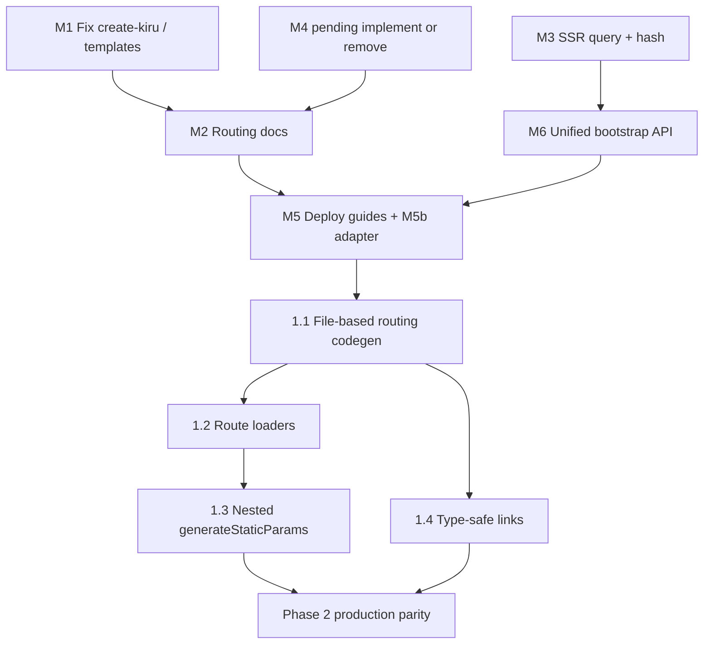

# Kiru router adoption plan

Roadmap focused on changes most likely to increase adoption and items that block serious evaluation against Next.js, SvelteKit, and SolidStart.

**Scope:** `kiru/router`, `kiru/ssr/router`, `vite-plugin-kiru`, `create-kiru`, and public docs—not core renderer/signals work unless it unblocks routing.

**Success criteria (12 months):**

- A new team can ship CSR, SSG, or SSR from templates without reading framework internals.
- Hybrid static + SSR deploys to at least one serverless target with a documented recipe.
- Migrators from file-based routers recognize familiar patterns (routes on disk, data before render, typed navigation).

---

## Must-haves (do before positioning as a Next/SvelteKit alternative)

These are adoption blockers or trust breakers if left open.

| #   | Item                                      | Outcome                                                                                                                                                                                                               | Notes                                                                                            |
| --- | ----------------------------------------- | --------------------------------------------------------------------------------------------------------------------------------------------------------------------------------------------------------------------- | ------------------------------------------------------------------------------------------------ |
| M1  | **Fix onboarding truth**                  | `create-kiru` SSR template and README describe Hono + `createRenderer`, not Vike. Templates match e2e/sandbox patterns.                                                                                               | Low effort; high first-impression impact.                                                        |
| M2  | **Routing docs on kirujs.dev**            | Single “Routing” section: mode matrix (CSR / SSG / SSR / hybrid), `defineRouteTree` API, guards, head/SEO, hydration (`bootstrapSsrClient` vs `RouterView`), remote actions, hybrid `prerenderedHtmlDir` dev vs prod. | Competes on docs, not features alone.                                                            |
| M3  | **SSR query + hash parity**               | `createRenderer` passes URL `search` and `hash` into `createStaticRouter`; hydrated client matches server HTML for pages that read `router.query` / `router.hash`.                                                    | Today `buildAppElement` hardcodes `query: {}`, `hash: ""`.                                       |
| M4  | **`pending` routes: implement or remove** | Either show scope/route `pending` UI during navigation (CSR + streaming SSR) or delete from types/manifest until ready.                                                                                               | API surface must not lie.                                                                        |
| M5  | **One deployment guide per mode**         | Documented, CI-tested paths: static host (SSG), Node server (SSR), hybrid (SSG build + `createRenderer` + static assets).                                                                                             | No code in repo today mentions Vercel/CF/Netlify—pick **one** serverless adapter for SSR in M5b. |
| M5b | **Reference serverless adapter**          | Example: Cloudflare Workers or Vercel Edge using `createRenderer({ stream: true })` + asset binding.                                                                                                                  | Unblocks “where do I deploy?”                                                                    |
| M6  | **Unified client bootstrap API**          | `createKiruApp({ mode, routes, container })` wrapping CSR mount vs `bootstrapSsrClient` / `bootstrapSsgClient`; deprecate foot-gun of hydrating with `RouterView` alone.                                              | Reduces support burden; document in M2.                                                          |

---

## Phase 1 — Migration ergonomics (highest adoption ROI)

What evaluators ask for in week one of a spike.

### 1.1 File-based routing (optional, codegen)

**Goal:** `src/routes/**` (or `src/pages/**`) compiles to today’s `defineRouteTree` output—no runtime behavior change.

**Deliverables:**

- Vite plugin scans a user-defined `dir` with **per-role glob patterns** (e.g. `page: "page.{tsx,mdx}"`, `layout: "layout.tsx"`, `notFound: "not-found.tsx"`) — no fixed SvelteKit/Next preset enum.
- Folder segments map to URL paths using existing syntax: `[param]`, `[[optional]]`, `[...rest]`.
- `generateStaticParams` / `load` / `head` via named exports from the page module or an optional `config` glob sidecar.
- SSG flag: `export const prerender = true` (maps to `static: true` in codegen — **`export const static` is invalid** as a JS identifier). Config sidecars may use `export default { static: true, ... }` (object property key is fine).
- Generated `src/routes.gen.ts` (gitignored or committed—document tradeoff).
- Manual `routes.ts` remains supported for small apps and tests.

**Why:** Manual `routes.ts` does not scale; file-based routing is the default mental model for Next/SvelteKit/SolidStart.

### 1.2 Route loaders (`load`)

**Goal:** First-class async data tied to a route, with SSR serialization and CSR reuse.

**Proposed API (sketch):**

```ts
r.page("/users/[id]", {
  component: () => import("./user"),
  load: async ({ params, context, url }) => ({
    user: await fetchUser(params.id, context),
  }),
})
```

**Deliverables:**

- `load` runs on SSR before render and on CSR navigation before route commit (parallel to `beforeActivate` where appropriate).
- Serialized payload embedded in HTML (non-streaming) and in stream bootstrap (streaming)—same contract as `CustomRequestContext`.
- `useRouteData<T>()` (or props injection into page default export) for typed access.
- Document pattern for “no loaders, use `resource()` only” for advanced users.

**Why:** Without loaders, every migrator re-invents data fetching; comparisons to SvelteKit `load` / Remix fail immediately.

### 1.3 Nested `generateStaticParams`

**Goal:** Child static routes receive parent param values in `GenerateStaticParamsContext.params`.

**Deliverables:**

- `generateStaticPaths` walks the route tree and composes param sets for nested dynamic static segments.
- Tests mirroring Next-style `/posts/[slug]/comments/[id]`.
- Docs + e2e SSG case.

**Why:** Required for real static sites with hierarchical URLs.

### 1.4 Type-safe navigation

**Goal:** Compile-time valid paths and params from the route manifest.

**Deliverables:**

- `compileRouteTree` emits a `RoutePaths` / `RouteParams` helper type (or codegen from file-based routes).
- `Link to={...}` overloads or `href()` function accepting only valid routes + params.
- Optional: `navigate()` typed overload on `Router`.

**Why:** SvelteKit’s typed `route()` is a retention feature; reduces broken links in large apps.

---

## Phase 2 — Production parity (needed for “we shipped it” stories)

Not required for first spike, required for teams replacing an existing meta-framework.

| Item                                     | Outcome                                                                                                                                    |
| ---------------------------------------- | ------------------------------------------------------------------------------------------------------------------------------------------ |
| **Server middleware convention**         | Document + types for `createRenderer` wrapper: auth, redirects, `setHeaders`, request ID. Optional `hooks.server.ts` pattern in templates. |
| **`formAction` progressive enhancement** | Forms work without JS; document + e2e.                                                                                                     |
| **Trailing slash / base path policy**    | Config on router + static path generation; hosting docs (e.g. Cloudflare Pages trailing slash).                                            |
| **Sitemap + robots from static paths**   | Vite plugin hook: `generateStaticPaths` → `sitemap.xml` (and optional `robots.txt`).                                                       |
| **JSON-LD / structured data**            | Extend `RouteHeadMeta` or `<Head>` helper for `application/ld+json`.                                                                       |
| **Security defaults for remote actions** | CSRF/origin docs, env-based `secret`, template `.env.example`.                                                                             |
| **`@kiru/testing` router helpers**       | `renderRoute(path)`, `navigate`, assert `document.head`—extract patterns from `router.test.tsx`.                                           |

---

## Phase 3 — Differentiation (after Phase 1–2 traction)

Defer until evaluators convert to production pilots.

- ISR / on-demand revalidation for `static` routes.
- Incremental SSG (changed paths only).
- Partial prerender / islands.
- Image pipeline (`<KiruImage>` or vite plugin).
- i18n routing (`/[locale]/...`).
- Parallel / intercepted routes (Next App Router advanced).

---

## Explicit non-goals (for this plan)

- Replacing Vite or Hono—stay BYO server with great recipes.
- Feature parity with Next App Router (RSC, PPR, etc.) in Phase 1–2.
- File-based routing as the **only** API—codegen must remain optional.

---

## Recommended execution order



**Suggested milestones:**

| Milestone          | Contents       | Audience unlock                               |
| ------------------ | -------------- | --------------------------------------------- |
| **v0.1 “Trust”**   | M1, M2, M4, M3 | Honest eval; SSR apps with search params work |
| **v0.2 “Deploy”**  | M5, M5b, M6    | Ship to staging                               |
| **v0.3 “Migrate”** | 1.1, 1.2, 1.3  | Teams port existing apps                      |
| **v0.4 “Scale”**   | 1.4, Phase 2   | Production hardening                          |

---

## Open decisions (resolve before implementation)

1. **File-based discovery:** `fileRoutes.dir` + `fileRoutes.files` globs (resolved)—document sensible defaults and README presets only.
2. **Loader serialization:** JSON in `<script type="application/json">` vs stream chunks—must match streaming SSR story.
3. **First serverless target:** Cloudflare Workers vs Vercel vs Netlify—choose by team hosting preference and existing plugin cache.
4. **`pending`:** Ship minimal suspense boundary around `loadRouteTree` or remove from public API until Suspense story is clear.

---

## Tracking

Create GitHub issues/epics per row (M1–M6, 1.1–1.4, Phase 2 items). Link PRs to this doc. Revisit Phase 3 quarterly based on issue demand and competitor moves.

_Derived from router/SSG/CSR/SSR API analysis, May 2026._
