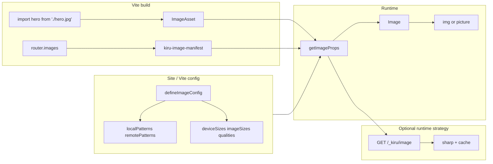

# Image — Next-style image pipeline

Guide for Kiru’s [`Image`](../../packages/lib/src/components/Image.tsx) component and [`kiru/image`](../../packages/lib/src/image/) module. Behavior aligns with [Next.js 16 `next/image`](https://nextjs.org/docs/app/api-reference/components/image) where practical. Kiru stays Vite-first and bring-your-own-server; parity is **behavioral**, not API-identical (`Image`, not `next/image`).

**Status:** Phases 1–4 implemented — `getImageProps`, `Image`, `defineImageConfig`, Vite `router.images` (build-time variants + manifest), runtime `createImageOptimizer` / `createImageOptimizerIfRuntime`, SSR preload registry, AVIF negotiation, and art-direction helper. See [checklist](#implementation-checklist) and [testing matrix](#testing-matrix).

## Quick start

```tsx
import { Image } from "kiru"

<Image
  src="/hero.jpg"
  alt="Hero"
  width={800}
  height={400}
  sizes="100vw"
  priority
/>
```

```ts
import { defineImageConfig } from "kiru/image"
import { createImageOptimizerIfRuntime } from "kiru/router"
import sharp from "sharp"

// Pick one strategy for the whole app (see below).
defineImageConfig({
  strategy: "build", // or "runtime" | use unoptimized: true
  path: "/_kiru/image",
  formats: ["image/avif", "image/webp"],
})

const handler = createImageOptimizerIfRuntime({
  root: clientDir,
  config: imageConfig,
  sharp,
})
if (handler) {
  app.get(imageConfig.path, (c) => handler(c.req.raw).then(/* … */))
}
```

**Vite (CSR / SSG / SSR with build strategy):**

```ts
kiru({
  router: {
    images: {
      optimize: true,
      formats: ["webp"],
      config: { strategy: "build" },
    },
  },
})
```

---

## App modes (CSR, SSR, SSG)

**The same `Image` / `getImageProps` API works in all three modes.** What differs is where HTML is produced and whether a runtime optimizer exists.

| Capability | CSR (`kiru/router/csr`) | SSR (`createRenderer` + server) | SSG (`prerenderStaticRoutes` + static host) |
|------------|-------------------------|----------------------------------|---------------------------------------------|
| `Image` / `getImageProps` (dimensions, `srcset`, `sizes`, lazy, fill, blur placeholder) | Client render | Server render + client hydrate (same markup) | HTML at build time; hydrate via `bootstrapSsgClient` |
| Vite static `import hero from './x.jpg'` → `ImageAsset` | Yes | Yes | Yes |
| **Build-time variants** (`strategy: 'build'`) | **Primary** (no server) | Optional (static marketing assets) | **Primary** on CDN |
| **Runtime** `/_kiru/image` (`strategy: 'runtime'`) | Optional (needs API/edge) | **Primary** for dynamic SSR | Optional for hybrid |
| `unoptimized` / custom `loader` | Escape hatch | Escape hatch | Escape hatch |
| `priority` → `<link rel="preload" as="image">` | Manual `head` on shell, or SSR/SSG preload registry | Yes — route `head` / SSR document assembly | Yes — prerendered HTML |
| `onLoad` / `onError` | Yes | Yes | Yes |

**Design rules:**

1. **`getImageProps` is isomorphic** — same `src` / `srcset` / `sizes` for the same props + config in CSR, SSR, and SSG.
2. **`defineImageConfig` is shared** — virtual `virtual:kiru:image-config` (client/build) and the same object on the server when using the runtime optimizer.
3. **Pick one optimization strategy per app** (not per component):
   - **`strategy: 'build'`** — Vite emits width/format variants under `/assets/…`; default loader points `srcset` at static URLs. No request-time sharp.
   - **`strategy: 'runtime'`** — `srcset` uses `/_kiru/image?url=…&w=…`; mount **`createImageOptimizerIfRuntime`** (returns `null` for other strategies).
   - **`unoptimized: true`** (or per-image `unoptimized`) — passthrough / DPR-only srcset; or supply a custom `loader` (imgix, Cloudflare Images, etc.).
4. **Do not ship runtime-only optimizer URLs in HTML served from a CDN with no handler** — use `strategy: 'build'` (or external `loader`) for pure SSG/CSR.

**E2E coverage:**

| Suite | Strategy | Focus |
|-------|----------|--------|
| `e2e/csr` | `build` (`router.images`) | Client render + build-time srcset (`cypress/e2e/image.cy.ts`) |
| `e2e/ssg` | `build` | Prerendered HTML + `kiru-image-manifest.json` |
| `e2e/ssr` | `runtime` (default); `KIRU_IMAGE_STRATEGY=build` for build mode | Optimizer, AVIF, `priority` preload (`tier3-wave1` Assets) |

---

## Next.js behaviors mirrored

| Next.js 16 behavior | Kiru |
|---------------------|------|
| **Without `sizes`**: DPR srcset (`1x`, `2x`) for fixed-size images | `getImageProps` / `Image` |
| **With `sizes`**: width srcset from `deviceSizes` + `imageSizes` | Implemented |
| `priority` | Eager load, `fetchPriority="high"`, and `<link rel="preload" as="image">` on SSR/SSG |
| Custom **`loader({ src, width, quality })`** | Prop + default loader per strategy |
| **`unoptimized`** | Bypass optimizer; auto for `.svg` |
| **`overrideSrc`** | Different `src` attr vs srcset URLs |
| **`getImageProps()`** | `kiru/image` — for `<picture>`, art direction, CSS |
| **`qualities` allowlist** | Optimizer validates `q`; snap to nearest allowed |
| **`localPatterns` / `remotePatterns`** | Pathname + optional `search` constraints |
| Static import: dimensions + `blurDataURL` | Vite `?kiru-img` + sharp at build |
| `placeholder`: `empty` \| `blur` \| `data:…` | Supported |
| `fill` + parent `position: relative` | Wrapper + `style.objectFit` on img |
| `onLoad` / `onError` | Pass through on `` |
| Optimizer path default `/_next/image` | Default `/_kiru/image`; configurable via `defineImageConfig({ path })` |

---

## Target architecture



| Layer | Location | Export |
|-------|----------|--------|
| Types + `getImageProps` | `packages/lib/src/image/` | `kiru/image` |
| Component | `packages/lib/src/components/Image.tsx` | `kiru` |
| Strategy helpers | `packages/lib/src/image/strategy.ts` | `usesRuntimeImageOptimizer`, `usesBuildImageStrategy` |
| Optimizer handler | `packages/lib/src/router/imageOptimizer.ts` | `createImageOptimizer`, `createImageOptimizerIfRuntime` |
| Vite static imports + variants | `packages/vite-plugin-kiru/src/image/` | `router.images` → `ImagePluginOptions` |

---

## Site-level config — `defineImageConfig`

Equivalent to `next.config.js` `images`. Import in app code and pass the same object to the Vite plugin (`router.images.config`) and the server optimizer.

```ts
defineImageConfig({
  /** 'build' = emit variants at vite build. 'runtime' = /_kiru/image on SSR. */
  strategy: "build",
  path: "/_kiru/image",
  deviceSizes: [640, 750, 828, 1080, 1200, 1920, 2048, 3840],
  imageSizes: [32, 48, 64, 96, 128, 256, 384],
  qualities: [75],
  formats: ["image/avif", "image/webp"],
  localPatterns: [{ pathname: "/assets/**" }],
  remotePatterns: [],
  minimumCacheTTL: 14_400,
  maximumRedirects: 3,
  maximumResponseBody: 50_000_000,
  unoptimized: false,
  dangerouslyAllowSVG: false,
  contentSecurityPolicy: "default-src 'self'; script-src 'none'; sandbox;",
})
```

Client/build: virtual module `virtual:kiru:image-config` (injected via `#kiru-image-manifest` script + `bootstrapImagePipeline`). Server: import the same config when mounting the optimizer.

### Build-time vs runtime optimization

| | Build-time (`strategy: 'build'`) | Runtime (`strategy: 'runtime'`) |
|--|----------------------------------|--------------------------------|
| **When** | `vite build` | Each `GET /_kiru/image` |
| **Best for** | Pure CSR, pure SSG on CDN, **Cloudflare Workers** | SSR, hybrid on **Node/Bun** |
| **Output** | Files in `dist/assets/` + `kiru-image-manifest.json` | Cached bytes (memory/disk) |
| **srcset** | Static `/assets/hero-640w.webp` URLs | Optimizer query URLs |
| **sharp** | vite-plugin-kiru (build) | `createImageOptimizer` (optional peer on server) |
| **Server mount** | None | `createImageOptimizerIfRuntime` only |

SSR apps can use **`strategy: 'build'`** for static assets (enable `router.images` in Vite, do not mount the optimizer) and **`runtime`** for user uploads via `remotePatterns` — typically two configs or one strategy per deployment; wave 1 uses one `defineImageConfig` per app.

**SSR e2e toggle:** `KIRU_IMAGE_STRATEGY=build` sets `defineImageConfig({ strategy: 'build' })` and enables `router.images` in [`e2e/ssr/vite.config.ts`](../../e2e/ssr/vite.config.ts); default is `runtime` with optimizer via [`@kirujs/adapter-node`](../../packages/adapter-node) in [`e2e/ssr/src/server.ts`](../../e2e/ssr/src/server.ts).

**Edge:** use `strategy: 'build'` only — runtime `sharp` optimizer is not supported on Workers. See [deploy-runtimes.md](./deploy-runtimes.md).

---

## `getImageProps` (`kiru/image`)

Headless API used by `Image` and for custom markup.

- Resolves `ImageAsset` → intrinsic dimensions
- **Srcset:** `unoptimized` / `.svg` → single `src`; no `sizes` → DPR `1x`/`2x`; with `sizes` → width srcset from `deviceSizes ∪ imageSizes` (capped, deduped)
- **`src`:** largest reasonable default; respects `overrideSrc`
- **`preloadLink`:** when `priority: true`, metadata for SSR/SSG `<head>` via `registerImagePreload`
- SSR-safe (no component state)

---

## `Image` component (`kiru`)

Thin wrapper: `getImageProps` + optional blur layer + fill wrapper. **Do not** pass user `srcSet`.

| Prop | Notes |
|------|--------|
| `src` | `string \| ImageAsset` |
| `alt` | Required |
| `width` / `height` | Required unless `ImageAsset` or `fill` |
| `fill` | Parent should be `position: relative`; img absolutely positioned |
| `sizes` | Toggles width-based srcset |
| `quality` | Snapped to config `qualities` allowlist |
| `loader` | Custom URL builder |
| `unoptimized` | Skip optimization; auto for `.svg` |
| `overrideSrc` | Different `src` attr vs srcset URLs |
| `placeholder` | `empty` (default) \| `blur` \| `data:image/...` |
| `blurDataURL` | With `placeholder="blur"`; from static import when available |
| `priority` | LCP: eager + high fetch priority + SSR/SSG head preload |
| `loading` / `decoding` | Defaults `lazy` / `async` |
| `style` / `class` | Including `objectFit` for `fill` |
| `onLoad` / `onError` | Native img callbacks |

---

## Runtime optimizer

### `createImageOptimizerIfRuntime({ config, root, cacheDir?, sharp? })`

Returns a request handler **only** when `defineImageConfig({ strategy: 'runtime' })` and not `unoptimized`. Returns `null` for `build` / `unoptimized` — use Vite `router.images` instead.

### `createImageOptimizer({ … })`

Always returns a handler (use when you manage strategy yourself). Request: `GET {config.path}?url=…&w=…&q=…`

1. Validate `url` against **`localPatterns`** or **`remotePatterns`**
2. Reject unknown quality → **400**
3. Fetch local or remote (no forwarded client `Authorization` / cookies)
4. Enforce **`maximumResponseBody`**, **`maximumRedirects`**
5. **sharp** resize `fit: inside` without enlarging; format from `Accept` + `formats`
6. Cache + `Cache-Control` from **`minimumCacheTTL`**
7. **SVG:** reject unless `dangerouslyAllowSVG`

Mount on the server **before** static files and the renderer (see [`e2e/ssr/src/server.ts`](../../e2e/ssr/src/server.ts)).

Default runtime loader:

```ts
({ src, width, quality }) =>
  `${config.path}?url=${encodeURIComponent(src)}&w=${width}&q=${quality}`
```

---

## Vite build pipeline (`router.images`)

- Transform static `import x from '*.jpg|png|webp|avif'` → `?kiru-img` → `ImageAsset`
- **`blurDataURL`:** ~8px-wide JPEG LQIP at build (see `packages/vite-plugin-kiru/src/image/constants.ts`)
- When `optimize: true` / `strategy: 'build'`: emit resized variants, `kiru-image-manifest.json`, bootstrap script `#kiru-image-manifest`
- SSG prerender rehydrates manifest from `kiru-image-assets.json` sidecar
- Options type: `ImagePluginOptions` in `vite-plugin-kiru`

---

## Advanced

### Format negotiation

`formats: ['image/avif', 'image/webp']` — `Accept` header order; separate cache per format.

### `priority` + document head

`registerImagePreload` during SSR; merged into route `head.links`. Use `priority` only for true LCP heroes.

### Art direction

`buildArtDirectionPictureHtml()` — two `getImageProps()` calls + `<picture>` with `<source media>`; no `sources[]` prop on `Image`.

---

## API surface

| Export | Symbols |
|--------|---------|
| `kiru/image` | `getImageProps`, `defineImageConfig`, `ImageAsset`, `ImageConfig`, `ImageLoader`, loaders, `buildArtDirectionPictureHtml`, `usesRuntimeImageOptimizer`, `usesBuildImageStrategy`, preload helpers |
| `kiru` | `Image`, `ImageProps` |
| `kiru/router` | `createImageOptimizer`, `createImageOptimizerIfRuntime` |

---

## Implementation checklist

- [x] `packages/lib/src/image/` + `kiru/image` export + unit tests
- [x] `Image` + dual srcset + props (`priority`, `unoptimized`, `loader`, `overrideSrc`, `placeholder`, `fill`)
- [x] `defineImageConfig` + `virtual:kiru:image-config` + manifest bootstrap
- [x] `createImageOptimizer` + `createImageOptimizerIfRuntime` + configurable SSR strategy
- [x] Vite `router.images` plugin (variants in `generateBundle`, manifest, LQIP)
- [x] CSR / SSG / SSR e2e (`image.cy.ts`, `tier3-wave1` Assets)
- [x] Preload head collector (`preloadRegistry` + renderer merge)
- [x] Art-direction helper + unit test

---

## Testing matrix

| Area | Location |
|------|----------|
| `getImageProps` DPR vs width modes | `packages/lib/src/tests/unit/image.test.ts` |
| Preload / `priority` | `packages/lib/src/tests/unit/imagePreload.test.ts` |
| Strategy helpers | `packages/lib/src/tests/unit/imageStrategy.test.ts` |
| Art direction | `packages/lib/src/tests/unit/artDirection.test.ts` |
| Vite image processing | `packages/vite-plugin-kiru/src/image/processImage.test.ts` |
| E2E CSR | `e2e/csr/cypress/e2e/image.cy.ts` |
| E2E SSG | `e2e/ssg/cypress/e2e/image.cy.ts` |
| E2E SSR | `e2e/ssr/cypress/e2e/tier3-wave1.cy.ts` (Assets) |

---

## Non-goals

- Full `next.config.js` parity (`dangerouslyAllowLocalIP`, custom cache handler hooks)
- Open Graph image route (see [tier-3-differentiation.md](../router-roadmap/tier-3-differentiation.md))
- Built-in CDN adapters (use custom `loader`)
- RSC / `"use client"` serialization
- `sources[]` prop on `Image` (use `getImageProps` + `<picture>`)

---

## Risk notes

- **Breaking change:** adding `sizes` switches from DPR to width srcset (matches Next).
- **Config drift:** server optimizer and client `getImageProps` must share the same `defineImageConfig`.
- **sharp:** optional peer; required for optimizer and Vite variant tests in CI.
- **SSG/CSR on CDN:** use `strategy: 'build'` so srcset targets pre-generated assets.
