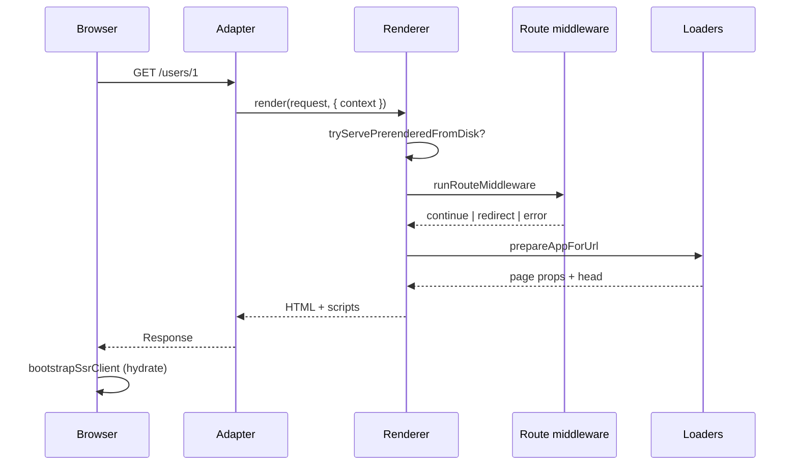

# Architecture — mental model

Kiru v2 treats routing as a **compiled manifest** plus **environment-specific runtimes** (CSR router, SSR renderer, SSG prerender). One `routes.ts` file drives all modes.

## Layered stack

```
┌─────────────────────────────────────────────────────────────┐
│  App: routes.ts (createRouteTree) + pages + site.config    │
└───────────────────────────┬─────────────────────────────────┘
                            │ compileRouteTree
┌───────────────────────────▼─────────────────────────────────┐
│  RouteManifest — flat routes, scopes, meta, static flags   │
└─────────┬───────────────────────┬─────────────────────────┘
          │                       │
   CSR    │ createRouter          │ createRenderer / prerenderStaticRoutes
          │ navigation.ts         │ renderer.ts, ssg.ts
          ▼                       ▼
┌─────────────────┐     ┌─────────────────────────────────────┐
│ Browser history │     │ Server: adapters (Node/Bun/CF)       │
│ hydrate (ssg/   │     │ Response | null, static assets, ISR  │
│ ssr bootstrap)  │     └─────────────────────────────────────┘
└─────────────────┘
```

## Single navigation pipeline (CSR)

Client navigations funnel through `packages/lib/src/router/navigation.ts`:

1. Match URL → `matchRoute(manifest, pathname, pathPolicy)`
2. **Context gate** — `resolveContext` if scope requires (`contextGate.ts`, `contextResolve.ts`)
3. **Route middleware** — global + per-scope/page chain (`runRouteMiddleware`)
4. Commit URL / history
5. **Prepare route** — loaders, `pageHead`, streaming gate (`prepareRoute.ts`, `runPageLoad.ts`)
6. Update outlet (`RouterView` / SSR shell subscription)

SSR first paint runs the same middleware + loader ordering inside `createRenderer` → `prepareAppForUrl.ts`.

## HTML document contract

SSR and SSG emit a filled HTML shell:

| Token / script | Purpose |
|----------------|---------|
| `{{kiru_head}}` / `{{kiru_body}}` | Vite template injection (dev + build shell) |
| `<script k-page-data>` | Serialized loader props for hydrate |
| `<script k-request-context>` | Serialized `CustomRequestContext` |
| `<script k-i18n>` | Locale + message bundle snapshot |
| `kiru:deferred` | Streaming loader placeholders (SSR stream) |

Hydration reads these in `routerHydrate.ts` (`readHydratedRequestContext`, `useHydratedPageData`).

## Loader execution matrix

| Kind | First paint (SSR) | First paint (SSG) | CSR navigation | SSR navigation |
|------|-------------------|-------------------|----------------|----------------|
| `loader` | Server runs | Build runs | Client runs | Server via RPC or universal split |
| `serverLoader` | Server | Build (static paths) | **Throws** without SSR | `POST /?loader=` |
| `clientLoader` | Stub / skip | N/A on static | Client | Client after hydrate |
| `staticLoader` | Build bake → module export | Build bake | **Warn** — no op | Uses baked payload |

`staticLoader` data lives in `export const __kiruStaticLoaderPayload` on the page module (see [03-loaders-and-data.md](./03-loaders-and-data.md)).

## Three “middleware” layers (do not conflate)

| Layer | Where | Examples |
|-------|--------|----------|
| HTTP | Your server (Hono, Express) | CORS, logging, rate limits |
| **Route middleware** | `createRouter` / `createRenderer` | Auth redirect, meta policy |
| Component guards | CSR only (`navigationGuards.ts`) | Unsaved form confirm |

Kiru adapters intentionally do not register HTTP middleware.

## Deploy target affects renderer

`createRenderer({ deployTarget })`:

- **node / bun:** disk prerender dir, ISR TTL, `revalidatePath` / `revalidateTag`, Sharp runtime images
- **cloudflare:** no disk ISR; immutable prerender from Assets; Web Crypto action tokens

`getRuntimeCapabilities(target)` in `@kirujs/runtime` is the single capability source for plugin warnings and adapter behavior.

## File map (high-signal)

| File | Responsibility |
|------|----------------|
| `createRouteTree.ts` | Authoring API |
| `manifest.ts` | Compile tree, match, static path generation |
| `csr.ts` | `createRouter`, signals, navigations |
| `renderer.ts` | `createRenderer` orchestration, actions, re-exports |
| `prepareAppForUrl.ts` | SSR match, middleware, loaders, redirects |
| `rendererStream.ts` | Streaming shell + templated flush |
| `ssrAppBuild.ts` | `buildAppElement`, string render + document head |
| `staticRouteRender.ts` | SSG / string SSR match render |
| `renderErrorRecovery.ts` | SSR error boundary HTML / stream |
| `prerenderRegenerate.ts` | ISR background regen (`onRegenerate`) |
| `clientRoutePrep.ts` | Shared CSR/SSR outlet prep + document head |
| `prefetchRoute.ts` | Link hover/visible prefetch |
| `loaderClient.ts` | Client `/?loader=` dispatch |
| `loaderRegistry.ts` | Server loader RPC registry (internal import path) |
| `routerRuntime.ts` | Internal router state (gate, nav generation) |
| `navigation.ts` | Client navigation orchestration |
| `routeMiddleware.ts` | Middleware runner |
| `routeMeta.ts` | Meta merge, middleware chain, context strategy |
| `contextGate.ts` | Outlet block / pending UI |
| `runPageLoad.ts` | Loader dispatch, validation, cache |
| `loaderCache.ts` | staleTime / gcTime client cache |
| `prerenderServe.ts` | Production disk HTML serve + SWR regen |
| `prerenderCache.ts` | Disk + memory ISR store |
| `ssg.ts` | `prerenderStaticRoutes` build API |
| `bootstrap/*.ts` | `createRouterApp` per mode |
| `ssr/routerHydrate.ts` | Hydrate + post-hydrate navigations |

## Request lifecycle (SSR first paint)



## Request lifecycle (CSR navigation)

```mermaid
sequenceDiagram
  participant User
  participant Router as createRouter
  participant Ctx as resolveContext
  participant MW as Middleware
  participant Load as clientLoader/loader

  User->>Router: Link click / navigate()
  Note over Router: Previous nav AbortController aborted; navToken bumped
  Router->>Ctx: optional await (block strategy)
  Router->>MW: runRouteMiddleware
  MW-->>Router: redirect?
  Router->>Load: prepareRouteForNavigation (LoaderContext.signal)
  Load-->>Router: leaf props (discarded if nav superseded)
  Router->>User: DOM update
```

## Design principles on this branch

1. **One route tree** — no duplicate filesystem routing vs programmatic routes.
2. **Explicit modes** — bootstrap import (`csr` / `ssg` / `ssr`) documents deploy contract.
3. **SSR and CSR share policy** — middleware + meta + loader context shape align.
4. **Static is opt-in** — `static: true` on scope/page controls prerender set only.
5. **Bring your own server** — `Response | null` handler composes with Hono/Express/etc.
