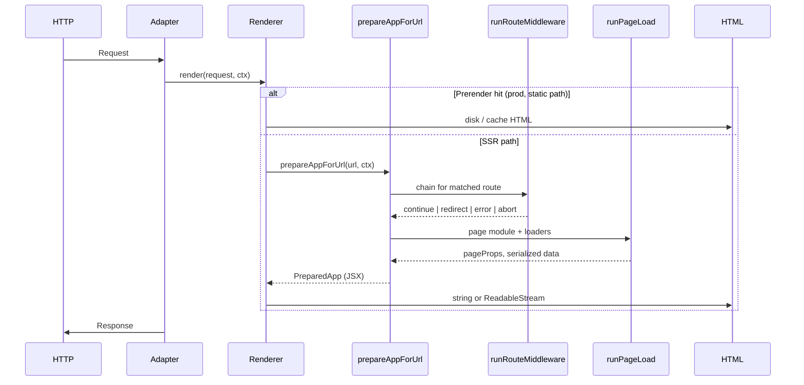

# Architecture

This document describes how Kiru v2’s router and rendering stack is structured across packages, how a single HTTP request flows through the system, and where complexity is intentionally split for tree-shaking and deploy targets.

---

## Design goals

1. **One route tree** powers CSR, SSR, SSG, and hybrid ISR — no duplicate route definitions per mode.
2. **Tree-shakeable client bundles** — CSR builds must not pull SSR hydration; SSG must not pull SSR-only loader RPC unless hybrid.
3. **Explicit deploy capabilities** — Node/Bun vs Cloudflare differ for ISR and disk (`@kirujs/runtime`). Image pipeline redesign: [21-image-pipeline-adr.md](./21-image-pipeline-adr.md).
4. **Framework parity where it matters** — loaders, middleware, actions, streaming HTML, static generation, and client navigations after hydration.

Kiru is **not** aiming for React Server Components or a second server rendering paradigm; the server produces HTML + serialized hydration payloads for a **client-side signal tree**.

---

## Package boundaries

### `kiru` (`packages/lib`)

| Area | Path | Responsibility |
|------|------|----------------|
| Router core | `src/router/csr.ts` | `createRouter`, history, `navigate`, guards |
| Matching | `src/router/manifest.ts` | `compileRouteTree`, `matchRoute`, static path generation |
| Server render | `src/router/renderer.ts` | `createRenderer`, actions/loader multiplex |
| Preparation | `src/router/prepareAppForUrl.ts` | Match URL → middleware → loaders → JSX app |
| Client prep | `src/router/clientRoutePrep.ts`, `prepareRoute.ts` | Shared loader/head prep for CSR & SSR client |
| Hydration | `src/ssr/routerHydrate.ts` | `bootstrapSsrClient`, `bootstrapSsgClient` |
| Remote | `src/remote/` | `query()` / `mutation()` / `form()`, RPC dispatch, cookies |
| Env guards | `src/env.ts` | `__KIRU_PURE_CLIENT__`, `__KIRU_SSR__` |

**Exports** (see [17-package-exports-and-import-guide.md](./17-package-exports-and-import-guide.md)):

- `kiru/router` — full router + renderer (server-safe).
- `kiru/router/client` — browser subset (package.json `"browser"` field).
- `kiru/router/csr` | `ssr` | `ssg` — bootstrap-only entry points.
- `kiru/ssr/router` — low-level hydrate API.

### `vite-plugin-kiru` (`packages/vite-plugin-kiru`)

- Injects `__KIRU_ROUTER_BOOTSTRAP__` on **client** builds.
- Runs SSG prerender during `vite build` when `router.ssg` is set.
- Bundles `router.serverEntry` for SSR.
- Codegen: remote registry, loader registry, file routes, page loaders, HMR.
- Dev server: SSR request handling when `serverEntry` is configured.

### `@kirujs/file-routes` (`packages/file-routes`)

- Scans `src/pages` → generates `routes.gen.ts`.
- Co-located `middleware.ts`, `page.config.ts`, `layout.tsx`, `not-found.tsx`.

### Adapters

| Package | Runtimes |
|---------|----------|
| `adapter-node` | Node — `createKiruHandler`, disk ISR, static assets |
| `adapter-bun` | Bun — same capabilities as Node |
| `adapter-cloudflare` | Workers — SSR + **immutable** prerender via `getAsset`; no timed ISR |

`adapter-contract` defines `KiruHandle`, `toFetchHandler`, middleware composition.

### `@kirujs/runtime`

Single source of truth for **what each deploy target can do**:

```typescript
// packages/runtime/src/index.ts (conceptual)
node | bun  → { isr: true, mutablePrerenderCache: true, fs: true }
cloudflare → { isr: false, mutablePrerenderCache: false, fs: false }
```

Build and adapter startup call `assertISRAllowed()` when edge + timed revalidate/tags would be ignored.

---

## Compile-time bootstrap guards

`packages/lib/src/env.ts`:

| Constant | When true |
|----------|-----------|
| `__KIRU_PURE_CLIENT__` | Client bundle is `csr` or `ssg` |
| `__KIRU_SSR__` | Client bundle is `ssr` |

**Why it matters:**

- `serverLoader` on a pure CSR/SSG client bundle triggers dev warnings and failed RPC.
- Remote `dispatch` on pure client rejects in dev with a clear message.
- Tests compile each file with a per-file bootstrap via `packages/lib/scripts/test.mjs`.

---

## Request lifecycle (SSR)



**Multiplexed side channels** on the same origin (when `createRenderer({ actions })` is configured):

| Query | Method | Handler |
|-------|--------|---------|
| `?action=<id>` | POST (+ JSON body) | JSON remote action (RPC) |
| `?action=<id>` | POST (form) | Form action (multipart / urlencoded) |
| `?loader=<routeId>:load` | POST | Server loader RPC |

Both use signed context tokens (`k-request-token`) and optional origin allowlists.

---

## Client lifecycle (after first paint)

Two **outlet implementations** exist (important for parity testing):

### Path A — CSR (`kiru/router/csr`)

```
createRouterApp → RouterProvider → RouterView
  → resource() watches match, loaderEpoch, outletRenderError
  → buildClientOutletSubtree()
```

`RouterView` is the documented CSR outlet. It uses `ErrorBoundary` and coordinates `isNavigating` with loader pending state.

### Path B — SSR / SSG (`bootstrapSsrClient` / `bootstrapSsgClient`)

```
createRouter → preload outlet via buildSsrClientOutlet()
  → hydrate(Fragment + createSsrRouterShell(() => outlet.value))
  → subscribeSsrClientOutlet() on match / isNavigating / currentNavigation
```

SSR/SSG **do not mount `RouterView`**. They keep outlet JSX in a `signal` and refresh it on navigation. Same underlying `buildClientOutletSubtree`, but different scheduling and pending UX.

**Hydration mode:**

- SSR: `hydrationMode: "dynamic"` (default in `kiru/router/ssr`).
- SSG: `hydrationMode: "static"` (via `bootstrapSsgClient`).

---

## `createStaticRouter` (build-time only)

`createStaticRouter` in `csr.ts` provides a **non-navigating** router (`navigationMode: "static"`, `navigate` no-ops) used when rendering HTML during prerender or SSR string generation (`ssrAppBuild.ts`). Application code should use `createRouter` or `createRouterApp`, not `createStaticRouter`.

---

## State: request context vs router state

| State | Storage | SSR first paint | Client navigation |
|-------|---------|-----------------|-------------------|
| URL | router signals (`pathname`, `query`, `hash`, `params`) | From request | `navigation.ts` |
| Per-request app data | `CustomRequestContext` (augmentable) | Serialized `k-request-context` script | `requestContext` signal; refreshed via action headers |
| Page loader data | `k-page-data` script + loader cache | Hydrated once | RPC / re-fetch per loader rules |
| i18n | `k-i18n` script + runtime | Hydrated | `loadI18nMessages` on locale change |
| Route meta | `useMatches()` segments | From compiled tree | Recomputed on match |

Augment `CustomRequestContext` and `RouteMeta` via `declare module "kiru/router"` (see types in `packages/lib/src/router/types.ts`).

---

## Navigation pipeline (CSR / hydrated SSR)

`createNavigateInternal` in `navigation.ts` runs, in order:

1. **Leave guards** (`onBeforeRouteLeave`) — per-route component guards, CSR only.
2. **Update guards** (`onBeforeRouteUpdate`) — same route id, param change.
3. **Route middleware** — `runRouteMiddleware` (redirect / abort / error).
4. **Search validation** — schema from page `validation` export.
5. **History commit** — `pushState` / `replaceState`, scroll stack.
6. **Enter guards** — component enter hooks.

SSR first paint runs middleware inside `prepareAppForUrl` with a real `Request`; client navigations pass `request: undefined` to middleware (documented on `RouteMiddlewareContext`).

---

## Error handling layers

| Layer | Mechanism |
|-------|-----------|
| Loader throw | Propagates to route prep; may set error page props |
| Render throw | Route `error` module or root `error` |
| Middleware `{ error, body? }` | SSR: HTTP status + body; CSR: **see [05-middleware-and-navigation-guards.md](./05-middleware-and-navigation-guards.md)** |
| Client boundary | `ErrorBoundary` in `RouterView`; SSR outlet uses `outletRenderError` + `renderClientErrorOutlet` |

---

## File-based vs manual routes

Both compile to the same `RouteManifest`:

- **Manual:** `createRouteTree` in `src/routes.ts`.
- **Generated:** `generateFileRoutes` → `src/routes.gen.ts`, enabled with `router.fileRoutes` in Vite.

Co-located `middleware.ts` is normalized via `collectRouteMiddlewareModule` (`routeMiddleware.ts`).

---

## What belongs outside the router

- **Vite** — bundling, HMR, client/server split.
- **Adapters** — static file serving, `fetch` integration, `getRequestContext`.
- Image pipeline — removed in v2.0; v2.1+ per [21-image-pipeline-adr.md](./21-image-pipeline-adr.md).
- **Cypress e2e** — behavioral contracts; see [15-testing.md](./15-testing.md).

---

## Hydration chunk preloads (v2)

Build emits `kiru-route-chunks.json`; SSR/SSG HTML and `Link` hover inject `<link rel="modulepreload">` for the matched route tree. Client bootstrap loads the manifest; `loadRouteTree` still uses dynamic `import()`. [22-hydration-module-prewarm-adr.md](./22-hydration-module-prewarm-adr.md).

---

## Further reading

- [03-rendering-modes.md](./03-rendering-modes.md)
- [08-renderer-ssr-and-streaming.md](./08-renderer-ssr-and-streaming.md)
- [09-client-bootstrap-and-hydration.md](./09-client-bootstrap-and-hydration.md)
- [22-hydration-module-prewarm-adr.md](./22-hydration-module-prewarm-adr.md)
- [16-gaps-risks-and-launch-checklist.md](./16-gaps-risks-and-launch-checklist.md)
