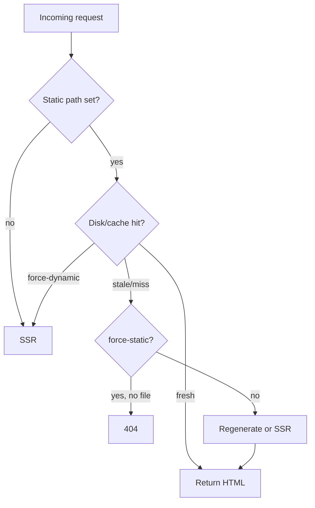

# ISR, hybrid prerender, and cache

Kiru implements a **PPR-lite / ISR** model on Node and Bun: static HTML at build time, optional timed revalidation, on-demand path/tag invalidation, and `force-dynamic` / `force-static` route overrides.

Edge (Cloudflare) supports **immutable** prerender only — no timed ISR or tag revalidation.

Sources: `isr.ts`, `routeRevalidate.ts`, `prerenderCache.ts`, `prerenderRegenerate.ts`, `prerenderServe.ts`, `revalidate.ts`, `ssg.ts`.

---

## Page-level ISR config

```typescript
import { defineISR } from "kiru/router"

// Hybrid default — prerender when fresh, SSR when stale/missing
export const isr = defineISR({
  revalidate: 60,
  tags: ["blog"],
})

// Always SSR — never read/write disk prerender for this route
export const isr = defineISR({ dynamic: "force-dynamic" })

// Build-time only — 404 in prod if HTML file missing
export const isr = defineISR({ dynamic: "force-static" })
```

`readRouteISRExport` / `getISRRevalidate` consumed in renderer and prerender pipeline.

---

## Build-time prerender (`prerenderStaticRoutes`)

`packages/lib/src/router/ssg.ts`:

- Input: route tree, optional `htmlTemplate`, `pathPolicy`, `i18n`, `maxConcurrentRenders` (default 10), `AbortSignal`
- Expands locale targets via `expandPrerenderTargets`
- Renders each path with `createRenderer` / `renderMatchToStaticHtml`
- Output: `StaticRouteOutput[]` with `path`, `diskPath`, `storageKey`, `body`, `html`, `document`, `pageData`, `routeId`

Vite plugin orchestrates writes to client output + cache index.

---

## Production serve order (Node/Bun hybrid)



`tryServePrerenderedFromDisk` + `diskPrerenderCache` — `prerenderedHtmlDir` must align with Vite client output.

**Dev:** Branch skipped — always live SSR.

---

## Cache store

`PrerenderCacheStore` interface — `get`, `set`, `delete`, tag index.

Default: `diskPrerenderCache({ clientDir, pathPolicy, staticPaths })`.

`createRenderer({ prerenderCache })` overrides for custom Redis/KV (bring your own adapter integration).

---

## On-demand revalidation

Server-only (`assertServerOnly`):

```typescript
await revalidatePath("/blog/post-1")
await revalidateTag("blog")
```

Deletes cache entries; next request regenerates (regen handler in `prerenderRegenerate.ts`).

Tests: `revalidate.test.ts`, e2e revalidate demos.

**Cloudflare:** Functions exist but capabilities false — use immutable HTML or external cache.

---

## `force-static` vs `force-dynamic`

| Mode | Behavior |
|------|----------|
| `force-static` | No SSR fallback if prerender file absent (404) — e2e `ppr-force-static-demo` |
| `force-dynamic` | Skip disk even if HTML exists — always SSR — e2e `ppr-force-dynamic-demo` |

Unit: `rendererPprDynamic.test.tsx` (verify in [15-testing.md](./15-testing.md) runner).

---

## Static loader payload injection

Hybrid SSG client chunks may embed `__kiruStaticLoaderPayload` at build (`vite-plugin-kiru` `injectStaticLoaderPayloadIntoClientChunks`).

Enables instant client data for static routes without loader RPC.

---

## Stripping request scripts

Public static pages may remove sensitive scripts:

`stripPrerenderedRequestInjections(html)` — removes `k-request-context` and `k-request-token`.

Use when exporting HTML that should not ship auth tokens.

---

## Sitemap interaction

`generateSitemapPaths` can include SSR-only routes via `defaultSsrPaths` while static paths come from `static: true` leaves.

---

## Cloudflare constraints

`assertISRAllowed` throws at build if `revalidate > 0` or `tags` on cloudflare target.

`getISRWarningsForTarget` — non-fatal warnings.

Worker handler: `tryServeImmutablePrerender` via `getAsset(pathname)` then SSR.

See [14-adapters-and-deploy-runtimes.md](./14-adapters-and-deploy-runtimes.md).

---

## Operational checklist

- [ ] `prerenderedHtmlDir` points at Vite `outDir` client assets in prod
- [ ] ISR seconds align with CDN cache headers (`routeResponse` cache export)
- [ ] Regeneration is single-flight under load (`e2e/ssr/scripts/prerender-regen-single-flight.mjs`)
- [ ] `revalidatePath` called after mutations that affect static pages
- [ ] Do not enable timed ISR on Workers deploy

---

## Further reading

- [03-rendering-modes.md](./03-rendering-modes.md)
- [08-renderer-ssr-and-streaming.md](./08-renderer-ssr-and-streaming.md)
- [13-vite-plugin-and-build-pipeline.md](./13-vite-plugin-and-build-pipeline.md)
