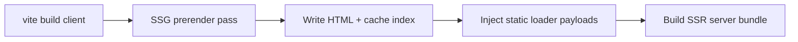

# Vite plugin and build pipeline

`vite-plugin-kiru` connects Kiru to Vite: transforms, codegen, SSG prerender, SSR dev server, client bootstrap defines, and preview middleware.

Package: `packages/vite-plugin-kiru/`.

---

## Installation

```typescript
// vite.config.ts
import kiru from "vite-plugin-kiru"

export default defineConfig({
  plugins: [
    kiru({
      router: {
        ssg: true,
        serverEntry: "./src/server/index.ts",
        fileRoutes: true,
        remote: "*.actions.ts",
        adapter: "node",
      },
    }),
  ],
})
```

---

## Router options (detailed)

| Option | Type | Effect |
|--------|------|--------|
| `ssg` | `boolean \| { routes, siteModule?, build? }` | Enables build prerender; `maxConcurrentRenders` default 10 |
| `serverEntry` | glob string | SSR server bundle + dev SSR + client bootstrap **`ssr`** |
| `fileRoutes` | `boolean \| { dir, outFile, pageFiles, extend }` | Generates `routes.gen.ts` |
| `adapter` | `node \| bun \| cloudflare` | ISR build checks, platform hints |
| `remote` | glob | Action codegen + virtual registry |
| `htmlTemplate` | path | Shell for prerender/SSR (default `index.html`) |
| `htmlShell` | async fn | Full HTML override per route |
| `images` | boolean \| ImagePluginOptions | Asset pipeline |

### Bootstrap resolution

```typescript
if (serverEntry) return "ssr"
if (ssg) return "ssg"
return "csr"
```

Hybrid = **both** `ssg` and `serverEntry` → client is `ssr`.

---

## Build sequence (hybrid)



`ensureSsgPrerenderCache` — caches prerender in plugin state for preview.

`injectStaticLoaderPayloadIntoClientChunks` — prepends const map to client chunks.

---

## Codegen pipelines

| Pipeline | Virtual / output | Purpose |
|----------|------------------|---------|
| Remote | `virtual:kiru:remote-registry` | Action IDs |
| Loaders | `virtual:kiru:loader-registry` | Server loader dispatch table |
| Page loaders | `preparePageLoaders` | Auto wire `load` exports |
| File routes | `routes.gen.ts` | FS → tree |
| JSX | `prepareJSXHoisting` (experimental) | Static hoisting |
| HMR | `prepareHMR` | Dev component boundaries |

Tests: `remote.test.ts`, `fileRoutesCodegen.test.ts`, `fileRoutesDev.integration.test.ts`.

---

## Dev server

When `serverEntry` set:

- `handleSsrDevRequest` — SSR without separate Hono vite plugin requirement
- Injects dev CSS links (`injectDevCssLinks`)
- `collectSsrDevHeadExtras`

`attachFileRoutesDevWatcher` — regen routes on page add/remove.

---

## Preview

- `createSsgPreviewMiddleware` — serve prerendered HTML in preview
- `createPreviewSsrProxy` — proxy to SSR server when hybrid
- `preview-server.test.ts`, `preview-integration.test.ts`

**Not-found behavior by mode:** SSG-only → `404.html` for unknown paths; hybrid → SSR (skips static `404.html`); CSR → Vite SPA `index.html` fallback. Strategy matrix: [19-static-404-and-host-fallback-strategies.md](./19-static-404-and-host-fallback-strategies.md).

---

## SSG-only build

`router.ssg: true` without `serverEntry`:

- Client bootstrap `ssg`
- Output static HTML per path
- No loader RPC unless you add a server later (not recommended for `serverLoader`)

---

## Cloudflare build

`adapter: "cloudflare"`:

- `assertISRAllowed` at build for each ISR route
- `warnCloudflareISRInPages` / `generateWranglerSnippet` helpers
- Worker bundle excludes Node fs cache

---

## Experimental

```typescript
experimental: {
  staticHoisting: true,  // default false
}
```

Hoists static JSX to module scope — reduces rerenders; off by default until validated.

---

## Devtools

`devtools: true` — injects devtools overlay in development (`devtools.ts`).

---

## Logging

`loggingEnabled`, `onFileTransformed`, `onFileExcluded` — transform diagnostics.

---

## `include` paths

Transform JSX/TSX outside project root (e.g. shared component libraries).

---

## Environment

Plugin respects `NODE_ENV` for dev vs prod behavior alignment with renderer disk reads.

Tests should set `NODE_ENV=development` in lib package (`package.json` pretest).

---

## Further reading

- [03-rendering-modes.md](./03-rendering-modes.md)
- [10-isr-hybrid-and-prerender.md](./10-isr-hybrid-and-prerender.md)
- [14-adapters-and-deploy-runtimes.md](./14-adapters-and-deploy-runtimes.md)
- [19-static-404-and-host-fallback-strategies.md](./19-static-404-and-host-fallback-strategies.md)
- [17-package-exports-and-import-guide.md](./17-package-exports-and-import-guide.md)
