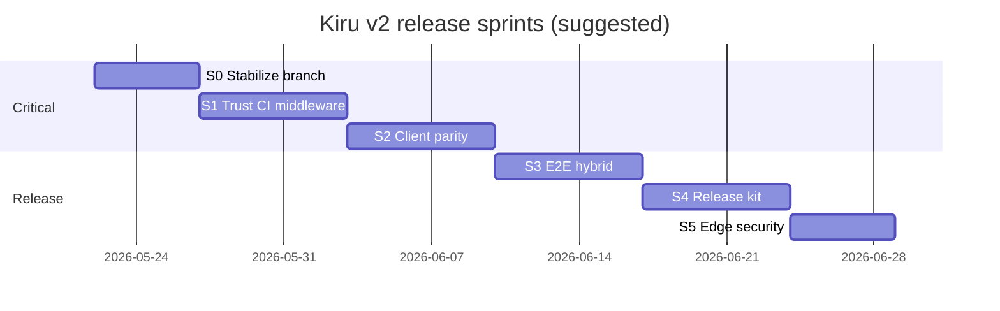

# Release sprint todos (v2)

Actionable backlog for Kiru v2 release, chunked into sprints. Each item has an **ID**, **priority**, **acceptance criteria**, and **primary files**.

**Related docs:** [16-gaps-risks-and-launch-checklist.md](./16-gaps-risks-and-launch-checklist.md) (summary), [15-testing.md](./15-testing.md), [05-middleware-and-navigation-guards.md](./05-middleware-and-navigation-guards.md).

**How to use:** Work sprints in order unless noted. Mark `- [ ]` → `- [x]` in PRs. Do not close a sprint until **exit criteria** are met.

---

## Priority legend

| Priority | Meaning |
|----------|---------|
| **P0** | Ship blocker — release should not go public without this |
| **P1** | High — credibility / parity with competing frameworks |
| **P2** | Medium — improves adoption; can ship shortly after v2.0 |
| **P3** | Low — post-release roadmap |

---

## Sprint map (overview)

| Sprint | Theme | Goal | P0 items |
|--------|--------|------|----------|
| **S0** | Stabilize branch | Green CI on current work; freeze API surface | — **done** |
| **S1** | Trust | Tests actually run; middleware CSR fixed | P0-2, P0-1 |
| **S2** | Client parity | SSR/CSR/SSG behave the same after hydrate | P0-3 |
| **S3** | E2E & hybrid | Cypress + matrix cover real deploy paths | P1-* |
| **S4** | Release kit | Docs site, templates, migration, golden deploys | P1-7, product |
| **S5** | Edge & security | Cloudflare path + RPC security story | P1-4, P1-6 |
| **Post** | Differentiation | P2/P3 ecosystem gaps | P2-*, P3-* |

---

## Master backlog

| ID | Title | Priority | Sprint | Type |
|----|-------|----------|--------|------|
| P0-1 | Fix CSR middleware `{ error }` | P0 | S1 | Code |
| P0-2 | Run `*.test.tsx` in lib CI | P0 | S1 | CI |
| P0-3 | SSR/CSR outlet parity tests or unify | P0 | S2 | Code + test |
| P1-1 | E2E middleware error SSR + CSR | P1 | S1/S3 | E2E |
| P1-2 | Expand SSG + hybrid e2e | P1 | S3 | E2E |
| P1-3 | FBR e2e: SSR + SSG fixtures | P1 | S3 | E2E |
| P1-12 | FBR configurable layout/error/not-found filenames | P1 | S3 | Code + doc |
| P1-4 | Cloudflare Worker CI smoke | P1 | S5 | CI |
| P1-5 | Global middleware story (doc or codegen) | P1 | S4 | Doc/code |
| P1-6 | Security doc: `?action` / `?loader` | P1 | S5 | Doc |
| P1-7 | v2 version bump + migration guide | P1 | S4 | Product |
| P1-8 | Remote actions API freeze + e2e | P1 | S0/S3 | Code + E2E — **done** |
| P1-9 | `create-kiru` templates audit | P1 | S4 | Product |
| P1-10 | Golden Node deploy sample | P1 | S4 | Product |
| P1-11 | Golden Cloudflare deploy sample | P1 | S5 | Product |
| P2-1 | Vercel/Netlify deploy guide | P2 | Post | Doc |
| P2-2 | REST API pattern doc (BYO mount) | P2 | Post | Doc |
| P2-3 | Positioning: not RSC (public) | P2 | S4 | Doc |
| P2-4 | Evaluate default static hoisting | P2 | Post | Code |
| P2-5 | Content/MDX — defer or partner | P2 | Post | — |
| P2-6 | `prepareAppForUrl` integration tests | P2 | S2 | Test |
| P2-7 | Configurable static 404 / host fallback strategies | P2 | Post | Doc + code |
| P3-1 | OG image route convention | P3 | Post | — |
| P3-2 | PWA / service worker kit | P3 | Post | — |
| P3-3 | ICU i18n | P3 | Post | — |
| P3-4 | Parallel / intercepting routes | P3 | Post | — |
| P3-5 | Draft / preview mode | P3 | Post | — |
| W-1 | Weak: dual outlet maintenance | — | S2 | Tech debt |
| W-2 | Weak: `navigation.ts` size/complexity | — | Post | Refactor |
| W-3 | Weak: middleware `request` absent on CSR | — | S4 | Doc |
| W-4 | Weak: no first-party `/api` routes | — | S4/S5 | Doc |
| R-1 | Risk: CSR middleware auth bug | — | S1 | Mitigate P0-1 |
| R-2 | Risk: false-green CI | — | S1 | Mitigate P0-2 |
| R-3 | Risk: SSR/CSR drift | — | S2 | Mitigate P0-3 |
| R-4 | Risk: edge ISR misconfiguration | — | S5 | Mitigate P1-4 |
| R-5 | Risk: loader/action RPC abuse | — | S5 | Mitigate P1-6 |
| R-6 | Risk: hash hydration mismatch | — | S3 | Test |

---

# Sprint 0 — Stabilize branch

**Duration (suggested):** 3–5 days  
**Goal:** Current v2 branch is mergeable; remote/actions API stable; no new P0 introduced.

## Exit criteria

- [x] `node builderman.js test` green (all packages that release includes) — verified 2026-05-22
- [x] `e2e/ssr` Cypress suite green locally (or documented flakes) — via builderman `e2e:ssr` (includes `verify-hybrid-prerender.mjs`)
- [x] Changelog draft started for v2 breaking changes — [CHANGELOG.md](../../CHANGELOG.md) Unreleased section
- [x] No open P0 regressions from in-flight action/router work — P0-1/2/3 closed in S1–S2

## Tasks

### S0-1 — Remote actions API sign-off (P1-8)

- [x] **Audit** default-export actions, linked `.actions.ts`, `ActionFailure`, `actionResponse` cookies — align `e2e/ssr` pages with public API
- [x] **Files:** `packages/lib/src/remote/`, `packages/vite-plugin-kiru/src/codegen/remote.ts`, `e2e/ssr/src/pages/default-export-*`, `sandbox/ssr/src/pages/*.actions.ts`
- [x] **Acceptance:** e2e `default-export-demo` specs in `ssr.cy.ts`; S3 sign-off — sandbox flows manual smoke before release tag

### S0-2 — Dev warnings per bootstrap mode

- [x] **Verify** `devWarnings.guard-{csr,ssr,ssg}.test.ts` pass after test runner fix (S1)
- [x] **Acceptance:** Wrong loader/action in wrong bundle fails loudly in dev (lib CI, 407 tests)

### S0-3 — ISR build checks on cloudflare target

- [x] **Runtime API** — `assertISRAllowed` in `@kirujs/runtime` with unit tests; error cites `docs/v2/14-adapters-and-deploy-runtimes.md`
- [x] **Build today** — `warnCloudflareISRInPages` page scan when `adapter: "cloudflare"` (warnings only)
- [ ] **Build fail on route meta** — wire `assertISRAllowed` over SSG `buildMeta` in vite-plugin (**deferred to S5**; needs `SsgRouteBuildMetaEntry` typed with `dynamic` / `revalidate`)

### S0-4 — Branch hygiene

- [x] **List** breaking API changes vs `main` — [BREAKING-CHANGES.md](./BREAKING-CHANGES.md)
- [x] **Acceptance:** List feeds P1-7 migration guide (S4-1)

---

# Sprint 1 — Trust (CI + middleware)

**Duration (suggested):** 5–7 days  
**Goal:** CI runs the real router test suite; CSR middleware errors behave correctly; first e2e for middleware errors.

**Depends on:** S0 exit criteria (recommended).

## Exit criteria

- [ ] P0-1 and P0-2 complete
- [ ] `router.test.tsx` green in CI
- [ ] Unit test added for CSR middleware `{ error: 403 }` (not redirect to `/login`)
- [ ] At least one e2e proves SSR middleware error status (P1-1 partial)

## Tasks

### S1-1 — P0-2: Include `*.test.tsx` in lib test runner

- [ ] **Change** `packages/lib/scripts/test.mjs` to collect `*.test.ts` and `*.test.tsx` (or rename tests — prefer extending collector)
- [ ] **Fix** any failures in:
  - [ ] `router.test.tsx`
  - [ ] `ssr-streaming.test.tsx`
  - [ ] `rendererPprDynamic.test.tsx`
  - [ ] `routerShellTree.test.tsx`
  - [ ] `clientErrorOutlet.test.tsx`
  - [ ] `resource-streaming.test.tsx`
  - [ ] Other `src/tests/**/*.test.tsx`
- [ ] **Wire** `builderman.js` / CI — no separate job needed if lib `pnpm test` covers all
- [ ] **Acceptance:** `cd packages/lib && pnpm test` runs ≥11 previously skipped TSX files; CI log shows `router.test.tsx` executed

### S1-2 — P0-1: Fix CSR middleware `{ error }`

- [ ] **Remove** hardcoded `runRedirect("/login")` in `packages/lib/src/router/navigation.ts` (~line 470)
- [ ] **Implement** one of:
  - [ ] **Option A:** `NavigationResult` / `NavigationFailure` with `type: "error"`, status, body → render error outlet or dedicated error route
  - [ ] **Option B:** Map status to configurable redirects in route meta (e.g. `meta.errorRedirect`)
  - [ ] **Option C:** Reuse SSR error page component in client outlet with HTTP status preserved in UI
- [ ] **Align** with SSR `prepareAppForUrl` error shape where possible
- [ ] **Acceptance:**
  - [ ] `{ error: 403 }` on client nav does **not** go to `/login` unless middleware returns `{ redirect: "/login" }`
  - [ ] `{ error: 503, body: "..." }` surfaces 503 UX on CSR
  - [ ] Existing redirect middleware tests in `router.test.tsx` still pass

### S1-3 — Unit tests for middleware CSR errors (P1-1 partial)

- [ ] **Add** `packages/lib/src/tests/unit/navigationMiddlewareError.test.ts` (or extend `routeMiddleware.test.ts`)
- [ ] **Cases:** 401, 403, 500; redirect still works; abort still cancels
- [ ] **Acceptance:** Covers S1-2 behavior; runs in S1-1 runner

### S1-4 — E2E: SSR middleware error (P1-1)

- [ ] **Add** `e2e/ssr` page + route: middleware returns `{ error: 403 }` on `/forbidden`
- [ ] **Assert:** Full page load returns 403 status (or body text), not 302 to login
- [ ] **Acceptance:** Cypress `cy.request` or status assertion on first visit

### S1-5 — Expand `routeMiddleware.test.ts`

- [ ] **Add:** `{ error }` return handling in `runRouteMiddleware` (unchanged API)
- [ ] **Add:** `{ abort: true }` case
- [ ] **Acceptance:** ≥5 tests; documents contract for S1-2

### S1-6 — Risk mitigation R-1, R-2

- [ ] **Verify** sandbox/auth flows after S1-2 (no accidental `/login` redirect on 403)
- [ ] **Document** fix in [05-middleware-and-navigation-guards.md](./05-middleware-and-navigation-guards.md) — remove “known issue” once fixed

---

# Sprint 2 — Client parity (outlets + integration)

**Duration (suggested):** 5–7 days  
**Goal:** SSR/SSG hydrated apps and CSR SPAs stay in sync for navigations, invalidate, and errors.

**Depends on:** S1 complete (tests + middleware).

## Exit criteria

- [x] P0-3 addressed (tests **or** unified outlet — pick one, document the other as deferred)
- [x] Post-hydrate navigation test matrix documented and green
- [x] P2-6 integration coverage started (at least 3 `prepareAppForUrl` scenarios)

## Tasks

### S2-1 — P0-3: Outlet parity decision

- [ ] **Spike** (time-box 1 day): unify `RouterView` vs `subscribeSsrClientOutlet` **or** keep dual path
- [ ] **If unify:** Single outlet module used by CSR bootstrap + `bootstrapSsrClient`
- [ ] **If keep dual:** Checklist of behaviors both must implement (see S2-2)
- [ ] **Acceptance:** Decision recorded in [09-client-bootstrap-and-hydration.md](./09-client-bootstrap-and-hydration.md)

### S2-2 — Parity test matrix (P0-3)

- [ ] **Add** e2e or integration tests for **each row**:

| Scenario | CSR | SSR hydrate | SSG hydrate |
|----------|-----|-------------|-------------|
| Client nav → `serverLoader` refetch | — | [ ] | [ ] hybrid only |
| `router.invalidate()` refetch | [ ] | [ ] | [ ] |
| Action `x-kiru-invalidate` | [ ] | [ ] | [ ] |
| Back/forward + loader cache | [ ] | [ ] | [ ] |
| Link prefetch hover | — | [ ] | — |
| Render error → error route | [ ] | [ ] | [ ] |
| Middleware redirect | [ ] | [ ] | [ ] |
| Middleware error (after S1) | [ ] | [ ] | [ ] |
| Hash-only change (R-6) | [ ] | [ ] | [ ] |
| Locale prefix nav | [ ] | [ ] | [ ] |

- [ ] **Files:** `e2e/ssr/cypress/e2e/`, `e2e/csr/cypress/e2e/`, `e2e/ssg/cypress/e2e/`
- [ ] **Acceptance:** Table ≥80% checked for release scope

### S2-3 — W-1: Dual outlet audit

- [ ] **Audit** `buildClientOutletSubtree`, `prepareRouteWithDocumentHead`, `isLoaderPending` / `isNavigating` — differences between `routerView.tsx` and `routerHydrate.ts`
- [ ] **Fix** any bugs found (file issues per finding)
- [ ] **Acceptance:** No P0 outlet bugs open

### S2-4 — P2-6: `prepareAppForUrl` integration tests

- [ ] **Add** `prepareAppForUrl.test.ts` (TS) with cases:
  - [ ] Locale detection redirect
  - [ ] Middleware redirect chain
  - [ ] Middleware error response
  - [ ] Search validation redirect
  - [ ] Unmatched + notFound
- [ ] **Acceptance:** Runs in lib CI; no TSX required

### S2-5 — `routerBootstrap` expand

- [ ] **Beyond smoke:** hydrate minimal HTML fixture in jsdom; assert `__kiruHydratedAt` pattern optional
- [ ] **Acceptance:** `routerBootstrap.test.ts` covers ssr + ssg bootstrap imports call without throw

### S2-6 — Risk R-3

- [ ] **Sign-off:** Engineering lead confirms parity table for release notes

---

# Sprint 3 — E2E & hybrid deploy paths

**Duration (suggested):** 5–7 days  
**Goal:** Cypress and scripts cover hybrid ISR, SSG client nav, FBR under SSR/SSG (not CSR-only), configurable FBR special filenames, and action flows.

**Depends on:** S1–S2.

## Exit criteria

- [x] P1-2, P1-3, P1-8, P1-12 complete
- [x] `e2e/ssr/scripts/verify-hybrid-prerender.mjs` in CI
- [x] `e2e/ssr-matrix` green in CI
- [x] SSG e2e count increased (+10 in `ssg-parity.cy.ts`; 30 total Cypress `it()`)

## Tasks

### S3-1 — P1-2: SSG e2e expansion

- [ ] **Add** client navigation after SSG load (internal `Link` click)
- [ ] **Add** static loader page: data present without `?loader=` POST
- [x] **Add** 404 / `not-found` static page — covered by `e2e/file-routes-ssg` (+ `e2e/ssg`); deploy strategy work tracked in **P2-7** / [19-static-404-and-host-fallback-strategies.md](./19-static-404-and-host-fallback-strategies.md)
- [ ] **Add** hybrid: optional job runs `verify-hybrid-prerender.mjs` in CI
- [ ] **Files:** `e2e/ssg/cypress/e2e/ssg.cy.ts`, new specs as needed
- [ ] **Acceptance:** +10 tests or explicit defer list with P2 ticket

### S3-2 — P1-1: E2E CSR middleware error (complete)

- [ ] **Add** CSR app route with middleware `{ error: 403 }` on client navigation (not full reload)
- [ ] **Assert:** URL stays /forbidden or error UI shown; not `/login`
- [ ] **Depends on:** S1-2
- [ ] **Acceptance:** Fails on `main`-before-fix; passes after S1-2

### S3-3 — Action invalidate + loader refetch e2e

- [ ] **Extend** `e2e/ssr` invalidate / revalidate demos
- [ ] **Assert:** After form action, `x-kiru-invalidate` causes visible DOM update without full reload
- [ ] **Files:** `e2e/ssr/src/pages/invalidate-demo.*`, `revalidate-demo.*`
- [ ] **Acceptance:** Cypress spec in `ssr.cy.ts` or dedicated file

### S3-4 — P1-8: Default-export actions e2e

- [ ] **Complete** coverage for `default-export-demo`, literal vs linked actions
- [ ] **Acceptance:** All cases in `e2e/ssr/cypress/e2e/ssr.cy.ts` or tier3

### S3-5 — P1-3: FBR e2e for SSR and SSG

`e2e/file-routes` is CSR-only today ([15-testing.md](./15-testing.md)). Extend coverage so file-based codegen is exercised under server render and static prerender, not only client bootstrap.

**SSR**

- [ ] **Option A:** New `e2e/file-routes-ssr` with `serverEntry` + `router.fileRoutes` codegen
- [ ] **Option B:** Add `serverEntry` + hybrid handler to existing `e2e/file-routes`
- [ ] **Tests (SSR):** middleware redirect, dynamic `[slug]`, route group, `extendRoutes` — full page load + at least one client nav after hydrate
- [ ] **Acceptance:** ≥3 Cypress tests in an SSR file-routes app (mirror key cases from `e2e/file-routes/cypress/e2e/file-routes.cy.ts`)

**SSG**

- [ ] **Option A:** New `e2e/file-routes-ssg` with `router.fileRoutes` + `ssg: true` (routes default to `routes.gen.ts`)
- [ ] **Option B:** Enable `fileRoutes` on a dedicated pages tree under `e2e/ssg` (or small sibling app)
- [ ] **Tests (SSG):** static prerender of FBR index + dynamic route; `not-found` for unknown path; client `Link` nav after load
- [ ] **Acceptance:** ≥3 Cypress tests in an SSG file-routes app; prerender output includes expected route HTML

**Shared**

- [ ] **Files:** `packages/file-routes/`, `e2e/file-routes/`, new `e2e/file-routes-ssr` / `e2e/file-routes-ssg` if split
- [ ] **Doc:** Update [04-route-tree-and-matching.md](./04-route-tree-and-matching.md) and `e2e/file-routes/README` — no longer “CSR verified only” once SSR/SSG land

### S3-10 — P1-12: FBR configurable layout / error / not-found filenames

Today `router.fileRoutes.pageFiles` customizes leaf route filenames (`page.tsx`, `index.tsx`, …), but `layout.tsx`, `error.tsx`, and `not-found.tsx` are hardcoded in `@kirujs/file-routes` (`scanPagesDir.ts`). Teams using alternate conventions (e.g. `_layout.tsx`, `404.tsx`) cannot align special files with their page naming scheme.

- [ ] **Add** options on `FileRoutesOptions` and `router.fileRoutes` (names TBD, e.g. `layoutFiles`, `errorFiles`, `notFoundFiles` — same glob-style patterns as `pageFiles`)
- [ ] **Refactor** `scanPagesDir.ts` to match special files via `fileNameMatchesPagePattern` (or shared matcher) instead of fixed regexes
- [ ] **Defaults** preserve current behavior: `layout.{tsx,ts,jsx,js,mdx}`, `error.{…}`, `not-found.{…}`
- [ ] **Plumb** through `packages/vite-plugin-kiru/src/fileRoutesConfig.ts` and plugin types/README
- [ ] **Tests:** `packages/file-routes` unit tests with custom filenames; optional fixture under `packages/file-routes/fixtures/`
- [ ] **Doc:** [04-route-tree-and-matching.md](./04-route-tree-and-matching.md) + `docs/router/file-based-routes.md` — table of configurable patterns
- [ ] **Acceptance:** App with `layoutFiles: ["_layout.{tsx,ts}"]` (or equivalent) codegen’s `routes.gen.ts` without renaming files on disk to `layout.tsx`

### S3-6 — `ssr-matrix` CI

- [ ] **Add** builderman task or GitHub workflow step: `e2e/ssr-matrix/scripts/matrix.mjs` (or subset)
- [ ] **Acceptance:** Node + at least one Bun + Worker cell green on PR to main

### S3-7 — Tier3 / ISR e2e consolidation

- [ ] **Review** `e2e/ssr/cypress/e2e/tier3-wave1.cy.ts` — map to PPR/ISR docs
- [ ] **Add** missing: `force-static` 404 without prerender file (if not in CI)
- [ ] **Acceptance:** Each `defineISR` mode has one e2e assertion

### S3-8 — R-6: Hash hydration regression

- [ ] **Add** e2e: visit `/page#section`, hydrate, assert no text mismatch / reconcile error
- [ ] **Files:** `routerHydrate.ts` stash/restore behavior
- [ ] **Acceptance:** Spec in `ssr.cy.ts`

### S3-9 — Forms / `ActionFailure` UX

- [ ] **E2E:** form validation errors display `ActionFailure` fields
- [ ] **Files:** `forms-demo.*`, `formController` tests already unit-level
- [ ] **Acceptance:** One happy path + one failure path in browser

---

# Sprint 4 — Release kit (docs, templates, migration)

**Duration (suggested):** 5–7 days  
**Goal:** A new team can scaffold, deploy on Node, and understand breaking changes.

**Can overlap S3** for doc-only tasks.

## Exit criteria

- [ ] P1-7, P1-9, P1-10, P2-3 done
- [ ] CHANGELOG v2 published
- [ ] kirujs.dev sync planned or stub complete
- [ ] “Not RSC” positioning on landing/docs

## Tasks

### S4-1 — P1-7: Version bump + migration guide

- [ ] **Bump** `packages/lib/package.json` version to `2.0.0` (or agreed tag)
- [ ] **Write** `docs/v2/MIGRATION.md` from [BREAKING-CHANGES.md](./BREAKING-CHANGES.md):
  - [ ] Bootstrap imports (`kiru/router/csr|ssr|ssg`)
  - [ ] Remote action failure types
  - [ ] Removed/changed APIs
  - [ ] Loader / middleware behavior changes
- [ ] **Acceptance:** Migration doc linked from CHANGELOG

### S4-2 — P1-9: `create-kiru` template audit

- [ ] **Verify** each template uses correct `createRouterApp` import per mode
- [ ] **Verify** `vite-plugin-kiru` options match [13-vite-plugin-and-build-pipeline.md](./13-vite-plugin-and-build-pipeline.md)
- [ ] **Update** `packages/create-kiru` README — link to `docs/v2/`
- [ ] **Acceptance:** `npx create-kiru@latest` CSR + SSR templates run

### S4-3 — P1-10: Golden Node deploy sample

- [ ] **Polish** `sandbox/ssr` or `e2e/ssr` server as copy-paste reference
- [ ] **Document** `createKiruHandler`, `prerenderedHtmlDir`, env vars
- [ ] **Add** `docs/v2/DEPLOY-NODE.md` (short golden path)
- [ ] **Acceptance:** Fresh clone → build → `node dist/server` serves hybrid app

### S4-4 — P1-5: Global middleware story

- [ ] **Document** root scope middleware pattern (replaces Next `middleware.ts`)
- [ ] **Optional code:** `file-routes` codegen for `src/middleware.ts` → root scope — spike only if ≤2 days
- [ ] **Acceptance:** [04-route-tree-and-matching.md](./04-route-tree-and-matching.md) links pattern; W-3 documented

### S4-5 — P2-3: Public positioning

- [ ] **Add** “What Kiru is / is not” section to docs index
- [ ] **Include:** No RSC; signals + SSR HTML; compare table from [02-competitive-positioning.md](./02-competitive-positioning.md)
- [ ] **Acceptance:** Readable in 5 minutes by evaluator

### S4-6 — Quickstart tutorial

- [ ] **Write** `docs/v2/QUICKSTART.md` — 10-minute CSR + SSR paths
- [ ] **Acceptance:** Linked from [README.md](./README.md)

### S4-7 — W-3, W-4: Document CSR limitations

- [ ] **Document:** middleware without `request` on client — use `context`
- [ ] **Document:** no built-in `/api` — multiplex + BYO framework
- [ ] **Files:** [05-middleware](./05-middleware-and-navigation-guards.md), [07-remote-actions](./07-remote-actions.md)

### S4-8 — CHANGELOG + release notes

- [ ] **Finalize** CHANGELOG v2.0.0
- [ ] **List:** P0 fixes, breaking changes, adapter matrix
- [ ] **Acceptance:** Ready for GitHub release

### S4-9 — kirujs.dev sync (if in scope)

- [ ] **Plan** pages matching `docs/v2/` topics
- [ ] **Acceptance:** Checklist or tracking issue with URLs

---

# Sprint 5 — Edge & security

**Duration (suggested):** 3–5 days  
**Goal:** Cloudflare deploy is safe and documented; security reviewers have RPC guidance.

**Depends on:** S4 deploy docs recommended.

## Exit criteria

- [ ] P1-4, P1-6, P1-11 done
- [ ] Cloudflare sample deploys immutable SSG + SSR without ISR footguns

## Tasks

### S5-1 — P1-11: Golden Cloudflare deploy sample

- [ ] **Polish** `e2e/ssr-matrix` Worker fixture or new `examples/cloudflare-worker`
- [ ] **Write** `docs/v2/DEPLOY-CLOUDFLARE.md`:
  - [ ] `getAsset` for prerender
  - [ ] `assetFetch` for bundles
  - [ ] ISR limits table from [14-adapters-and-deploy-runtimes.md](./14-adapters-and-deploy-runtimes.md)
  - [ ] Static 404 / `nearest-asset` vs `hybrid-ssr` — [19-static-404-and-host-fallback-strategies.md](./19-static-404-and-host-fallback-strategies.md)
- [ ] **Acceptance:** Wrangler deploy documented step-by-step

### S5-2 — P1-4: Cloudflare CI smoke

- [ ] **CI job:** build worker + smoke fetch `/` (miniflare or vitest pool)
- [ ] **Assert:** no throw on ISR-incompatible config at build
- [ ] **Acceptance:** PR check `cloudflare-smoke` green

### S5-3 — P1-6: Security document RPC endpoints

- [ ] **Write** `docs/v2/SECURITY.md`:
  - [ ] `?action=` / `?loader=` threat model
  - [ ] `actions.secret`, token rotation, `allowedOrigins`
  - [ ] CSRF considerations (same-origin + token)
  - [ ] Rate limiting recommendation at adapter
- [ ] **Acceptance:** Linked from [07-remote-actions.md](./07-remote-actions.md)

### S5-4 — R-4, R-5 mitigation review

- [ ] **Review** `loaderRegistry.test.ts` + `remote.test.ts` cover token forgery
- [ ] **Add** tests if gaps for rejected token / wrong origin
- [ ] **Acceptance:** Security doc references test coverage

### S5-5 — Edge ISR warnings UX

- [ ] **Verify** `getISRWarningsForTarget` surfaces at build log for CF
- [ ] **Wire** `assertISRAllowed` over SSG `buildMeta` in `vite-plugin-kiru` `closeBundle` when `adapter === "cloudflare"` (extend `SsgRouteBuildMetaEntry` with `dynamic` + `revalidate: number | false`)
- [ ] **Acceptance:** Developer sees warning when `revalidate: 60` on cloudflare adapter; incompatible route meta **fails build** with runtime error message

---

# Post-release backlog (P2 / P3)

Work after **v2.0.0** tag unless schedule allows earlier.

## P2 — Medium (schedule into v2.1)

| ID | Task | Notes |
|----|------|-------|
| P2-1 | [ ] Vercel serverless deploy guide | Node handler + static assets |
| P2-2 | [ ] Netlify / static + functions guide | SSG export pattern |
| P2-4 | [ ] Static JSX hoisting — benchmark + default on if safe | `experimental.staticHoisting` |
| P2-5 | [ ] Content layer decision | Defer or integrate MDX |
| P2-6 | [ ] Deeper `prepareAppForUrl` refactor + tests | After S2-4 baseline |
| P2-7 | [ ] Configurable static 404 / host fallback strategies | [19-static-404-and-host-fallback-strategies.md](./19-static-404-and-host-fallback-strategies.md) (analysis done); spike `notFoundStrategy` on vite `router` + adapters; shared `resolveHtmlAssetCandidates`; optional `_redirects` / `_routes.json` codegen; per-scope static 404 if needed |
| W-2 | [ ] Split `navigation.ts` into smaller modules | No behavior change |

## P3 — Low (roadmap)

| ID | Task |
|----|------|
| P3-1 | [ ] OG image generation route helper |
| P3-2 | [ ] PWA / service worker starter |
| P3-3 | [ ] ICU MessageFormat in i18n |
| P3-4 | [ ] Parallel / intercepting routes design |
| P3-5 | [ ] Draft mode / preview URL API |

---

# Release definition of done (v2.0.0)

All **must** be true to tag `v2.0.0`:

## Code & CI

- [x] **P0-1** CSR middleware error fixed (S1)
- [x] **P0-2** All lib `*.test.tsx` run in CI (S1)
- [x] **P0-3** Parity matrix ≥80% checked (S2-2)
- [x] `node builderman.js test` green (S0)
- [x] `e2e/ssr` + `e2e/csr` + `e2e/ssg` Cypress green (builderman e2e pipeline)
- [x] **P1-3** FBR e2e on SSR + SSG
- [x] **P1-12** FBR `layout` / `error` / `not-found` filenames configurable via `router.fileRoutes`
- [x] `ssr-matrix` smoke in CI (S3)
- [ ] Cloudflare build fails on timed ISR/tags in route meta (S5 — `assertISRAllowed` in vite-plugin); warnings today (S0-3)

## Docs & product

- [ ] `docs/v2/` complete (this folder)
- [ ] `MIGRATION.md` (S4) + [x] CHANGELOG draft ([CHANGELOG.md](../../CHANGELOG.md))
- [ ] `QUICKSTART.md` + Node deploy golden path
- [ ] `SECURITY.md` published
- [ ] `create-kiru` templates verified
- [ ] Positioning: not RSC / not Next clone

## Known issues (acceptable only if documented)

- [x] Dual client outlet (if not unified) — documented in 09
- [ ] No global `middleware.ts` — documented workaround
- [ ] Cloudflare no timed ISR — deploy doc table
- [ ] No first-party `/api` routes — BYO pattern in SECURITY

---

# Risk register → sprint mapping

| Risk | ID | Sprint | Task |
|------|-----|--------|------|
| CSR middleware auth bug | R-1 | S1 | S1-2, S1-3, S3-2 |
| False-green CI | R-2 | S1 | S1-1 |
| SSR/CSR drift | R-3 | S2 | S2-2, S2-3 |
| Edge ISR misconfiguration | R-4 | S0, S5 | S0-3, S5-5 |
| Loader/action RPC abuse | R-5 | S5 | S5-3, S5-4 |
| Hash hydration mismatch | R-6 | S3 | S3-8 |

---

# Weaknesses → sprint mapping

| Weakness | Sprint | Task |
|----------|--------|------|
| Dual outlet (W-1) | S2 | S2-1, S2-3 |
| `navigation.ts` complexity (W-2) | Post | P2 backlog |
| No `request` in CSR middleware (W-3) | S4 | S4-7 |
| No `/api` routes (W-4) | S4, S5 | S4-7, S5-3 |
| `prepareAppForUrl` untested (W-2 related) | S2 | S2-4 |
| Thin SSG e2e (P1-2) | S3 | S3-1 |
| File-routes SSR/SSG gap (P1-3) | S3 | S3-5 |
| FBR special files not configurable (P1-12) | S3 | S3-10 |
| Thin middleware unit tests | S1 | S1-5 |

---

# Suggested team allocation

| Sprint | FE framework | SSR/infra | QA | Docs/product |
|--------|--------------|-----------|-----|--------------|
| S0 | Actions API | ISR build | Smoke e2e | Changelog draft |
| S1 | navigation fix | test.mjs | e2e SSR error | Update middleware doc |
| S2 | outlet unify/audit | prepareApp tests | parity matrix | Update hydration doc |
| S3 | e2e pages, FBR config | matrix CI | Cypress FBR SSR/SSG | file-routes docs |
| S4 | templates | DEPLOY-NODE | — | QUICKSTART, MIGRATION |
| S5 | — | DEPLOY-CF | CF smoke | SECURITY |

---

# Tracking

Copy unchecked items into GitHub Issues / Linear using IDs (`P0-1`, `S1-2`, etc.) as labels.

**Update this file** when sprints complete: move items to “Done” section below.

## Done (changelog)

<!-- Move completed sprint items here with date -->

### Sprint 0 — Stabilize branch (2026-05-22)

- **S0 exit** — `node builderman.js test` green; e2e pipeline includes `e2e/ssr` + hybrid verify script
- **S0-1 / P1-8** — Remote actions API audited; `e2e/ssr` default-export + linked actions e2e
- **S0-2** — `devWarnings.guard-{csr,ssr,ssg}.test.ts` in lib CI (post S1 test runner)
- **S0-3** — `assertISRAllowed` API + runtime tests; Cloudflare page scan warnings (`warnCloudflareISRInPages`). Build-time fail on route meta → **S5**
- **S0-4** — [BREAKING-CHANGES.md](./BREAKING-CHANGES.md); [CHANGELOG.md](../../CHANGELOG.md) Unreleased draft

### Sprint 1 — Trust (2026-05-22)

- **P0-2** — `packages/lib/scripts/test.mjs` runs `*.test.tsx` (11 files, 396+ tests in lib CI)
- **P0-1** — CSR middleware `{ error }` → `RouteMiddlewareHttpError` + error outlet (no `/login` redirect)
- **P1-1 partial** — SSR e2e `/forbidden` returns 403 (`e2e/ssr`)
- **S1-3, S1-5** — `navigationMiddlewareError.test.ts`, expanded `routeMiddleware.test.ts`
- **S1-6** — [05-middleware-and-navigation-guards.md](./05-middleware-and-navigation-guards.md) updated

### Sprint 2 — Client parity (2026-05-22)

- **P0-3** — Keep dual outlets; parity checklist in [09-client-bootstrap-and-hydration.md](./09-client-bootstrap-and-hydration.md)
- **S2-3** — `outletNavigation.ts`, SSR `isNavigating` / `isLoaderPending` / `outletRenderError` parity in `routerHydrate.ts`
- **S2-4** — `prepareAppForUrl.test.ts` (6 cases including no-notFound → `null`)
- **S2-5** — `routerBootstrap.test.ts` SSR/SSG jsdom hydrate; `routerHydrate.middlewareError.test.ts`
- **S2-2** — `e2e/csr/cypress/e2e/parity.cy.ts`; SSG hash/forbidden/history; SSR HTTP 403 + existing serverLoader/invalidate/back tests
- **P2-6** — Baseline `prepareAppForUrl` integration coverage in lib CI
- **Deferred S3** — SSR Cypress client-nav middleware error UI (lib + CSR e2e sufficient); link prefetch hover

### Sprint 3 — E2E & hybrid (2026-05-22)

- **P1-12** — `layoutFiles`, `errorFiles`, `notFoundFiles` on `@kirujs/file-routes` + vite-plugin; unit fixture `fixtures/custom-names`
- **P1-3** — `e2e/file-routes-ssr` (4 Cypress), `e2e/file-routes-ssg` (4 Cypress); builderman pipeline
- **P1-2** — `e2e/ssg/cypress/e2e/ssg-parity.cy.ts` (+10 tests); 30 SSG Cypress tests total
- **S3-2–S3-4, S3-6–S3-9** — Verified done (CSR parity, SSR invalidate/revalidate, default-export actions, matrix CI, tier3 ISR, hash e2e, ActionFailure forms)
- **Docs** — [04-route-tree-and-matching.md](./04-route-tree-and-matching.md), [15-testing.md](./15-testing.md), [e2e/file-routes/README.md](../../e2e/file-routes/README.md)

### Docs — static 404 / host fallback (2026-05-22)

- **P2-7 (analysis)** — [19-static-404-and-host-fallback-strategies.md](./19-static-404-and-host-fallback-strategies.md); cross-links in 04, 10, 13, 14, 16; S3-1 static 404 e2e noted done via `e2e/file-routes-ssg`

---

## Further reading

- [16-gaps-risks-and-launch-checklist.md](./16-gaps-risks-and-launch-checklist.md)
- [15-testing.md](./15-testing.md)
- [02-competitive-positioning.md](./02-competitive-positioning.md)
