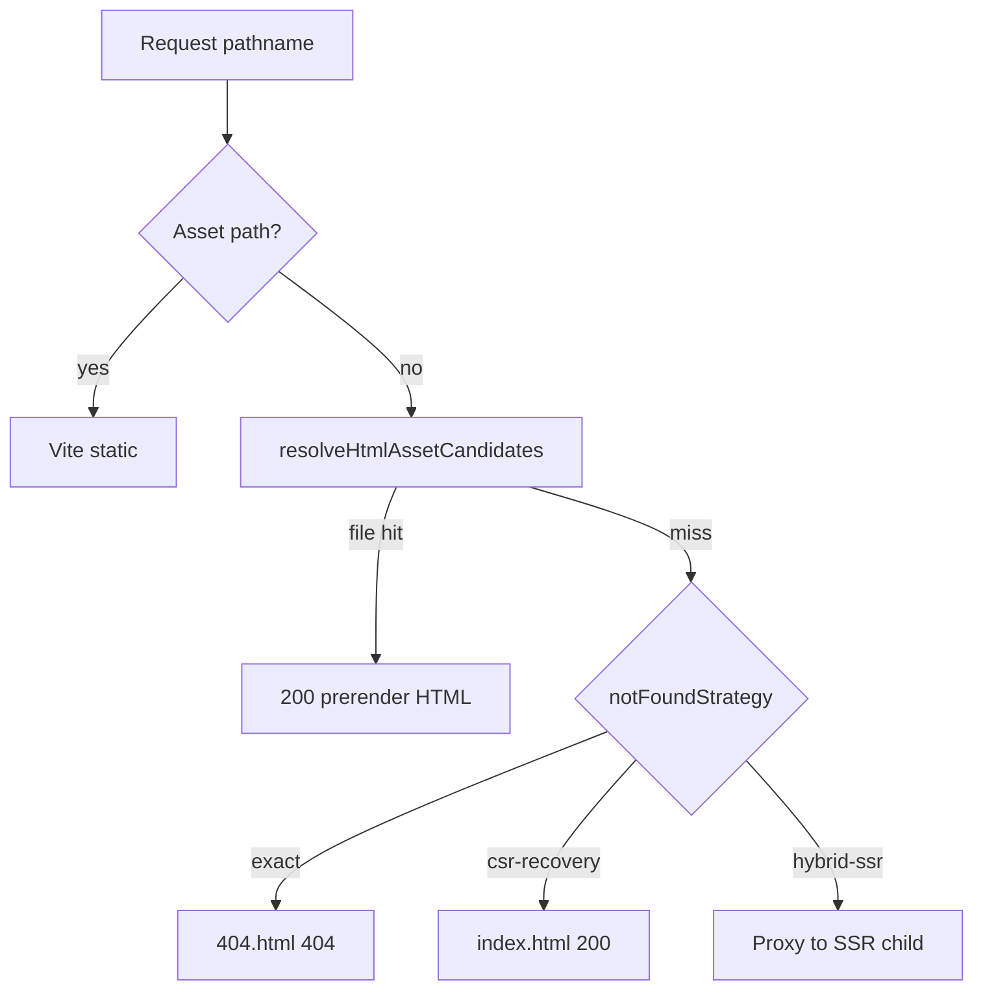
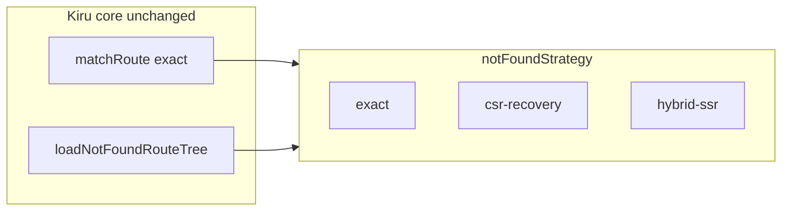

# Static 404 and host fallback strategies

How Kiru handles **not found** at the router, at build time (SSG), in local preview, and on production hosts.

**Related:** [04-route-tree-and-matching.md](./04-route-tree-and-matching.md), [10-isr-hybrid-and-prerender.md](./10-isr-hybrid-and-prerender.md), [13-vite-plugin-and-build-pipeline.md](./13-vite-plugin-and-build-pipeline.md), [14-adapters-and-deploy-runtimes.md](./14-adapters-and-deploy-runtimes.md).

---

## Executive summary

- **Application routing** in Kiru is **exact**: `matchRoute` either matches a leaf or does not. Not-found UI uses the **nearest scope** that defines `notFound` (`loadNotFoundRouteTree`).
- **Static hosts** differ widely. Cloudflare Pages/Workers can probe hierarchical asset paths at the edge; most CDNs use **exact key lookup** plus **explicit rewrites** or a single SPA fallback (`/* → /index.html`).
- **Deploy-time strategy** (preview today; production adapters follow the same model) is one of three values: **`exact`**, **`csr-recovery`**, **`hybrid-ssr`** — configured on `vite-plugin-kiru` `router.notFoundStrategy` or inferred from `ssg` + `serverEntry`.
- Hierarchical edge probing (Cloudflare Assets, `_routes.json`, BYO rewrites) is a **host/platform** concern, not a fourth Kiru strategy.

---

## Shipped API (P2-7)

### `NotFoundStrategy`

| Value | After prerender candidates miss |
|-------|--------------------------------|
| **`exact`** | Serve built **`404.html`** with HTTP **404** (SSG-only default) |
| **`csr-recovery`** | Serve filled **`index.html`** with HTTP **200** (SPA static hosts) |
| **`hybrid-ssr`** | Fall through to SSR (hybrid default when `serverEntry` is set) |

```typescript
// vite.config.ts
import kiru from "vite-plugin-kiru"

export default {
  plugins: [
    kiru({
      router: {
        ssg: true,
        // notFoundStrategy: "exact", // default for SSG-only
        serverEntry: "./src/server.ts",
        // notFoundStrategy inferred as "hybrid-ssr" when serverEntry is set
      },
    }),
  ],
}
```

### Shared HTML asset candidates

`resolveHtmlAssetCandidates` and `fetchHtmlAsset` in `packages/lib/src/router/htmlAssetCandidates.ts`:

- Used by `vite preview` (`htmlCandidates` → on-disk paths; directories are skipped).
- Used by `@kirujs/adapter-cloudflare` `createKiruWorkerHandler` for immutable prerender `getAsset` probes.

Order for `/about`: `/about`, `/about.html`, `/about/index.html`. Trailing slash: `/posts/one/` → `/posts/one/index.html` only.

`inferNotFoundStrategy({ ssg, serverEntry })` — SSG + `serverEntry` → `hybrid-ssr`; SSG only → `exact`.

---

## How other hosts behave (summary)

| Host | Typical unmatched URL behavior | Hierarchical HTML at edge |
|------|--------------------------------|---------------------------|
| **Cloudflare Pages / Workers** | Asset manifest + optional upward probing; SPA rewrites | Often (platform `_routes.json`, Assets) |
| **Vercel** | Exact file + framework rewrites | Framework-controlled |
| **Netlify** | Exact file + `_redirects`; common `/* /index.html 200` | No |
| **GitHub Pages** | Exact file + `404.html` | No |
| **S3 + CloudFront** | Literal object key; custom error → rewrite | No (unless you configure it) |

Configure hierarchical or SPA fallbacks in **host config** (`_redirects`, `_routes.json`, `vercel.json`) — Kiru does not codegen these yet (backlog).

---

## Kiru’s four layers

### Layer 1 — Application router (host-agnostic)

| Concern | Source | Behavior |
|---------|--------|----------|
| Route match | `matchRoute` | Exact logical pathname |
| Not-found UI | `loadNotFoundRouteTree` | Nearest scope with `notFound` |
| SSR response | `prepareAppForUrl` | `responseStatus: 404` when not-found tree loads |
| Client navigation | `clientRoutePrep.ts` | Same `loadNotFoundRouteTree` |

### Layer 2 — SSG build output

`prerenderStaticRoutes` emits `404.html` when `manifest.rootHasNotFound` (single root file; no per-scope static 404 yet).

### Layer 3 — Local preview (`vite preview`)



| Config | Inferred / explicit strategy |
|--------|------------------------------|
| `ssg` only | `exact` |
| `ssg` + `serverEntry` | `hybrid-ssr` |
| `notFoundStrategy: "csr-recovery"` | SPA recovery on static preview |

Legacy: `requireFilledHtml: true` in preview middleware options ≡ `hybrid-ssr`.

### Layer 4 — Production adapters

| Runtime | Unmatched URL | Not-found body |
|---------|---------------|----------------|
| **Node / Bun hybrid** | Not in static set → SSR | Router `notFound` or plain 404 |
| **Cloudflare Worker** | Not in static set → SSR | `fetchHtmlAsset(getAsset, pathname)` for static paths only |
| **Pure SSG on CDN** | Host rules + `404.html` | Kiru-built `404.html` when root `notFound` configured |

---

## Deploy strategies

These are **deploy-time** choices, not changes to `matchRoute`.

| Strategy | Typical use | Static / preview miss behavior |
|----------|-------------|--------------------------------|
| **`exact`** | SSG-only | `404.html` with 404 status |
| **`csr-recovery`** | CSR on static CDN | `index.html` with 200 |
| **`hybrid-ssr`** | SSG + `serverEntry` | SSR (`prepareAppForUrl` + `notFound`) |



### Defaults

| Setup | Strategy |
|-------|----------|
| `router.ssg` only (preview) | `exact` |
| `ssg` + `serverEntry` (preview) | `hybrid-ssr` |
| CSR + `vite preview` | Vite SPA fallback (outside Kiru middleware) |
| Cloudflare Worker + Kiru SSR | `hybrid-ssr` for unknown paths |

---

## Footguns

1. **Hybrid vs SSG-only preview** — With `serverEntry`, do not expect static `404.html` for unknown URLs; preview uses `hybrid-ssr` (`preview-server.test.ts`).
2. **`force-static` without prerender file** — 404 without SSR fallback; not the same as `notFound` UI unless that path was prerendered.
3. **Scope `notFound` on SSG** — Full document requests may only get root `404.html` unless SSR or future per-scope static output exists.
4. **Host SPA rewrites** — Serving a parent `index.html` with **200** for deep unknown URLs is a **host misconfiguration** risk; use explicit rewrites or `csr-recovery` only when intentional.
5. **No root `notFound`** — No `404.html` in SSG output; adapters return plain 404 when renderer returns `null`.

---

## Backlog (not in P2-7 PR1)

| Item | Purpose |
|------|---------|
| Rewrite codegen | `_redirects`, `_routes.json`, `vercel.json` for `csr-recovery` and segment shells |
| `notFoundStrategy` on Node adapter | Explicit knob for pure SSG Node static hosting (preview already wired) |
| Per-scope / per-locale static `404.html` | Parity with runtime scope `notFound` |

---

## Testing references

| Case | Location |
|------|----------|
| SSG static 404 | `e2e/file-routes-ssg/cypress/e2e/file-routes-ssg.cy.ts` |
| Preview strategies | `packages/vite-plugin-kiru/src/preview-server.test.ts` |
| Asset candidates | `packages/lib/src/tests/unit/htmlAssetCandidates.test.ts` |
| `prepareAppForUrl` notFound | `packages/lib/src/tests/unit/prepareAppForUrl.test.ts` |
| Hybrid preview skips `404.html` | `preview-server.test.ts` (`hybrid-ssr`) |

---

## Further reading

- [04-route-tree-and-matching.md](./04-route-tree-and-matching.md)
- [10-isr-hybrid-and-prerender.md](./10-isr-hybrid-and-prerender.md)
- [13-vite-plugin-and-build-pipeline.md](./13-vite-plugin-and-build-pipeline.md)
- [14-adapters-and-deploy-runtimes.md](./14-adapters-and-deploy-runtimes.md)
- [16-gaps-risks-and-launch-checklist.md](./16-gaps-risks-and-launch-checklist.md)
