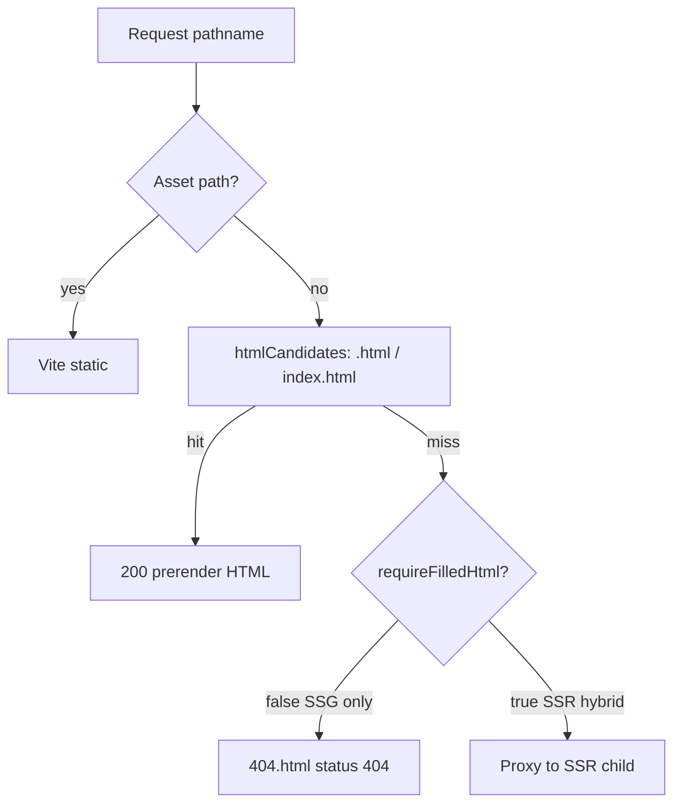
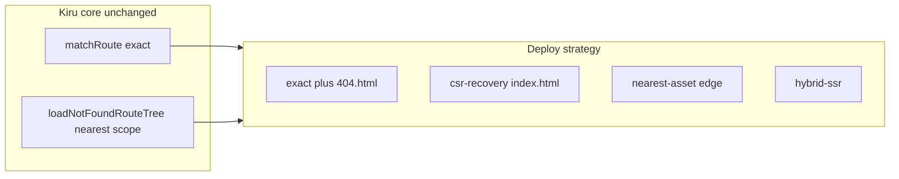

# Static 404 and host fallback strategies

How Kiru handles **not found** at the router, at build time (SSG), in local preview, and on production hosts — and why **Cloudflare-style nearest-asset fallback** should stay an opt-in deploy strategy, not core route semantics.

**Related:** [04-route-tree-and-matching.md](./04-route-tree-and-matching.md), [10-isr-hybrid-and-prerender.md](./10-isr-hybrid-and-prerender.md), [13-vite-plugin-and-build-pipeline.md](./13-vite-plugin-and-build-pipeline.md), [14-adapters-and-deploy-runtimes.md](./14-adapters-and-deploy-runtimes.md).

---

## Executive summary

- **Application routing** in Kiru is **exact**: `matchRoute` either matches a leaf or does not. Not-found UI uses the **nearest scope** that defines `notFound` (`loadNotFoundRouteTree`).
- **Static hosts** differ widely. Cloudflare Pages/Workers can probe hierarchical asset paths at the edge; most CDNs (S3, Netlify, GitHub Pages, Vercel static) use **exact key lookup** plus **explicit rewrites** or a single SPA fallback (`/* → /index.html`).
- Kiru today is **mostly portable at the router layer**. Ambiguity appears at **static file serving**: SSG emits `404.html`, hybrid apps defer unknown paths to SSR, and CSR preview uses Vite’s SPA `index.html` fallback.
- **Recommendation:** Keep router semantics exact; make **deploy-time not-found strategy** configurable (`exact`, `csr-recovery`, `nearest-asset`, `hybrid-ssr`) in adapters, preview, and optional rewrite codegen — not in `matchRoute`.

---

## How other hosts behave (summary)

| Host | Typical unmatched URL behavior | “Nearest” hierarchical HTML |
|------|--------------------------------|----------------------------|
| **Cloudflare Pages / Workers** | Asset manifest + optional upward probing (`path`, `path.html`, `path/index.html`, parent segments); SPA mode can rewrite to a shell without redirect | **Yes** (platform-specific; `_routes.json`, Workers) |
| **Vercel** | Exact file + framework rewrites / middleware; Next adds its own routing layer | No (framework-controlled) |
| **Netlify** | Exact file + `_redirects`; common SPA rule `/* /index.html 200` | No |
| **GitHub Pages** | Exact file + `404.html` (often awkward for SPAs) | No |
| **Firebase Hosting** | Rewrites / redirects in config | No (unless configured) |
| **S3 + CloudFront** | Literal object key; custom error response → rewrite; Lambda@Edge for advanced cases | No (unless you build it) |

Cloudflare’s edge asset layer is tightly integrated with Workers and internal rewriting, so cheap candidate loops at the edge are feasible. Traditional origins usually cannot afford implicit hierarchical probing without explicit rules.

**Implication for Kiru:** Do not assume nearest-asset semantics exist on every host. Treat them as an **adapter optimization** (especially Cloudflare) or as **generated rewrites** for portability.

---

## Kiru’s four layers

### Layer 1 — Application router (host-agnostic)

| Concern | Source | Behavior |
|---------|--------|----------|
| Route match | `matchRoute` in `packages/lib/src/router/prepareAppForUrl.ts` | Exact logical pathname (after `pathPolicy` / i18n split) |
| Not-found UI | `loadNotFoundRouteTree` in `packages/lib/src/router/routeTree.ts` | **Nearest scope** along the pathname that defines `notFound` |
| SSR response | `prepareAppForUrl` | `responseStatus: 404` when not-found tree loads; `null` when no `notFound` |
| Client navigation | `clientRoutePrep.ts` | Same `loadNotFoundRouteTree` after client-side navigation |

Scope-level `notFound` (e.g. `/docs/*` with a docs layout not-found) works at **runtime** on SSR and CSR. It does **not** automatically produce separate static HTML files per scope (see Layer 2).

### Layer 2 — SSG build output

`prerenderStaticRoutes` (`packages/lib/src/router/ssg.ts`):

- Emits HTML only for paths from `generateStaticPaths` (static leaves + `generateStaticParams`).
- When `manifest.rootHasNotFound`, adds **one** extra page: path `/404` → disk **`404.html`** (rendered via internal URL `__kiru_ssg_not_found__`).

There is **no** per-scope `404.html` or per-locale not-found file today.

### Layer 3 — Local preview (`vite preview`)

`createSsgPreviewMiddleware` (`packages/vite-plugin-kiru/src/preview-server.ts`):



| Preview mode | Unknown path |
|--------------|--------------|
| **SSG only** | Serve `404.html` with HTTP 404 if present and filled |
| **SSR / hybrid** | Skip `404.html`; proxy to SSR child (`requireFilledHtml`) |
| **CSR** | Vite default SPA fallback → `index.html` |

`htmlCandidates` tries `path.html` and `path/index.html` — **filesystem candidates**, not parent-segment “nearest layout” walking.

### Layer 4 — Production adapters

| Runtime | Unmatched URL (not in static path set) | Not-found body |
|---------|----------------------------------------|----------------|
| **Node / Bun hybrid** | `tryServePrerenderedFromDisk` misses → SSR `createRenderer` | Router `notFound` → 404 HTML, or adapter plain 404 if `null` |
| **Cloudflare Worker** | `tryServeImmutablePrerender` only for static paths; else SSR | `getAsset` tries `path`, `path.html`, `path/index.html` **for static paths only** (`createKiruWorkerHandler.ts`); unknown → `null` → default 404 unless host serves `404.html` |
| **Pure SSG on CDN** | Host rules + whether `404.html` exists | Kiru-built `404.html` when root `notFound` configured |

The Cloudflare adapter’s `getAsset` wrapper duplicates **candidate resolution** similar to preview `htmlCandidates`, but **does not** run for arbitrary unknown URLs and **does not** walk parent path segments unless the **host Assets binding** does.

---

## Deploy strategies (recommended model)

These are **deploy-time** choices, not changes to `matchRoute`.

| Strategy | Typical use | Static / edge behavior | App router on full load |
|----------|-------------|------------------------|-------------------------|
| **`exact`** | SSG-only sites | Serve only prerendered files; unknown → **`404.html`** (404 status) if built | Static 404 page; client nav uses `notFound` |
| **`csr-recovery`** | CSR SPA on static host | Unknown → **`200` + `index.html`** shell | Client router renders scope/root `notFound` |
| **`nearest-asset`** | Cloudflare Pages (opt-in) | Edge probes segment / asset candidates (platform or adapter) | Same exact router; risk of serving **parent** `index.html` for deep 404s if misconfigured |
| **`hybrid-ssr`** | SSG + `serverEntry` | Known static paths from disk/assets; **unknown → SSR** (no static `404.html` for misses) | `prepareAppForUrl` + `notFound` |



### Defaults by bootstrap / adapter

| Setup | Effective strategy today | Notes |
|-------|-------------------------|-------|
| `router.ssg` only | **`exact`** (preview + static CDN) | Emit `404.html` with root `notFound` |
| `router.serverEntry` only (CSR client not applicable on server) | N/A static | Adapter **`hybrid-ssr`** if also `ssg` |
| `ssg` + `serverEntry` (hybrid) | **`hybrid-ssr`** in preview/prod | Do not serve prerendered `404.html` for unknown paths |
| CSR + `vite preview` | **`csr-recovery`** | Vite SPA fallback |
| `adapter: cloudflare` | Static paths: candidate `getAsset`; unknown: SSR or 404 | **`nearest-asset`** only if you rely on CF Assets + `_routes.json`; Worker-first + Kiru SSR is **`hybrid-ssr`** |

---

## Footguns

1. **Hybrid vs SSG-only preview** — Expecting `404.html` on `vite preview` with `serverEntry` set will fail; unknown paths go to SSR (`preview-server.test.ts`).
2. **`force-static` without prerender file** — Returns **404** with no SSR fallback ([10-isr-hybrid-and-prerender.md](./10-isr-hybrid-and-prerender.md)); not the same as `notFound` route UI unless you prerender that path.
3. **Scope `notFound` on SSG** — Runtime scopes work after hydrate/SSR; **full document request** to an unknown URL under a scope may only get root **`404.html`**, not scope-specific HTML, unless you add SSR or future per-scope static output.
4. **`nearest-asset` on deep paths** — Serving `/docs/index.html` for `/docs/missing-page` can return **200** with wrong content if the host does not distinguish “missing leaf” from “SPA shell”.
5. **No root `notFound`** — SSG builds no `404.html`; adapters return plain **404** when renderer returns `null`.

---

## Portable patterns (what to generate or configure)

| Pattern | Portability | Kiru today |
|---------|-------------|------------|
| Deterministic paths (`/about/index.html`) | High | Default prerender layout per `pathPolicy` |
| Root `404.html` | High (SSG hosts) | Built when `rootHasNotFound` |
| Explicit rewrites (`/docs/*` → `/docs/index.html`) | High | **Not** codegen’d — BYO `_redirects` / `vercel.json` |
| Edge middleware / Worker | Medium | `adapter-cloudflare`, Node `createKiruHandler` |
| Nearest-segment asset walk | Low (CF-specific) | Optional; do not assume in core |

---

## Future work (backlog)

Planned API shape (not implemented in v2.0):

```typescript
// vite.config — illustrative
router: {
  adapter: "cloudflare",
  // deploy: {
  //   notFoundStrategy: "exact" | "csr-recovery" | "nearest-asset" | "hybrid-ssr",
  // },
}
```

| Item | Purpose |
|------|---------|
| `notFoundStrategy` on Vite `router` + adapters | Single knob for preview + production |
| Shared `resolveHtmlAssetCandidates(pathname)` | Unify preview-server and Cloudflare `getAsset` |
| Rewrite codegen | `_redirects`, `_routes.json`, `vercel.json` for `csr-recovery` and segment shells |
| Per-scope / per-locale static `404.html` | Parity with runtime scope `notFound` |

Track as **P2-7** in [18-release-sprint-todos.md](./18-release-sprint-todos.md).

---

## Testing references

| Case | Location |
|------|----------|
| SSG static 404 | `e2e/file-routes-ssg/cypress/e2e/file-routes-ssg.cy.ts` |
| Hybrid preview skips `404.html` | `packages/vite-plugin-kiru/src/preview-server.test.ts` |
| `prepareAppForUrl` notFound | `packages/lib/src/tests/unit/prepareAppForUrl.test.ts` |
| `force-static` 404 | `e2e/ssr/cypress/e2e/tier3-wave1.cy.ts` |

---

## Further reading

- [04-route-tree-and-matching.md](./04-route-tree-and-matching.md) — `notFound` routes and `rootHasNotFound`
- [10-isr-hybrid-and-prerender.md](./10-isr-hybrid-and-prerender.md) — hybrid serve order
- [13-vite-plugin-and-build-pipeline.md](./13-vite-plugin-and-build-pipeline.md) — preview modes
- [14-adapters-and-deploy-runtimes.md](./14-adapters-and-deploy-runtimes.md) — Node / Cloudflare wiring
- [16-gaps-risks-and-launch-checklist.md](./16-gaps-risks-and-launch-checklist.md) — P2-7 gap
