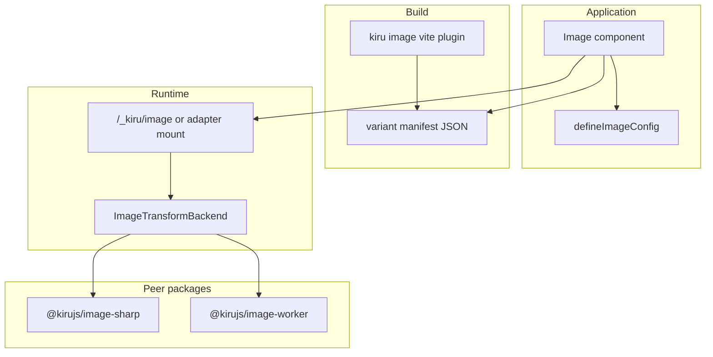

# ADR: Unified image pipeline (Node sharp + edge resvg)

**Status:** Accepted direction — **v2.0 removes prior implementation**  
**Sprint:** S5 (replaces P3-1 OG helper scope)  
**Related:** [12-seo-head-sitemap-images.md](./12-seo-head-sitemap-images.md), [14-adapters-and-deploy-runtimes.md](./14-adapters-and-deploy-runtimes.md)

---

## Context

Kiru v2.0 shipped an experimental `<Image />` component, `kiru/image`, Vite `router.images` (sharp at build), and Node runtime `/_kiru/image` (sharp). Cloudflare had **no** runtime optimizer. The stack was split across `packages/lib`, `vite-plugin-kiru`, and `adapter-node` with no edge story.

**v2.0 action:** Remove the implementation. Document a single pipeline with pluggable backends for **v2.1+**.

**OG / social images:** Not part of v2.0 or initial v2.1 image work. Dynamic `image/png` routes will reuse the same `ImageTransformBackend` after the HTML image pipeline lands (phase 3).

---

## Decision summary

| Layer | v2.0 | v2.1+ |
|-------|------|-------|
| `<Image />`, `kiru/image`, `router.images`, sharp optimizer | **Removed** | New API |
| `head.openGraph` / `twitter` (static URLs) | **Keep** | Unchanged |
| `ImageTransformBackend` interface | ADR only | Implement |
| Node/Bun backend | — | **sharp** (or sharp-wasm fallback) |
| Cloudflare backend | — | **resvg** for SVG; raster TBD (wasm resize vs build-only) |
| OG `image/png` routes | Defer | Phase 3 on same backend |

**Package shape (resolved):** Optional peer packages — `@kirujs/image-sharp` (Node/Bun), `@kirujs/image-worker` (resvg + raster policy on Workers). Core `kiru/image` (or `kiru` subpath) holds **types, `defineImageConfig`, component, URL builder** — no native deps in the main bundle.

---

## Goals

1. One mental model: build-time variants + optional runtime transform URL.
2. Deploy target selects backend via `@kirujs/runtime` + adapter wiring.
3. No sharp import in browser or Worker bundles.
4. Regulated remote URL allowlists (retain `localPatterns` / `remotePatterns` concepts).

---

## Non-goals

- Shipping `<Image />` in v2.0.
- `@vercel/og` compatibility layer in core.
- Automatic OG route codegen in v2.1.

---

## Architecture (v2.1 target)



### `ImageTransformBackend`

```typescript
interface ImageSource {
  kind: "file" | "url" | "buffer"
  path?: string
  url?: string
  buffer?: Uint8Array
}

interface TransformOptions {
  width: number
  quality: number
  format: "webp" | "avif" | "jpeg" | "png"
}

interface TransformResult {
  body: Uint8Array
  contentType: string
  cacheControl?: string
}

interface ImageTransformBackend {
  transform(source: ImageSource, opts: TransformOptions): Promise<TransformResult>
}
```

### Strategies

| Strategy | Node/Bun | Cloudflare |
|----------|----------|------------|
| `build` | Vite plugin + sharp emits widths to `dist` | Build-only variants in Assets; no runtime sharp |
| `runtime` | Adapter mounts transform route; sharp backend | Worker backend (resvg SVG; raster via wasm or deny) |
| `unoptimized` | Pass-through `src` | Pass-through |

### User-facing API (sketch)

- `defineImageConfig({ strategy, path, deviceSizes, formats, localPatterns, remotePatterns, … })`
- `import { Image } from "kiru/image"` — reads virtual manifest in build strategy; emits `src` / `srcset` only
- Adapter option: `image: { backend: createSharpBackend({ … }) }` (Node), `image: { backend: createWorkerBackend({ … }) }` (CF)

### Raster on Workers (open point)

| Option | Pros | Cons |
|--------|------|------|
| Build-only raster on CF | Simple; matches today’s CF ISR limits | No on-the-fly remote images |
| wasm resize (e.g. photon/squoosh) | Runtime remote resize | Bundle size, CPU limits |
| External image CDN | Production-grade | BYO vendor |

**Recommendation:** v2.1 CF ships **build-only** + resvg for SVG; document runtime raster as experimental behind `@kirujs/image-worker` wasm flag.

---

## Phase 3: OG / social images

After HTML `<Image />` is stable:

- Resource route kind (non-HTML) on renderer or adapter: `content-type: image/png`
- Same `ImageTransformBackend` for compositing (Satori → resvg/sharp rasterization — package TBD)
- Wire `head.openGraph.images` to absolute URLs pointing at OG routes

Not competing with static `openGraph.image` strings in route meta (keep as-is).

---

## v2.0 removal checklist

See [BREAKING-CHANGES.md](./BREAKING-CHANGES.md). Removed:

- `Image` from `kiru` components
- `kiru/image` export
- `router.images` Vite option
- `createImageOptimizer` / `/_kiru/image` on Node adapter
- E2E image demos and `e2e:csr:image` builderman task

---

## Breaking change policy

**v2.0.0:** Delete `kiru/image` and `<Image />` entirely — no deprecated stub (surface was experimental; pre-2.0 adopters use plain ``).

---

## Further reading

- [12-seo-head-sitemap-images.md](./12-seo-head-sitemap-images.md)
- [14-adapters-and-deploy-runtimes.md](./14-adapters-and-deploy-runtimes.md)
- [18-release-sprint-todos.md](./18-release-sprint-todos.md) (S5-2)
