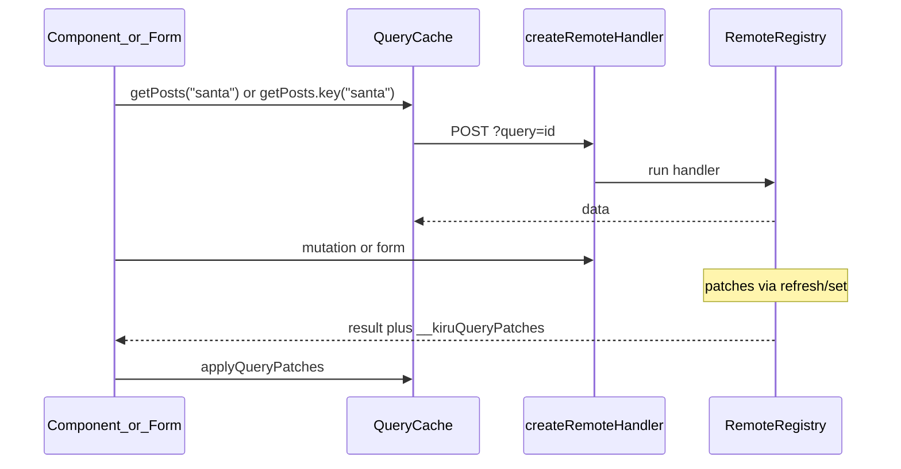

# Remote functions (`query`, `mutation`, `form`)

**Status:** Shipped on the v2 branch. Handlers use **`getRequestEvent()`** for framework context (SvelteKit-style); validated input is the only handler argument when a `schema` is present.

**Replaces:** monolithic `action()` in `*.actions.ts` (see [07-remote-actions.md](./07-remote-actions.md) for current shipped behavior).

**Hub:** [`packages/lib/src/remote/`](../../packages/lib/src/remote/) · codegen [`packages/vite-plugin-kiru/src/codegen/remote.ts`](../../packages/vite-plugin-kiru/src/codegen/remote.ts)

---

## Mental model

| Primitive | Purpose | Callable from render? | Wire |
|-----------|---------|----------------------|------|
| **`query()`** | Server read, cached by input | Yes (`resource()`, loaders) | `POST /?query=<id>` |
| **`mutation()`** | Server write (JSON) | No (events / handlers only) | `POST /?mutation=<id>` |
| **`form()`** | Server write (HTML form) | Via `<form>` | `POST /?mutation=<id>` + FormData |

Route **loaders** stay the URL/page layer; they **call** `query()` in-process on the server instead of duplicating fetch logic.



---

## File layout

| File | Responsibility |
|------|----------------|
| `packages/lib/src/remote/query.ts` | `query()`, instances, server `refresh`/`set`, patch collector |
| `packages/lib/src/remote/mutation.ts` | `mutation()` |
| `packages/lib/src/remote/form.ts` | `form()` |
| `packages/lib/src/remote/queryCache.ts` | Client cache, `applyQueryPatches`, loader seeding |
| `packages/lib/src/remote/requested.ts` | `requested()`, client `updates()` wire |
| `packages/lib/src/remote/abortScope.ts` | Implicit abort bag + `resolveRemoteFetchSignal()` |

**Client UI reads:** [`resource()`](../../packages/lib/src/resource.ts) in components — not a separate query hook.
| `packages/lib/src/remote/index.ts` | Registry + `createRemoteHandler` |

**Remove:** `action` export, `RemoteActionCallOptions`, `validation.body` / `validation.query`, `invalidate: routeIds`, `x-kiru-invalidate`.

**Rename:** `*.actions.ts` → `*.remote.ts` (Vite `router.remote` glob).

---

## Authoring

### Modules

- Place remotes in `**/*.remote.ts` (Vite `router.remote` glob).
- Import from `kiru/remote`: `query`, `mutation`, `form`, `getRequestEvent`, `redirect`, `RemoteError`, `createFormController`, `requested` (server).

### Validation (input only)

One Standard Schema per remote — pass as the first argument when input is validated (never legacy `validation.body` / `validation.query`).

| Authoring | Meaning |
|-----------|---------|
| `query(handler)` / `mutation(handler)` / `form(handler)` | Void input |
| `query(schema, handler)` / `mutation(schema, handler)` / `form(schema, handler)` | Validated input |

### Handler signatures

| Kind | No `schema` | With `schema` |
|------|-------------|---------------|
| `query()` | `() => Output` | `(input: Input) => Output` |
| `mutation()` | `() => Output` | `(input: Input) => Output` |
| `form()` | `() => Output` | `(input: Input) => Output` |

Framework concerns (`context`, `cookies`, `request`, `response`, `signal`, `redirect`) come from **`getRequestEvent()`** inside the handler — not from handler arguments.

```ts
import { query, mutation, form, getRequestEvent, redirect } from "kiru/remote"

export const getUser = query(async () => {
  const { cookies, context } = getRequestEvent()
  return findUser(cookies.get("session_id"), context)
})

export const submitRedirect = form(async () => {
  const { redirect } = getRequestEvent()
  return redirect(303, "/hello")
})

export const submitMessage = form(async () => {
  const { request } = getRequestEvent()
  const message = String(request.formData!.get("message") ?? "").trim()
  return { message: message || "empty" }
})
```

### `RemoteCallOptions` (abort only)

```ts
export type RemoteCallOptions = {
  signal?: AbortSignal
}
```

- **Last** argument on `mutation` / `query` calls and on `.key(input, …)`.
- Forwarded to client `fetch(..., { signal })` only — **not** part of validated input or cache key.
- `isRemoteCallOptions(value)` — object whose only key is `signal` (optional).

### Implicit abort (`remoteCallContext.abortSignal`)

Route **loaders**, `resource()` **load**, and in-process server remotes run inside a scoped **abort signal bag**. Queries and mutations read it when the call does not pass `{ signal }` (or combine with it — see below).

```ts
import { remoteCallContext } from "kiru/remote"

export const load = serverLoader(async () => {
  // Loader abort → listPosts fetch without a trailing { signal }
  const posts = await listPosts({ filter: "santa" })
  return { posts }
})

reviews = resource(async () => {
  // Same during resource load (bag = resource load signal for that invocation)
  return await getReviews()
})

// Optional explicit read (same value as the bag when set)
const s = remoteCallContext.abortSignal
```

**Resolution** (`resolveRemoteFetchSignal` in `abortScope.ts`):

| Explicit `{ signal }` on call | Bag set | Effective signal |
|------------------------------|---------|------------------|
| no | no | none |
| yes | no | explicit |
| no | yes | bag |
| yes | yes | `AbortSignal.any([bag, explicit])` |

- Bag is **not** part of the cache key or wire payload.
- **`runWithRemoteAbortSignal(signal, fn)`** / async variant: nested save/restore (same pattern as `runWithSsrRequestContext`).
- **Enter scope** when running: `serverLoader` / `loader` / `clientLoader` (`ctx.signal`), `resource()` `load` (`ctx.signal`), server in-process `query()` inside another remote handler (handler `signal`).
- **Limitation:** the bag is for **synchronous reads** and for work that stays inside the scoped `async` body. Detached callbacks (`setTimeout`, unscoped `.then` after the host returned) do not see it — pass `{ signal }` or thread your own controller.

### Mutations and forms (positional calls + optional `signal`)

**Input** is always positional. The only optional **call option** is `{ signal?: AbortSignal }` as a **trailing** argument (for abortable `fetch`).

**Not supported on the call:** `headers`, URL query params, `{ body }` / `{ query }` envelopes, or any other option keys.

| Definition | Call | POST body |
|------------|------|-----------|
| `mutation(handler)` | `bump()` or `bump({ signal })` | `null` |
| `mutation(schema, handler)` | `addLike(id)` or `addLike(id, { signal })` | `JSON.stringify(input)` |

```ts
export const addLike = mutation(v.string(), async (id) => {
  await db.like(id)
})

await addLike(item.id)
await addLike(item.id, { signal: ac.signal })

export const search = mutation(v.object({ q: v.string() }), async ({ q }) => { ... })
await search({ q: "kiru" }, { signal })
```

**Option detection:** trailing arg is call options when it is a plain object with **only** an optional `signal` property (see `isRemoteCallOptions` in implementation). For object **input** schemas, pass options as the **second** argument so it is never ambiguous with input.

**Mutations must not run during SSR render** (dev throw unless inside another remote handler).

Inside `resource()` load, pass `ctx.signal` into the bag so nested `query()` / `mutation()` calls abort with the resource without trailing `{ signal }`. Explicit `{ signal }` on a call is combined with the bag via `AbortSignal.any()` when both are set.

### Queries (callable + cache helpers)

Codegen: `Object.assign(call, extras)` where extras depend on input shape.

- **Call** = fetch (when awaited) + cache identity.
- **Void** queries: factory `set(data)` and `refresh()` — no `.key()`.
- **Keyed** queries: `.key(input)` = same cache identity without implying a new fetch (used in `updates()`).

| Input schema | Fetch | Cache / patch helpers |
|--------------|-------|------------------------|
| `v.string()` | `getPosts("santa")` | `getPosts.key("santa")` |
| `v.object({ filter: v.string() })` | `listPosts({ filter: "santa" })` | `listPosts.key({ filter: "santa" })` |
| void | `getCatalog()` | `getCatalog.set(data)` / `void getCatalog.refresh()` |

**Scalar:**

```ts
export const getPosts = query(v.string(), async (author) => posts)

await getPosts("santa")
getPosts.key("santa")   // same cache entry as getPosts("santa")
```

**Object** — `.key()` takes the **full object**, not a single field:

```ts
export const listPosts = query(
  v.object({ filter: v.string() }),
  async ({ filter }) => posts,
)

await listPosts({ filter: "santa" })
listPosts.key({ filter: "santa" })
```

**Void:**

```ts
export const getCatalog = query(async () => catalog)

await getCatalog()
getCatalog.set(catalog)       // server — push value into void cache
void getCatalog.refresh()     // server — re-run handler, queue refresh patch
```

**Instances** (from call or `.key(input)`): `await instance`, `instance.refresh()`, `instance.set(data)` (server), `instance.withOverride(fn)` (client). Void queries use factory `set` / `refresh` instead of `.key()`.

**Optional abort on call only** (not on `.key()`):

```ts
await getPosts("santa", { signal })
await listPosts({ filter: "santa" }, { signal })
```

**Not supported:** `getPosts({ body: id })`, `action({ type: "form" })`, `.filter()`, `.with()`, per-query `bind`, `{ headers }` or other call options besides `signal`.

### Client reads with `resource()`

Bind queries with the **object** `resource` signature and pass the query as `load`. `resource()` detects `__kiruRemoteQuery`, invokes the query with unwrapped `source` + `ctx.signal`, and subscribes to `queryCache` so mutation patches / server `.set()` refresh the UI automatically.

```ts
// Void query
const catalog = resource({ load: getCatalog })

// Scalar input (e.g. route param signal)
const name = signal("")
const greeting = resource({ source: name, load: getGreeting })

// Object input
const posts = resource({
  source: { filter, page },
  load: listPosts,
})
```

**`.key(input)`** is for cache targeting only (`updates()`, `requested()`, server `set`/`refresh`) — not for executing reads in components.

**Callback form** also auto-syncs when the load **awaits** queries (keys are collected during `runFetch`):

```ts
resource(() => getCatalog())
resource(() => getPost(params.id.value))
```

On the **server**, `resource()` uses the active SSR request/render signal from `runWithSsrRequestContext` — no per-resource `AbortController`. On the **client**, refetch/dispose still use a local controller.

### `serverLoader` with queries

```ts
export const load = serverLoader({
  load: getCatalog, // void query only as direct `load`
  fallback: () => <p>Loading…</p>,
})

export const load = serverLoader(async (ctx) => ({
  post: await getPost(ctx.params.id),
}))
```

Client navigations subscribe to query keys touched during `load` and refresh loader cache (and `loaderEpoch`) when patches arrive.

- **Loader + resource:** if `serverLoader` already called `getPost(id)`, seed cache from hydration/RPC; `resource({ source: id, load: getPost })` should not issue a second `POST ?query=` when the cache is warm.
- **After mutations:** `form.submit().updates(…)` patches cache; resources using `load: query` refetch from cache without manual `refetch()`.

**No `useQuery` hook** — do not add `router.queries` dispatch layer.

### Forms

```ts
export const createPost = form(postSchema, async (data) => {
  void getPosts.refresh()   // void query only; or getPosts.key(...).refresh() on instance
  return redirect(303, `/blog/${slug}`)
})
```

Keep `createFormController(formRef)` for progressive enhancement (`x-kiru-form`). Pass default update targets when the server uses `requested()`:

```ts
const form = createFormController(addTodo, { updates: [listTodos] })
// default onsubmit wires updates; for dynamic instances use submit(form).updates(...)
```

**Deferred (v1):** `.fields.as()`, preflight, `query.batch`, `query.live`.

---

## Cache invalidation

### Server-initiated (in handler)

```ts
getCatalog.set(result)                 // void query — factory set
void getCatalog.refresh()              // void query — factory refresh
getPosts.key("santa").set(result)      // keyed — skip refetch, push value
void getPosts.key("santa").refresh()   // keyed — re-run query, include in response patches
```

Framework awaits queued patches before sending the mutation/form response. Response may include `__kiruQueryPatches`:

```ts
type KiruQueryPatch =
  | { queryId: string; input: unknown; op: "refresh"; data: unknown }
  | { queryId: string; input: unknown; op: "set"; data: unknown }
```

Cache key: `queryId + ':' + stableSerialize(input)` (sorted object keys for objects).

### Client-requested (`updates` + `requested`)

When the server cannot know which instances are on screen:

```ts
await form.submit().updates(
  getPosts,
  getPosts.key("santa"),
  getPosts.key("santa").withOverride((posts) => [newPost, ...posts]),
)

await form.submit().updates(
  listPosts,
  listPosts.key({ filter: "santa" }),
  listPosts.key({ filter: "santa" }).withOverride((posts) => [newPost, ...posts]),
)
```

Server handler caps work with `requested(fn, limit)` — wire entries from the client POST are trusted:

```ts
export const createPost = form(postSchema, async (data) => {
  for (const { input, query } of requested(listPosts, 5)) {
    void query.refresh()
  }
  await requested(getPosts, 5).refreshAll()
  return redirect(303, `/blog/${slug}`)
})
```

On-demand prerender invalidation: call `revalidatePath` / `revalidateTag` from `kiru/router` inside the handler (not form metadata).

Mutation POST envelope (framework, separate from validated handler input):

```ts
type RemoteMutationWire =
  | null
  | Input
  | {
      input: Input | null
      requested?: Array<{ queryId: string; input: unknown; optimistic?: unknown }>
    }
```

Client cap (~8 requested entries). Server `requested(fn, limit)` — **limit required**.

`.withOverride()` sets optimistic client cache before the RPC; the override value is serialized on the wire as `optimistic` (server may ignore it).

### Examples in the repo

**Server-driven (void query)** — [`sandbox/ssr/src/pages/todos.remote.ts`](../../sandbox/ssr/src/pages/todos.remote.ts): write handlers call `listTodos.set(...)`; [`todos.tsx`](../../sandbox/ssr/src/pages/todos.tsx) uses `resource({ load: listTodos })` with no manual `refetch()`.

**Client-requested (parameterized query)** — [`e2e/ssr/src/pages/requested-queries-demo`](../../e2e/ssr/src/pages/requested-queries-demo.tsx): `submit().updates(listFiltered, listFiltered.key({ filter }))` + server `await requested(listFiltered, 3).refreshAll()`.

---

## Loader ↔ query cache

1. **Server:** `query()` inside `serverLoader` / SSR uses in-process invoke (no HTTP loopback).
2. **SSR:** `k-page-data` may include `__kiruQueries: { queryId, input, data }[]` → `seedQueryCache` on hydrate.
3. **Client nav:** loader RPC may return `__kiruQueries` snapshot → seed query cache before component `resource()` runs.
4. **`router.invalidate()`:** clears loader cache **and** query cache (v1: clear all query entries).

Recommended pattern:

```ts
// blog.remote.ts
export const getPost = query(v.string(), async (id) => fetchPost(id))

// page.tsx
export const load = serverLoader({
  load: async ({ params }) => ({ post: await getPost(params.id) }),
})
const post = resource(async ({ signal }) => getPost(params.id, { signal }))
// — no second POST ?query= when cache seeded from loader / __kiruQueries
```

---

## Wire protocol

| Kind | Method | URL | Body |
|------|--------|-----|------|
| Query | POST | `/?query=<routeId>:<export>` | `JSON.stringify(input)` or `null` |
| Mutation | POST | `/?mutation=<id>` | validated input (or wire envelope with `requested`) |
| Form | POST | `/?mutation=<id>` | FormData; enhanced: `x-kiru-form` + JSON response |

Framework headers only: `x-kiru-token`, `Content-Type: application/json`. Origin allowlist unchanged ([SECURITY.md](./SECURITY.md)).

RPC helpers: `buildQueryRpcUrl`, `buildMutationRpcUrl` in [`packages/lib/src/router/rpcUrl.ts`](../../packages/lib/src/router/rpcUrl.ts).

---

## Agent implementation checklist

Work top to bottom. Mark `[x]` when done. Do not skip phases without notes.

### Phase 0 — Docs and types (prep)

- [ ] Add exports surface in `packages/lib/src/remote/index.ts` (stubs OK behind `throw new Error("not implemented")` if needed for incremental work)
- [ ] Update [`docs/v2/07-remote-actions.md`](./07-remote-actions.md) banner → “superseded by [23-remote-functions.md](./23-remote-functions.md)”
- [ ] Add entry to [`docs/v2/BREAKING-CHANGES.md`](./BREAKING-CHANGES.md) for `action` → `query`/`mutation`/`form`
- [ ] Update [`docs/v2/17-package-exports-and-import-guide.md`](./17-package-exports-and-import-guide.md) (`*.remote.ts`)
- [ ] Update [`packages/vite-plugin-kiru/README.md`](../../packages/vite-plugin-kiru/README.md) glob example (`*.remote.ts`)

### Phase 1 — Query core

- [ ] `packages/lib/src/remote/abortScope.ts` — `remoteCallContext.abortSignal`, `runWithRemoteAbortSignal` (+ async), `resolveRemoteFetchSignal` (`AbortSignal.any` when bag + explicit)
- [ ] `packages/lib/src/remote/queryCache.ts` — `stableSerialize`, get/set, dedupe, subscribers
- [ ] `packages/lib/src/remote/query.ts` — `query()`, `RemoteQueryInstance`, `Object.assign(call, extras)` (void: `set` + `refresh`; keyed: `key(input)`); call accepts optional trailing `{ signal }`; fetch uses `resolveRemoteFetchSignal`
- [ ] Server registry brand `__kiruRemoteQuery`, `__kiruInvoke`
- [ ] `buildQueryRpcUrl` in `rpcUrl.ts`
- [ ] `createRemoteHandler` dispatches `POST` + `?query=` before `?mutation=`
- [ ] Request validation: body = full input; 400 on invalid schema
- [ ] Server per-request dedupe via `ActionExecution.runtime.cache.memo`
- [ ] Server patch collector (`refresh` / `set` queues `KiruQueryPatch`)
- [ ] `packages/lib/src/tests/unit/query.test.ts` — serialize key, dedupe, `key()` ≡ call, abort via `{ signal }`, implicit bag + `AbortSignal.any` with explicit
- [ ] `packages/lib/src/tests/unit/abortScope.test.ts` — nested scopes, bag cleared after host exits

### Phase 2 — Mutation and form

- [ ] `packages/lib/src/remote/mutation.ts` — extract from `action.ts` JSON path; positional `fn(input, { signal? })`; client fetch uses `resolveRemoteFetchSignal`
- [ ] `RemoteCallOptions` type + `isRemoteCallOptions()` peel helper (trailing arg only)
- [ ] `packages/lib/src/remote/form.ts` — extract form path; `form(schema, handler)`
- [ ] `buildMutationRpcUrl`; handler routes `?mutation=`
- [ ] Remove `action` export and `type: "form"` branch
- [ ] Replace `RemoteActionCallOptions` with `RemoteCallOptions` (`signal` only); remove `validation.body` / `validation.query`
- [ ] Config `schema` for query / mutation / form
- [ ] Render guard on `mutation()` during SSR
- [ ] Migrate [`formController.ts`](../../packages/lib/src/remote/formController.ts) types to `RemoteFormMutation`
- [ ] Refactor `formActions.test.ts`, `remote.test.ts` for `?mutation=`

### Phase 3 — Patch envelope (server-initiated)

- [ ] Flush patch collector before mutation/form HTTP response
- [ ] Attach `__kiruQueryPatches` to enhanced JSON body (with redirect + user payload rules)
- [ ] `applyQueryPatches` in `queryCache.ts`
- [ ] `routerHydrate` / mutation client parses patches + applies after fetch
- [ ] `formController` applies patches on enhanced submit
- [ ] Remove `__kiruInvalidateRoutes`, `x-kiru-invalidate`, `invalidateHeadersForAction`
- [ ] Tests: handler `getPosts.key(id).set()` and `void getCatalog.refresh()` return patches

### Phase 4 — Loader ↔ query cache + abort wiring

- [ ] Wire `runWithRemoteAbortSignal` in `runPageLoad.ts` (loaders) and `resource.ts` (load callback)
- [ ] In-process query on server inside mutation/form/loader scope (no HTTP)
- [ ] Collect queries during SSR/loader into `__kiruQueries` in page data ([`pageData.ts`](../../packages/lib/src/router/pageData.ts))
- [ ] `seedQueryCache` on SSR bootstrap ([`routerHydrate.ts`](../../packages/lib/src/ssr/routerHydrate.ts))
- [ ] Loader RPC response includes optional `__kiruQueries`; seed in [`runPageLoad.ts`](../../packages/lib/src/router/runPageLoad.ts)
- [ ] `router.invalidate()` clears query cache
- [ ] E2E or unit: loader seed + `resource()` does not double-fetch when cache hit

### Phase 5 — `updates()` and `requested()`

- [x] `packages/lib/src/remote/requested.ts` — `requested(fn, limit)`, `refreshAll` (trusts client wire entries)
- [x] Client: mutation/form result `.updates(...targets)` — factory, call, `.key`, `.withOverride`
- [x] Wire `requested` array in mutation POST envelope (cap client entries)
- [ ] Server: validate requested `input` per query; unauthorized query → per-entry error
- [x] Tests: `updates` + `requested` limit + optimistic wire serialization
- [x] E2E demo page for requested-queries ([`requested-queries-demo`](../../e2e/ssr/src/pages/requested-queries-demo.tsx))

### Phase 6 — Codegen and rename

- [ ] Codegen: alias scan `query`, `mutation`, `form` from `kiru/remote`
- [ ] `RemoteMatch.kind`: `"query" | "mutation" | "form"`
- [ ] Client: `__$defineQuery` → `Object.assign(call, { key, refresh? })`; `__$mutation(id, args)`
- [ ] Server: register all kinds in `__INTERNAL_REMOTE_REGISTRY`
- [ ] Rename all `*.actions.ts` → `*.remote.ts` (e2e, sandbox)
- [ ] Fix imports in pages; update `vite.config.ts` if needed
- [ ] Update [`packages/vite-plugin-kiru/src/codegen/remote.test.ts`](../../packages/vite-plugin-kiru/src/codegen/remote.test.ts)

### Phase 7 — Migrations and cleanup

- [ ] Migrate e2e [`index.actions.ts`](../../e2e/ssr/src/pages/index.actions.ts) reads → `query`, writes → `mutation`
- [ ] Migrate [`invalidate-demo`](../../e2e/ssr/src/pages/invalidate-demo.tsx) → `counterQuery` + `form` + `resource(() => counterQuery())` + `counterQuery.refresh()` / patches
- [ ] Migrate [`action-middleware-demo`](../../e2e/ssr/src/pages/action-middleware-demo.remote.ts) → handler guards via `getRequestEvent()`
- [ ] Migrate sandbox `*.actions.ts`
- [ ] Delete dead `action.ts` surface or reduce to shared internals only
- [ ] Final pass: [`docs/v2/07-remote-actions.md`](./07-remote-actions.md) rewrite or archive
- [ ] Run full unit + e2e SSR suite

---

## Verification (agent final gate)

- [x] No remaining `from "kiru/remote"` imports of `action` in repo
- [ ] No `*.actions.ts` files remain (except changelog references)
- [ ] `grep -r "x-kiru-invalidate"` only in changelog/docs history
- [ ] `grep -r "RemoteActionCallOptions"` clean; `RemoteCallOptions` used for client abort only
- [ ] Cypress/e2e SSR green
- [x] `packages/lib` unit tests green

---

## Related documents

- [06-loaders-and-data.md](./06-loaders-and-data.md) — route loaders (unchanged role)
- [07-remote-actions.md](./07-remote-actions.md) — **superseded** (archived pointer)
- [09-client-bootstrap-and-hydration.md](./09-client-bootstrap-and-hydration.md) — hydrate + dispatch wiring
- [13-vite-plugin-and-build-pipeline.md](./13-vite-plugin-and-build-pipeline.md) — `router.remote` glob
- [SECURITY.md](./SECURITY.md) — tokens and origin policy
