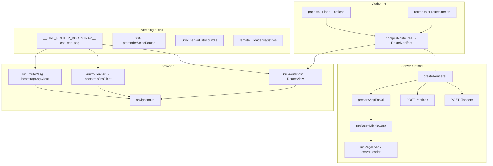

# Kiru v2 router & rendering — documentation index

Kiru v2 is a **full application framework** built on the Kiru signal renderer: nested route trees, four loader kinds, route middleware, streaming SSR, static prerender (SSG), hybrid ISR on Node/Bun, i18n, remote actions, and Vite-first tooling.

These documents describe **how the system works today**, where it competes with Next.js / SvelteKit / SolidStart / Nuxt, and what must be solid before a public v2 launch.

---

## Mental model in one diagram

---

## Document map

### Core platform

1. **[01-architecture.md](./01-architecture.md)** — Packages, lifecycle, compile-time mode guards, dual client outlet paths.
2. **[03-rendering-modes.md](./03-rendering-modes.md)** — CSR vs SSR vs SSG vs hybrid; when to use each; bootstrap entry points.
3. **[04-route-tree-and-matching.md](./04-route-tree-and-matching.md)** — Scopes, leaves, `static`, matching, typed `Link`/`navigate`.
4. **[17-package-exports-and-import-guide.md](./17-package-exports-and-import-guide.md)** — `kiru/router`, `kiru/router/ssr`, tree-shaking rules.

### Data & auth patterns

5. **[06-loaders-and-data.md](./06-loaders-and-data.md)** — `server` / `static` / `universal` / `client`, RPC, cache, validation.
6. **[07-remote-actions.md](./07-remote-actions.md)** — Unified `action()`, RPC (POST + JSON), forms, cookies, tokens.
7. **[05-middleware-and-navigation-guards.md](./05-middleware-and-navigation-guards.md)** — Route middleware vs component guards; **CSR/SSR parity caveats**.

### Rendering & deploy

8. **[08-renderer-ssr-and-streaming.md](./08-renderer-ssr-and-streaming.md)** — `createRenderer`, streaming, early head flush, error recovery.
9. **[09-client-bootstrap-and-hydration.md](./09-client-bootstrap-and-hydration.md)** — `bootstrapSsrClient` / `bootstrapSsgClient`, hash workaround, outlet subscriptions.
10. **[10-isr-hybrid-and-prerender.md](./10-isr-hybrid-and-prerender.md)** — `defineISR`, disk cache, `revalidatePath` / `revalidateTag`.
11. **[14-adapters-and-deploy-runtimes.md](./14-adapters-and-deploy-runtimes.md)** — Node, Bun, Cloudflare; capability matrix.
12. **[19-static-404-and-host-fallback-strategies.md](./19-static-404-and-host-fallback-strategies.md)** — `notFoundStrategy` (`exact`, `csr-recovery`, `hybrid-ssr`), `404.html`, SPA fallback.

### Product & DX

13. **[11-i18n.md](./11-i18n.md)** — Locales, domains, detection, prerender expansion.
14. **[12-seo-head-sitemap-images.md](./12-seo-head-sitemap-images.md)** — Head layers, sitemap (images: [21-image-pipeline-adr.md](./21-image-pipeline-adr.md)).
15. **[13-vite-plugin-and-build-pipeline.md](./13-vite-plugin-and-build-pipeline.md)** — Plugin options, SSG build, dev SSR, codegen.

### Strategy & quality

16. **[02-competitive-positioning.md](./02-competitive-positioning.md)** — vs Next / SvelteKit / SolidStart / Nuxt.
17. **[15-testing.md](./15-testing.md)** — Unit, e2e, recommended cases.
18. **[16-gaps-risks-and-launch-checklist.md](./16-gaps-risks-and-launch-checklist.md)** — Ship blockers and prioritized fixes.
19. **[BREAKING-CHANGES.md](./BREAKING-CHANGES.md)** — v2 API inventory vs `main` (feeds migration).
20. **[18-release-sprint-todos.md](./18-release-sprint-todos.md)** — Sprint backlog S0–S6; [CHANGELOG.md](../../CHANGELOG.md) at repo root.
21. **[22-hydration-module-prewarm-adr.md](./22-hydration-module-prewarm-adr.md)** — SSR/SSG + Link-hover `modulepreload` (v2.0).

---

## Quick reference: bootstrap mode

| Mode | Vite client define | Client entry | Server |
|------|-------------------|--------------|--------|
| CSR | `csr` | `createRouterApp` from `kiru/router/csr` | None |
| SSR | `ssr` | `createRouterApp` from `kiru/router/ssr` | `createRenderer` + adapter |
| SSG | `ssg` | `createRouterApp` from `kiru/router/ssg` | Optional `serverEntry` for hybrid |
| Hybrid | `ssr` (client) | Same as SSR | SSG prerender + SSR server |

Defined in `packages/lib/src/env.ts` via `__KIRU_ROUTER_BOOTSTRAP__`, injected by `vite-plugin-kiru`.

---

## Quick reference: loader kinds

| Kind | Runs on server first paint | Build-time SSG | Client navigation |
|------|---------------------------|----------------|-------------------|
| `staticLoader` | Inlined in HTML | Yes | From payload / no RPC |
| `serverLoader` | Yes | No | `POST /?loader=` if SSR bundle |
| `universalLoader` | Yes | Optional | Re-runs on client |
| `clientLoader` | No | No | Client only |

See [06-loaders-and-data.md](./06-loaders-and-data.md).

---

## Related apps in the monorepo

| Path | Purpose |
|------|---------|
| `e2e/ssr` | Primary SSR + actions + ISR Cypress suite |
| `e2e/ssg` | Static prerender + client nav |
| `e2e/csr` | SPA, signals, loaders |
| `e2e/file-routes` | `@kirujs/file-routes` codegen (CSR) |
| `e2e/file-routes-ssr` | FBR + SSR hydrate |
| `e2e/file-routes-ssg` | FBR + SSG prerender |
| `e2e/ssr-matrix` | Multi-server adapter smoke |
| `sandbox/ssr` | Auth/todos demo with real cookies |
